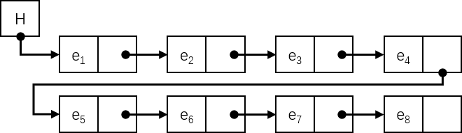
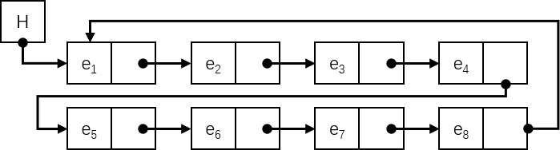
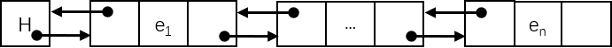
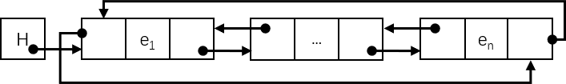
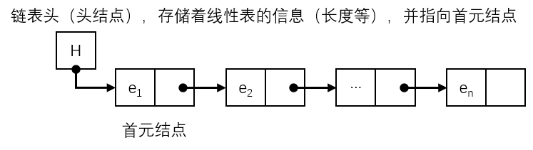

# 链式线性表

## 链式线性表的存储原理

链式存储就是线性表中的**每个元素独立地申请内存空间，元素与元素之间的内存地址可以不连续**。但为了表示线性表的前后关系，在每一个元素的组成中，除了包含元素本身的基本信息外，还需要包含一个或多个**指针域**指向该元素的直接前驱或直接后继，这样就可以把整个线性表中的元素链接起来，形成一个**链**。

根据线性表指针域的**数量**以及**指向方向**的不同，可以将线性表的链式存储分为：

- **单向链表** - 指每一个元素包含一个指针域，并指向该元素的直接后继。

  

- **单向循环链表** - 把最后一个结点的指针指向第一个结点。

  

- **双向链表** - 指每一个元素包含两个指针域，并分别指向该元素的直接前驱和直接后继。

  

- **双向循环链表** - 把最后一个结点的指针指向第一个结点，同时把第一个结点的前向指针指向最后一个结点。

    

## 链式线性表的算法实现

由于链式存储的线性表主要是用指针指向直接前驱或直接后继来实现链表的，因此可以把链式存储的数据结构定义为：

```c
typedef struct LNode {
    Element element;
    struct LNode *Next;
} LNode, *LPNode;
```

同时为了描述方便，定义一个线性表的**头结点**，用来描述线性表的基本信息：

```c
typedef struct Header {
	int length;
	struct LNode *header;
} *LHeader;
```

链式线性表的初始化算法如下：

```c
// 初始化一个单向链表，返回链表头
Status InitList(LHeader &Lh) {
    Lh = (LHeader) malloc(sizeof(Header));
    if (!Lh) {
        return OVERFLOW;
    }
    
    // 链表头中存储着线性表的长度和头结点的地址
    Lh->length = 0;
    Lh->header = NULL;
    
    return OK;
}
```

链式存储的线性表初始化时，并没有像顺序存储的线性表一样申请一块内存区，而是**初始化一个指向首元结点的指针（头指针）**：



> 数据结构中，在单链表的开始结点之前设立一个结点称之为头结点，头结点的数据域可以不存储任何信息，也可以存储链表的长度等附加信息，头结点的指针域存储指向第一个结点（首元结点）的指针（即第一个结点的存储位置）。

在元素插入的时候，才动态申请内存空间，元素插入的算法如下：

```c
Status InsertElement(LHeader &L, int idx, Element e) {
    if (idx < 1 || idx > L->length + 1) {
        return ERROR;
    }
    
    // q 用来存储直接前驱，p 用来存储直接后继
    LPNode q, p = L->header;
    // 遍历线性表，找到插入位置前的元素
    for (int i = 0; p && i < idx - 1; i++) {   
        q = p;
        p = p->Next;
    }
    
    // 创建一个结点
    LPNode s = (LPNode) malloc(sizeof(LNode));
    s->element = e;
    // 指向下一个结点（设置直接后继）
    s->Next = p;
	
    // （设置直接前驱）
    // 将该结点存储为首元结点
    if (idx == 1) {
        L->header = s;
    } 
    // 否则将上一个结点指向插入的结点
    else {
        q->Next = s;
    }
    L->length++;
    
    return OK;
}
```

在线性表的末尾加入一个元素：

```c
Status InsertElement_Rear(LHeader &L, Element e) {
	LPNode s = (LPNode) malloc(sizeof(LNode));
    s->element = e;
    s->Next = NULL;
    
    // 设置直接前驱
    // 如果线性表中没有元素，则将这个结点设置为首元结点
    if (L->header == NULL) {
        L->header = s;
        return OK;
    }
    // 否则就查找到线性表的尾部
    LPNode p = L->header;
    while (p->Next) {
        p = p->Next;
    }
    p->Next = s;
    
    // 增加线性表的长度
    L->length++;
    
    return OK;
}
```

在线性表中删除一个元素：

```c
// 删除第一个与元素 e 相同的元素，并将其位置返回给 idx
Status DeleteElement(LHeader &L, Element e, int &idx) {
	LPNode q = L->header, p = L->header;
	idx = 0;
    // 遍历线性表
	while (p) {
		idx++;
        // 找到相同的元素
		if (!memcmp(&(p->element), &e, sizeof(e))) {
            // 如果删除的是首元结点
			if(idx == 1) {
                LPNode r = p->Next;
                // 让头指针指向第二个元素
				q->element = p->Next->element;
				q->Next = p->Next->Next;
                free(r);
			}
            // 其他结点
            else {
                // 把被删除元素的前驱指向被删除元素的后驱
				q->Next = p->Next;
                // 释放被删除元素的内存
				free(p);
			}
            
			L->length--;
			break;
		}
        // 更新 q 和 p 的指针
		q = p;
		p = p->Next;
	}
    
	return OK;
}
```

销毁线性表：

```c
Status DestroyList(LHeader &L) {
	LPNode p = L->header, q;
    
    // 遍历线性表，释放每一个结点的内存
    while (p->Next) {
        q = p->Next;
        free(p);
        p = q;
    }
    
    // 重置线性表的信息
    L->length = 0;
    L->header = NULL;
    
    return OK;
}
```

清空线性表的元素：

```c
Status ClearList(LHeader &L) {
	return DestroyList(L);
}
```

判断线性表是否为空：

```c
Status ListIsEmpty(LHeader L) {
    return L->length == 0 ? TRUE : FALSE;
}
```

获取线性表的长度：

```c
int GetLength(LHeader L) {
	return L->length;
}
```

通过下标获取元素：

```c
// 位置是 idx - 1
Status GetElementByIndex(LHeader L, int idx, Element &e) {
    if (idx < 1 || idx > L->length) {
        return ERROR;
    }
    
    LPNode p = L->header;
    for (int i = 0; i < idx - 1; i++) {
        p = p->Next;
    }
    
    // 返回这个元素给 e
    e = p->element;
    
    return OK;
}
```

获取元素存放的位置：

```c
// 位置是 idx + 1
int Locate(LHeader L, Element e) {
    int idx = 0;
    LPNode p = L->header;
    
    while (p->Next) {
        idx++;
        // 如果找到了第一个相同的元素，就终止循环
        if (!memcmp(&(p->element), &e, sizeof(e))) {
            break;
        }
        p = p->Next;
    }
    
    // 如果没找到
    if (!p->Next) {
        return ERROR;
    }
    
    return idx;
}
```

获取指定元素的直接前驱：

```c
Status PriorElement(LHeader L, Element current_element, Element &prior_element) {
    LPNode q, p = L->header;
    
    // 如果指定元素是第一个元素，则返回 ERROR，因为没有前驱
    if (!memcmp(&(p->element), &current_element, sizeof(current_element))) {
        return ERROR;
    }
    
    // 遍历线性表
    while (p->Next) {
        q = p;
        p = p->Next;
        // 找到第一个相等的元素
        if (!memcmp(&(p->element), &current_element, sizeof(current_element))) {
            // 返回前驱
            prior_element = q->element;
            break;
        }
    }
    
    // 如果没找到
    if (!p->Next) {
        return ERROR;
    }
    
    return OK;
}
```

获取指定元素的直接后继：

```c
Status NextElement(LHeader L, Element current_element, Element &next_element) {
    LPNode p = L->header;
    
    // 遍历线性表
    while (p->Next) {
        // 找到第一个相等的元素，且后继不为空
        if (!memcmp(&(p->element), &current_element, sizeof(e)) && p->Next) {
            next_element = p->Next->element;
            break;
        }
        p = p->Next;
    }
    
    // 如果没找到
    if (!p->Next) {
        return ERROR;
    }
    
    return OK;
}
```

遍历线性表，同时调用条件函数：

```c
void List(LHeader L, void (*f)(Element e)) {
	LPNode p = L->header;
    // 遍历线性表
    while (p) {
        (*f) (p->element);
        p = p->Next;
    }
}
```

合并两个线性表：

```c
void MergeList(LHeader &La, LHeader &Lb, LHeader &Lc) {
    LPNode p = Lb->header;
	// 遍历 Lb，获取最后一个结点的指针
    while (p->Next) {
        p->Next;
    }
    // 将 p 指向 Lc 的指针头
    p->Next = Lc->header;
    // 将 La 的指针头指向 Lb 的指针头
    La->header = Lb->header;
    
    return;
}
```
