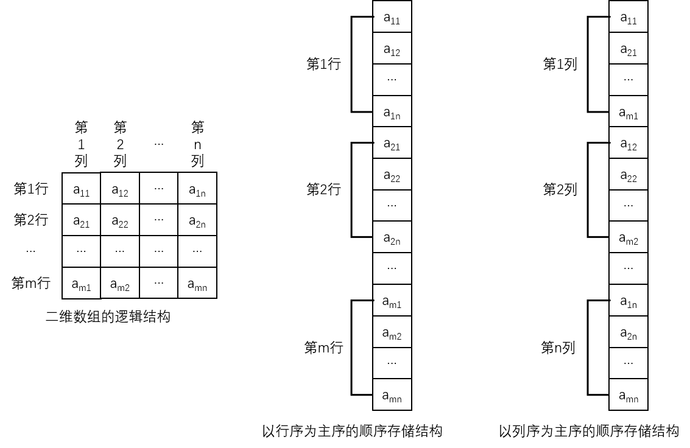

多维数组是线性表的推广，二维数组定义为**数据元素为一维数组的线性表**。一个 $$m$$ 行 $$n$$ 列的二维数组 $$A_{mn}$$ 有 $$m{\times}n$$ 个数据元素 $$a_{ij}(1{\leq}i{\leq}m,1{\leq}j{\leq}n)$$，示意图如下：

$$m$$ 行 $$n$$ 列的二维数组及可以看成是由 $$m$$ 个行所在的一维数组组成的一维数组，也可以看成是由 $$n$$ 个列所在的一维数组组成的一维数组。其中，每个数组元素 $$a_{mn}$$ 同时属于两个线性表——第 $$m$$ 行的线性表和第 $$n$$ 列的线性表。

可以将 $$A_{mn}$$ 另记为：

$$
A=(a_1,a_2,...,a_m)
$$

其中：

$$
a_m=(a_{m1},a_{m2},...,a_{mn})
$$

实际上，**计算机的内存是一个一维空间，内存地址正好可以对应一维数组的下标**。对于二维数组以及多维数组，它们的下标个数大于 $$1$$，若要使多个下标所指示的数据元素映射到内存这个一维空间中，就需要**把多维的下标表达式转换成一维的下标表达式**。

当行列固定后，要用一组连续的存储单元存放二维数组中的元素，需要考虑行列顺序排放问题，这样就产生了两种存储方式：

- **以行序为主序（先行后列，Row Major Order）的顺序存放** - 先存放第一行，再存放第二行，依次存放到第 $$m$$ 行，即：
  
  $$
  a_{11},a_{12},...,a_{1n},a_{21},a_{22},...,a_{2n},...,a_{m1},a_{m2},...,a_{mn}
  $$

- **以列序为主序（先列后行，Column Major Order）的顺序存放** - 先存放第一列，再存放第二列，依次存放到第 $$n$$ 列，即：
  
  $$
  a_{11},a_{21},...,a_{m1},a_{12},a_{22},...,a_{m2},...,a_{1n},a_{2n},...,a_{mn}
  $$

假设二维数组以行序为主序存储，共有 $$n$$ 列，第一个数据元素 $$a_{1,1}$$ 的存储地址是 $$Loc(a_{1,1})$$，每个数据元素占用 $$c$$ 个存储空间，则数据元素 $$a_{i,j}$$ 的存储地址计算公式为：

$$
Loc(a_{i,j})=Loc(a_{1,1})+((i-1)\times n+(j-1))\times c
$$

同理，假设二维数组以列序为主序存储，共有 $$m$$ 行，第一个数据元素 $$a_{1,1}$$ 的存储地址是 $$Loc(a_{1,1})$$，每个数据元素占用 $$c$$ 个存储空间，则数据元素 $$a_{i,j}$$ 的存储地址计算公式为：

$$
Loc(a_{i,j})=Loc(a_{1,1})+((j-1)\times m+(i-1))\times c
$$

不管是用行序优先还是列序优先的方式存储二维数组，只要知道第一个数据元素的地址，再计算出地址偏移量 $$c$$，就可以同通过公式得到任意一个数据元素的地址，实现了二维数组的**随机存储**，同时**使二维数组从二维空间映射到了一维空间**。

这样的公式还可以向三维和多维推广。