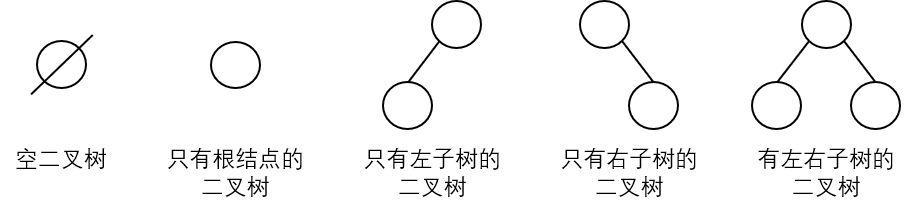

# 二叉树的基本概念

二叉树是一种特殊的树，通常，把满足以下两个条件的树形结构称为二叉树：

1. **结点的度** - 每个结点的度都不大于 2，也就是说每个结点最多只能有两个孩子，所以取名为二叉树。
2. **结点顺序** - 每个结点的孩子结点顺序不能任意颠倒，若改变其顺序就变为另一棵二叉树了。由此可见，二叉树是**有序树**。

由定义可知，一个二叉树中的每个结点只能含有**0、1 或 2 个孩子**，而且每个孩子有左右之分，把位于左边的孩子叫做**左孩子**、位于右边的孩子叫做**右孩子**。

**二叉树有以下五种基本形态**：

根据树的定义可得，二叉树的左、右子树又是一棵二叉树。

与树的基本操作类似，二叉树有以下基本操作：

- **Init(BinaryTree)** - 将 BinaryTree 初始化为空二叉树。
- **Create(BinaryTree)** - 创建一棵非空二叉树 BinaryTree。
- **Destory(BinaryTree)** - 销毁二叉树 BinaryTree。
- **Empty(BinaryTree)** - 判断二叉树是否为空。
- **Root(BinaryTree)** - 返回二叉树 BinaryTree 的根。
- **Parent(BinaryTree,x)** - 返回二叉树 BinaryTree 中结点 x 的**双亲结点**。若结点 x 是**根结点**或二叉树中不存在结点 x，则返回空。
- **LeftChild(BinaryTree,x)** - 返回二叉树 BinaryTree 中结点 x 的**左孩子结点**。若结点 x 是**叶结点**或二叉树中不存在结点 x，则返回空。
- **RightChild(BinaryTree,x)** - 返回二叉树 BinaryTree 中结点 x 的**右孩子结点**。若结点 x 是**叶结点**或二叉树中不存在结点 x，则返回空。
- **Traverse(BinaryTree)** - 遍历二叉树，按照某个顺序依次访问二叉树中每个结点一次（只访问一次）。
- **Clear(BinaryTree)** - 将二叉树 BinaryTree 置为空树，并回收资源。