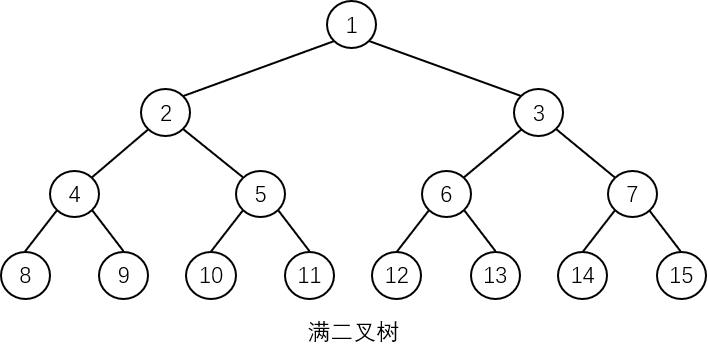
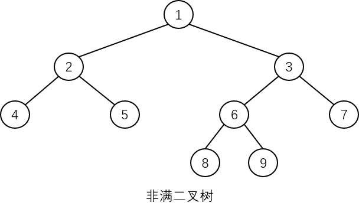
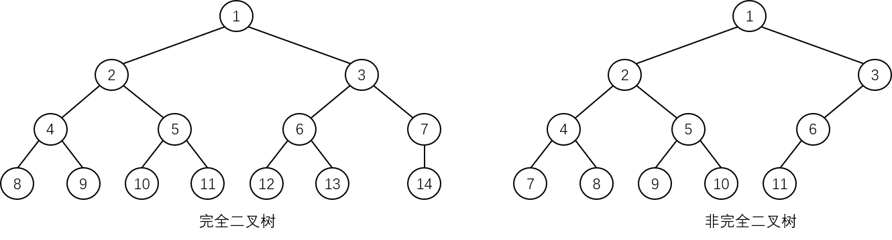

# 特殊二叉树

## 满二叉树

在一棵二叉树中，**如果所有分支结点都有左子树和右子树，并且所有叶结点都在同一层上**，这样的二叉树称为**满二叉树**。满二叉树中**只有度为 0 和 2 的结点**，没有度为 1 的结点。

满二叉树的示意图如下：

满二叉树有一种特殊情况被称为**非满二叉树**，其示意图如下：

虽然该二叉树中的所有结点要么是含有左、右子树的分支结点，要么是叶结点，但由于它的**所有叶结点并没有出现在同一层上**，所以不属于满二叉树。

## 完全二叉树

一棵深度为 $$k$$ 的有 $$n$$ 个结点的二叉树，将树中的结点按照**从上到下、从左到右**的顺序依次进行编号，如果编号为 $$i(1{\leq}i{\leq}n)$$ 的结点与满二叉树中编号为 $$i$$ 的结点在二叉树中的位置相同，那么这棵树就被称为**完全二叉树**。

> 在满二叉树中，从最后一个结点开始，往前面连续去掉任意个结点，就可以得到一棵完全二叉树。

完全二叉树的特点是：

- **叶结点**只能出现在**最下层**和**次下层**，而且**最下层的叶结点均集中在二叉树的左部分**。
- 深度为 $$k$$ 的完全二叉树**在 $$k-1$$ 层上一定是满二叉树**。
- **最多有一个度为 1 的结点**。

在一棵完全二叉树中：

- 若某结点**没有左孩子结点**，那么它一定**也没有右孩子结点**。
- 若某结点**没有右孩子结点**，那么按层序编号比它大的结点**一定没有孩子结点**。

**一棵满二叉树必然是一棵完全二叉树，但完全二叉树不一定是满二叉树，有时也会称满二叉树是完全二叉树的特例。**

## 斜树

所有结点只有左子树的二叉树称为**左斜树**，所有结点只有右子树的二叉树称为**右斜树**，左斜树和右斜树统称为**斜树**，也称为**单枝（支）二叉树**。

斜树的特点是：

- 在斜树中，**每一层都只有一个结点**。
- 斜树的**结点个数与其深度相同**。
- 斜树中**不存在度为 2 的结点**。