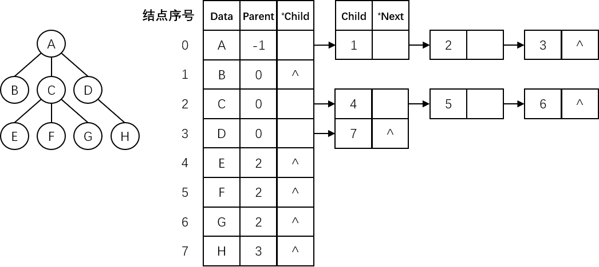

# 树的存储结构

树的存储结构主要有**双亲表示法**、**孩子表示法**和**孩子兄弟表示法**三种。

## 双亲表示法

**在树中，（除根结点外）每个结点的双亲是唯一的。**利用这一性质，可以在存储结点信息的同时，为每个结点附设一个**指向其双亲的指针**，就可以唯一地表示任何一棵树。尽管可以使用动态链表来实现，但用向量来表示更为方便，即用一组连续的空间（**数组**）来存储树中的结点，在保存每个结点的同时附设一个指示器来指示其双亲结点在连续空间中的位置。

整棵树用含有 MAX_COUNT 个结点的一维数组来表示，示意图如下：


一般数据结构定义如下：

```c
#define MAX_COUNT 100

typedef struct {
    ElemType Data;
    // 双亲结点的序号
    int Parent;
} TreeNode;

typedef struct {
    TreeNode Tree[MAX_COUNT];
    // 结点数
    int TreeNodeCount;
} ParentTree;
```

因为这种存储方法利用了树中（除根结点外）每个结点只有一个双亲结点的性质，使得查找某个结点的双亲结点非常容易。反复使用求双亲结点的操作，也可以较容易地找到树根。但是，在这种存储结构中，求某个结点的孩子时需要扫描整个向量。

## 孩子表示法

孩子表示法是把树中的每个结点的孩子结点排列起来，构成一个单链表，称为**孩子链表**。

$$n$$ 个结点共有 $$n$$ 个孩子链表（叶结点的孩子链表为空），而 $$n$$ 个结点的数据域 Data 和 $$n$$ 个孩子链表的头指针又组成一个顺序表，用一维数组来表示，数组中的每个元素包含数据域 Data 和指向孩子链表的头指针。示意图如下：


一般数据结构定义如下：

```c
#define MAX_COUNT 100

typedef struct CTNode {
    // （孩子）结点的序号
    int Child;
    struct CTNode *Next;
} ChildNode;

typedef struct {
    ElemType Data;
    // 指向第一个孩子结点
    ChildNode *FirstChild;
} ChildHeadNode;

typedef struct {
    ChildHeadNode Nodes[MAX_COUNT];
    int TreeNodeNumber;
    // 根结点所在顺序表中的序号
    int Root;
} ChildTree;
```

## 双亲孩子表示法

与双亲表示法相反，孩子表示法便于那些涉及孩子的操作的实现，却不适用于涉及查找双亲操作的实现。

可以把双亲表示法和孩子表示法结合起来，称之为**双亲孩子表示法**，便于其涉及查找孩子和双亲操作的实现，示意图如下：



一般数据结构定义如下：

```c
#define MAX_COUNT 100

typedef struct CTNode {
    int Child;
    struct CTNode *Next;
} ChildNode;

typedef struct {
    ElemType Data;
    int Parent;
    ChildNode *FirstChild;
} ChildHeadNode;

typedef struct {
    ChildHeadNode Nodes[MAX_COUNT];
    int TreeNodeNumber;
    int Root;
} ParentChildTree;
```

## 孩子兄弟表示法

孩子兄弟表示法又称为树的**二叉表示法**，或者**二叉链表表示法**，即以二叉链表作为树的存储结构。链表中每个结点设有两个链域，分别指向该结点的第一个孩子结点和下一个兄弟（右兄弟）结点。示意图如下：


一般数据结构定义如下：

```c
typedef struct ChildSiblingNode {
    ElemType Data;
    struct ChildSiblingNode *FirstChild, *NextSibling;
} *ChildSiblingTree;
```

这种存储结构便于实现树的各种操作。例如，如果要访问结点 $$x$$ 的第 $$i$$ 个孩子，则只要从 FirstChild 域找到第一个孩子结点，然后沿着这个孩子结点的 NextSibling 域连续走 $$i-1$$ 步，就可以找到结点 $$x$$ 的第 $$i$$ 个孩子。

> 如果在这种结构中增设一个 Parent 域，则同样可以很方便第实现查找双亲的操作。
