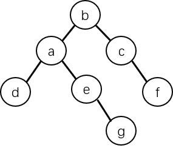
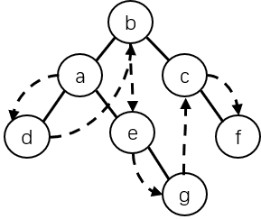

# 数据结构

## 数据结构的概念

数据结构只是在整个计算机科学与技术领域上被广泛使用的术语，目前对于它还没有一个公认的定义，不同的人根据自身的理解也有不同的论述，在本篇中，**数据结构（Data Structure）**是指**相互之间存在一种或多种特定关系的数据元素的集合**，一般包括如下三个方面：

1. **数据的逻辑结构** - 数据元素之间的逻辑关系。
2. **数据的存储结构/数据的物理结构** - 数据元素及其关系在计算机存储器中的存储方式。
3. **数据的运算** - 施加在数据上的操作。

从学科角度来讲，数据结构是一门研究非数值计算的程序设计问题中，**计算机的操作对象（数据对象）以及它们之间的关系和运算（操作）**等的学科。

>  “数据结构是数据对象，以及存在于该对象的实例和组成实例的数据元素之间的各种联系，这些联系可以通过定义相关的函数来给出。” —— Sartaj Sahni 《数据结构、算法与应用》  “数据结构是 ADT（抽象数据类型）的物理实现。” —— Clifford A.Shaffer 《数据结构与算法分析》  “一个数据结构的设计分为抽象层、数据结构层和实现层。其中，抽象层是指抽象数据类型层，它讨论数据的逻辑结构及其运算，数据结构层和实现层讨论一个数据结构的表示和在计算机内的存储细节以及运算的实现。” —— Robert L.Kruse 《数据结构与程序设计 —— C++ 语言描述》  “数据结构为数据元素的集合，每一个数据元素可以是一种数据类型或另一个数据结构，以及存在于数据元素之间的一组关系（即结构）。” —— Richard F.Gilberg & Behrouz A.Forouzan 《Data Structures: APseudocode Approach with C》  

## 数据结构的二元组描述

为了更确切地描述一种数据结构，通常采用二元组表示，即

$$
Data\_Structure=(D,S)
$$

- D 是数据元素的有限集合，S 是定义在 D 上的一种关系。
- D 上关系可以用一个有序对 <x,y> 表示，其中 x,y∈D，x 称作 y 的**直接前驱**、y 称作 x 的**直接后继**。
- 对于对称序对，即若有 <x,y>∈S，则有 <y,x>∈S，也可以用 (x,y)∈S 来表示。

以下是几个二元组描述的例子：

### 集合结构

复数是一种数据结构，在计算机科学中，复数可取如下定义：

$$
Complex=(C,R)
$$

式中：

- C 是含有两个实数的集合 {c1,c2}。
- R={P}，P 是定义在集合 C 上的一种关系 {<c1,c2>}，其中有序对 <c1,c2> 表示 c1 是复数的实部，c2 是复数的虚部。

### 线性结构

有一种数据结构：

$$
Linear\_List=(D,S)
$$

式中：

$$
D=\{1,3,5,7,2,4,6\}
$$

$$
S=\{<2,5>,<5,3>,<3,6>,<6,1>,<1,4>,<4,7>\}
$$

对应的逻辑结构图为：

可以得出，数据结构 Linear_List 表达的是一种**线性结构**。

### 树状结构

有一种数据结构：

$$
Tree=(D,S)
$$

式中：

$$
D=\{a,b,c,d,e,f,g\}
$$

$$
S=\{(b,a),(b,c),(a,d),(a,e),(c,f),(e,g)\}
$$

对应的逻辑结构图为：

可以得出，数据结构 Tree 表达的是一种**树状结构**。

### 网状结构

有一种数据结构：

$$
Graph=(D,S)
$$

式中：

$$
D=\{a,b,c,d,e,f,g\}
$$

$$
S=\{S_1,S_2\}
$$

$$
S_1=\{<b,a>,<b,c>,<a,d>,<a,e>,<c,f>,<e,g>\}
$$

$$
S_2=\{<a,d>,<d,b>,<b,e>,<e,g>,<g,c>,<c,f>\}
$$

对应的逻辑结构图为：

可以得出，数据结构 Graph 表达的是一种**带有两个关系的网状结构**，其中 $$S_1$$ 为树状结构（实线部分）、$$S_2$$ 为线性结构（虚线部分）。

## 数据结构和数据类型

在高级程序设计语言中，每个常量、变量或表达式都有各自确定的数据类型，数据类型显式或隐式地规定了程序执行期间个变量或表达式的取值范围、存储方式以及允许进行的运算。

可以认为，数据类型是**一个值的集合和定义在此集合上的一组操作的总称**。

数据类型分为**简单（基本）数据类型**和**结构类型**两种。简单数据类型中的每个数据**不可再分**；而结构类型是**由简单数据类型按照一定规则构造而成**，并且结构类型中**还可以再包含结构类型**，因此，结构类型中的每种数据可以分解为若干个简单数据或结构数据，每个结构数据仍**可再分**。

数据类型是数据结构密切相关的一个概念，在某种意义上，数据结构可以看成是**一组具有相同结构的值**，而数据类型则可以看成是**在程序设计中已经实现了的数据结构**。

在程序设计过程中，当需要引入某种新的数据结构时，就要借助编程语言所提供的数据结构来描述数据的存储结构。
