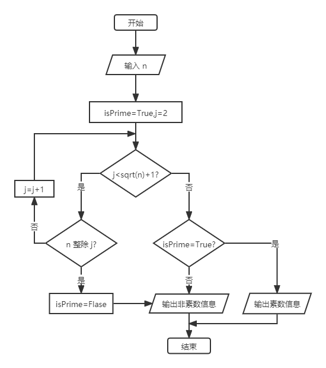

# 算法的描述

设计出来的算法需要一种语言来描述，可以清楚地表达问题的求解步骤，一般有自然语言、流程图、程序设计语言、伪代码等。

下面以判断一个自然数 n 是否为素数为例，列出几种算法描述的说明。

## 自然语言

用自然语言描述算法，最大的优点是**容易理解**，但缺点是**算法表达不够精确，容易出现二义性**。

用自然语言判断素数的算法步骤如下：

1. 输入自然数 n。
2. 判断 n 能否被 2 到 n+1 的平方根之间任意一个数整除。
3. 如果能被整除，则输出非素数的信息，否则就输出素数的信息。
4. 程序结束。

## 流程图

用流程图来描述算法，就是使用国际标准的流程图图形符号来表示算法的求解步骤，通常有 **ANSI 标准**和 **ISO 标准**。

以 ANSI 标准绘制判断素数的算法流程图如下：



## 程序设计语言

用程序设计语言来描述算法，就是直接用某种程序设计语言来表达算法的求解过程，其特点是**算法描述准确、严谨和结构化程度高**，通过编译器编译和链接生成机器代码后就可以直接运行，**不足是细节过多，直观性差**，经常需要借助程序注释才能明白算法的含义。

编写判断素数的算法如下：

```c
#include <stdio.h>
#include <math.h>

int main() {
	// 输入数据
	int n;
	printf("请输入一个自然数：\n");
	scanf("%d", &n);

	// 默认为素数
	int isPrime = 1;
	// 判断的区间为 2 到 n+1 的平方根
	for(int i = 2; i <= (int)sqrt(n) + 1; i++) {
		// 如果出现能整除的数，就结束循环，并标志为非素数
		if (!(n % i)) {
			isPrime = 0;
			break;
		}
	}

	// 输出结果
	if (isPrime) {
		printf("这个数是素数");
	} else {
		printf("这个数不是素数");
	}

	// 结束程序
	return 0;
}
```

## 伪代码

伪代码介于程序设计语言和自然语言之间，它忽略了程序设计语言中的一些严格语法规则与描述细节，可以采用英文和中文混合书写，以便把注意力主要集中在算法处理步骤的描述上。

伪代码**比程序设计语言更容易理解**，同时又**比自然语言更接近程序语言**，很多算法都是用伪代码进行描述的。

用伪代码描述判断素数的算法如下：

```tex
BEGIN
	step 1: isPrime←1; i←2;
	step 2: n←自然数;
	step 3: DO UNTIL (i<(int)sqrt(n)+1)
	step 4: 	IF (n能整除i) THEN isPrime←0;
	step 5: 	i←i+1;
	step 6: END DO
	step 7: IF isPrime=1 THEN PRINT "这个数是素数" ELSE PRINT "这个数不是素数"
END
```
