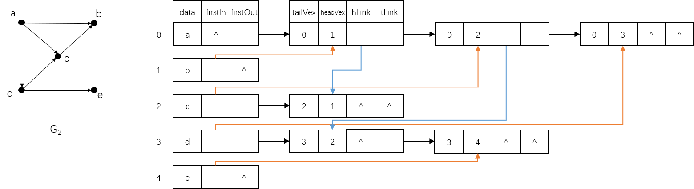

# 存储结构

**十字链表（Orthogonal List）**是把**邻接表**和**逆邻接表**结合在一起设计的一种数据结构。

在十字链表中，每个顶点除了保存自身基本信息外，还保存第一个出度的弧的信息和第一个入度的弧的信息；每个弧除了保存自身基本信息外，还要保存该弧的始点（弧尾）位置和终点（弧头）位置，以及和该弧始点相同的第一个弧的指针和该弧终点相同的第一个弧的指针信息。示意图如下：



十字链表的一般数据结构定义如下：

```c
// 弧
typedef struct ArcOL {
    // 弧尾和弧头在顶点数组中的下标
    int tailVex, headVex;
    // 弧的基本信息
    ArcCell *info;
    // 指向弧头相同的下一条弧，指向弧尾相同的下一条弧
    ArcOL *hLink, *tLink;
}

// 顶点
typedef struct NodeOL {
    GNode *data;
    // 指向该顶点的第一条入度的弧，指向该顶点的第一条出度的弧
    ArcOL *firstIn, *firstOut;
} NodeOL;

// 十字链表
typedef struct OrthogonalListGraph {
    // 顺序存放顶点
    NodeOL vexs[MAX_VERTEX_NUM];
    int vexNum, arcNum, maxVexNum;
    GraphKind graphKind;
} OrthogonalListGraph;
```

在十字链表中要找到以 $$v_i$$ 为始点的弧和以 $$v_i$$ 为终点的弧都很容易，所以想要求得顶点的出度和入度也都很容易，只要分别顺着 firstIn 和 firstOut 的指针扫描完对应链表，统计表中的结点数即可。

> **<font color="red">十字链表只适用于有向图。</font>**

# 算法实现

图的十字链表的一般算法实现如下：

```c
// 创建一个空的十字链表
void Create(OrthogonalListGraph *olg, int n, GraphKind gk) {
    olg->vexNum = olg->arcNum = 0;
    olg->graphKind = gk;
    olg->maxVexNum = n;
}

// 向十字链表中增加一个顶点
BOOL AddNode(OrthogonalListGraph *old, GNode *gn) {
    if (olg->vexNum >= olg->maxVexNum) {
        return FALSE;
    }
    
    int curr_idx = olg->vexNum;
    CopyNode(olg->vexs[curr_idx].data, gn);
    olg->vexs[curr_idx].firstOut = olg->vexs[curr_idx].firstIn = NULL;
    olg->vexNum++;
    return TRUE;
}

// 向十字链表中增加一条边 (i, j)
BOOL AddEdge(OrthogonalListGraph *old, int i, int j, ArcCell *ac) {
    ArcOL *ol = (ArcOL*) malloc(sizeof(ArcOL));
    ol->tailVex = i;
    ol->headVex = j;
    ol->hLink = olg->vexs[j].firstIn;
    ol->tLink = olg->vexs[i].firstOut;
    CopyArc(ol->info, ac);
    olg->vexs[i].firstOut = olg->vexs[j].firstIn = ol;
    return TRUE;
}
```
