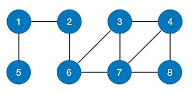
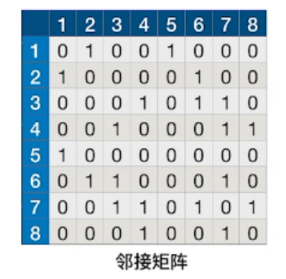
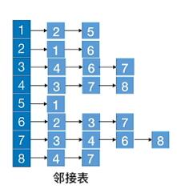
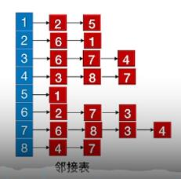

# 图的遍历序列的唯一性

## 图

例如有图：

以**图**为依据，根据 DFS 算法思想求得的遍历序列是**不唯一的**，因为可以选择任意顶点作为起点顶点，随后从其任意邻接点找任意邻接点；根据 **BFS** 算法思想求得的遍历序列也是**不唯一的**，因为也是选择任意顶点作为起始顶点，随后以任意顺序访问其邻接点，并依照这个顺序去访问邻接点的邻接点。

## 邻接矩阵

根据上图得到其**唯一的邻接矩阵**：

以邻接矩阵为依据，**DFS** 和 **BFS** 的遍历序列都是**唯一的**，分别为：

- **DFS** - 1,2,6,3,4,7,8,5。
- **BFS** - 1,2,5,6,3,7,4,8。

以 **DFS 序列**为例，遍历的过程如下：

1. 以 1 为起始顶点，在矩阵中找到它的**第一个邻接点** 2。
2. 转到第 2 行，找到 2 的**第一个还没被访问过的邻接点** 6。
3. 转到第 6 行，找到 6 的第一个还没被访问过的邻接点 3。
4. 转到第 3 行，找到 3 的第一个还没被访问过的邻接点 7。
5. 转到第 7 行，找到 7 的第一个还没被访问过的邻接点 8。
6. 转到第 8 行，发现其邻接点全都访问过了，**返回第 1 行**。
7. 找到 1 的**第二个邻接点** 5。
8. 转到第 5 行，发现其邻接点全都访问过了，**结束遍历**。

## 邻接表

根据上图可以得到很多邻接表，**因为邻接表的弧指针没有顺序要求**，所以邻接表是**不唯一的**，其中两种邻接表如下：

- 表 1：
  
- 表 2：
  

每个邻接表的 **DFS** 和 **BFS** 遍历序列都是**唯一的**，以表 2 为例，分别为：

- **DFS** - 1,2,6,7,8,4,3,5。
- **BFS** - 1,2,5,6,7,3,8,4。

以 **DFS 序列**为例，遍历的过程如下：

1. 以 1 为起始顶点，找到**第一条弧指向的邻接点** 2。
2. 转到顶点 2，找到 2 的**弧链表中第一个还没被访问过的邻接点** 6。
3. 转到顶点 6，找到 6 的弧链表中第一个还没被访问过的邻接点 7。
4. 转到顶点 7，找到 7 的弧链表中第一个还没被访问过的邻接点 8。
5. 转到顶点 8，找到 8 的弧链表中第一个还没被访问过的邻接点 4。
6. 转到顶点 4，找到 4 的弧链表中第一个还没被访问过的邻接点 3。
7. 转到顶点 3，发现其邻接点全都访问过了，**返回顶点 1**。
8. 找到 1 的**第二条弧指向的邻接点** 5。
9. 转到顶点 5，发现其邻接点全都访问过了，**结束遍历**。