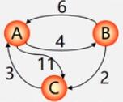

# 最短路径的抽象

最短路径的一个典型用途为交通网络的问题。

问：从甲地到乙地之间是否有公路连通？在有多条通路的情况下，哪一条路最短？

在这样的问题下，可以用**有向图**来表示交通网络：

| 交通网络                                   | 有向图     |
| ------------------------------------------ | ---------- |
| 地名                                       | 顶点       |
| 两地点有路连通                             | 弧         |
| 两地之间的距离、交通费或图中所花费的时间等 | 弧上的权值 |

如何能够使一个地点到另一个地点的运输时间最短或运费最省（最小代价）？这就是一个求两个地点间的**最短路径问题**。

最短路径问题可以抽象成：在**有向网**中，$$A$$ 点（**源点**）到达 $$B$$ 点（**终点**）的多条路径中，寻找一条**各边权值之和最小**的路径。

> 最短路径和最小生成树不同，路径上不一定包含 $$n$$ 个顶点，也不一定包含 $$n-1$$ 条边。

# 第一类问题：两点间的最短路径

例如有有向图：

从源点 $$v_1$$ 到终点 $$v_7$$ 的路径有：

1. $$v_1-v_2-v_5-v_7$$，路径长度为 20。
2. $$v_1-v_4-v_2-v_5-v_7$$，路径长度为 14。
3. $$v_1-v_2-v_7$$，路径长度为 23。
4. $$v_1-v_4-v_2-v_7$$，路径长度为 17。
5. $$v_1-v_4-v_6-v_7$$，路径长度为 26。

可见第二种路径的长度最短，这就求得了问题的两点间的最短路径。

# 第二类问题：某源点到其他各点的最短路径

例如有有向图：

从源点 $$v_0$$ 到其他各点的路径为：

| $$v_0$$ 到各顶点最短路径            | 路径长度 |
| ----------------------------------- | -------- |
| 到 $$v_1$$：$$v_0-v_1$$             | 13       |
| 到 $$v_2$$：$$v_0-v_2$$             | 8        |
| 到 $$v_3$$：$$v_0-v_2-v_3$$         | 13       |
| 到 $$v_4$$：$$v_0-v_2-v_3-v_4$$     | 19       |
| 到 $$v_5$$：$$v_0-v_2-v_3-v_4-v_5$$ | 21       |
| 到 $$v_6$$：$$v_0-v_1-v_6$$         | 20       |

可见 $$v_0$$ 到 $$v_2$$ 的路径是各点中最短的。

# Dijkstra 算法

**迪杰斯特拉算法（Dijkstra 算法）**通常用来求解**单源最短路径**，它的算法思想如下：

1. **初始化** - 先找出从源点到各终点的直达路径 $$(v_0,v_k)$$，即只通过一条弧到达的路径。
2. **选择** - 从这些路径中找出一条长度最短的路径 $$(v_0,u)$$。
3. **更新** - 然后对其余各路径进行适当调整：若图中存在弧 $$(u,v_k)$$，且 $$(v_0,u)+(u,v_k)<(v_0,v_k)$$，则以路径 $$(v_0,u,v_k)$$ 代替 $$(v_0,v_k)$$。
4. 重复 2 和 3 的操作。

简单来说，Dijkstra 算法就是**按照路径长度递增顺序产生最短路径**，其算法步骤为：

1. 把 $$V$$ 分成两组：
   1. **$$S$$** - 已经求出的最短路径的顶点的集合。
   2. **$$T=V-S$$** - 尚未确定最短路径的顶点的集合。
2. 将 $$T$$ 中的顶点按照最短路径递增的顺序加入到 $$S$$ 中，并且保证：
   1. 从源点到 $$S$$ 中各顶点的最短路径长度都不大于从源点到 $$T$$ 中任何顶点的最短路径长度。
   2. 每一个顶点对应一个距离值：
      1. **$$S$$ 中的顶点** - 从源点到此顶点的最短路径长度。
      2. **$$T$$ 中的顶点** - 从源点到此顶点只包括 $$S$$ 中顶点作为中间顶点的最短路径长度。

例如有有向图：

设源点为 $$v_0$$，此时 $$S=\{v_0\}$$，$$T=\{other\_v\}$$。

从源点到 $$T$$ 中顶点对应的距离用辅助数组 $$D$$ 存放，元素下标对应顶点下标，并规定：**若 $$<v_0,v_i>$$ 存在，那么元素的值为其权值，否则为 $${\infty}$$**。

在**第一次选择**中，源点 $$v_0$$ 能**直达**的顶点有 $$v_1$$、$$v_2$$、$$v_4$$、$$v_6$$，其他顶点都需要通过**中间顶点**才能到达：

| 终点 | $$v_1$$ | $$v_2$$ | $$v_3$$      | $$v_4$$ | $$v_5$$      | $$v_6$$ |
| ---- | ------- | ------- | ------------ | ------- | ------------ | ------- |
| 距离 | 13      | 8       | $${\infty}$$ | 30      | $${\infty}$$ | 32      |

然后将**最短距离**的终点 $$v_2$$ 加入集合 $$S$$ 中。

在**第二次选择**时，对 $$T$$ 中顶点的距离值进行修改：**若源点以 $$S$$ 集合中的顶点作为中间顶点到达 $$T$$ 中顶点的距离比上一次选择的距离短，那么就修改距离值为最新的值**。

在第一次选择中直达不了的 $$v_3$$ **由于中间顶点 $$v_2$$ 的加入得以到达**，故值修改为权值和 13。其余的顶点路径不变。

| 终点 | $$v_1$$ | $$v_3$$ | $$v_4$$ | $$v_5$$      | $$v_6$$ |
| ---- | ------- | ------- | ------- | ------------ | ------- |
| 距离 | 13      | 13      | 30      | $${\infty}$$ | 32      |

在第二次选择中，$$v_1$$ 和 $$v_3$$ 的距离相同小，**通常选择一个序号较小的顶点**加入到集合 S 中。

重复上述步骤，直到 $$S=V$$ 为止。

**第三次选择**将 $$v_3$$ 加入集合 $$S$$ 中：

| 终点 | $$v_3$$ | $$v_4$$ | $$v_5$$ | $$v_6$$ |
| ---- | ------- | ------- | ------- | ------- |
| 距离 | 13      | 30      | 22      | 20      |

**第四次选择**将 $$v_4$$ 加入集合 $$S$$ 中：

| 终点 | $$v_4$$ | $$v_5$$ | $$v_6$$ |
| ---- | ------- | ------- | ------- |
| 距离 | 19      | 22      | 20      |

**第五次选择**将 $$v_6$$ 加入集合 $$S$$ 中：

| 终点 | $$v_5$$ | $$v_6$$ |
| ---- | ------- | ------- |
| 距离 | 21      | 20      |

最后将 $$v_5$$ 加入到集合 $$S$$ 中。

通过如此选择之后，得到 $$v_0$$ 到各顶点之间的最短路径：

| $$v_0$$ 到各顶点最短路径            | 路径长度 |
| ----------------------------------- | -------- |
| 到 $$v_1$$：$$v_0-v_1$$             | 13       |
| 到 $$v_2$$：$$v_0-v_2$$             | 8        |
| 到 $$v_3$$：$$v_0-v_2-v_3$$         | 13       |
| 到 $$v_4$$：$$v_0-v_2-v_3-v_4$$     | 19       |
| 到 $$v_5$$：$$v_0-v_2-v_3-v_4-v_5$$ | 21       |
| 到 $$v_6$$：$$v_0-v_1-v_6$$         | 20       |

# Floyd 算法

**弗洛伊德算法（Floyd 算法）**通常用来求解**所有顶点间的最短路径**。

> 所有顶点间的最短路径也可以使用 Dijkstra 算法求解，每次以一个顶点为源点，重复执行 $$n$$ 次即可，时间复杂度为 $$O(n^3)$$。算法本身的复杂度为 $$O(n^2)$$，但因为要遍历顶点，所以是 $$O(n^3)$$。

Floyd 算法的时间复杂度为 **$$O(n^3)$$**，它的算法思想如下：

1. 逐个顶点试探。
2. 找到从 $$v_i$$ 到 $$v_j$$ 的所有可能存在的路径。
3. 选出一条长度最短的路径。

Floyd 算法求最短路径的步骤为：

1. 初始时设置一个 **$$n$$ 阶方阵**，令其**对角线元素为 $$0$$**。若存在两顶点的直达路径，则对应元素为**弧的权值**，否则为 **$${\infty}$$**。
2. 逐步试着**在原直接路径中增加中间顶点**。若加入中间顶点之后路径变短，则修改元素值，否则维持原值。
3. 直到所有顶点试探完毕，算法结束。

例如有有向图：

初始的矩阵为：

|       | $$A$$        | $$B$$                  | $$C$$         |
| ----- | ------------ | ---------------------- | ------------- |
| $$A$$ | $$0$$        | $$4(A-B)$$ |$$11(A-C)$$|
| $$B$$ | $$6(B-A)$$ | $$0$$                  | $$2(B-C)$$  |
| $$C$$ | $$3(C-A)$$ | $${\infty}$$（无连通） | $$0$$         |

首先尝试在各直达路径中加入 $$A$$ 顶点，看是否会使路径变小：

1. 在顶点 $$B$$ 到达顶点 $$C$$ 的路径中增加中间顶点 $$A$$ 后，路径长度变为 $$17$$，反而变长了，所以不将 $$A$$ 加入其中。
2. 在顶点 $$C$$ 到达顶点 $$B$$ 的路径中增加中间顶点 $$A$$ 后，两顶点变为可连通，路径长度为 $$7$$，故将 $$A$$ 加入其中，并修改原值。

调整之后的矩阵为：

|       | $$A$$      | $$B$$            | $$C$$       |
| ----- | ---------- | ---------------- | ----------- |
| $$A$$ | $$0$$      | $$4(A-B)$$       | $$11(A-C)$$ |
| $$B$$ | $$6(B-A)$$ | $$0$$            | $$2(B-C)$$  |
| $$C$$ | $$3(C-A)$$ | **$$7(C-A-B)$$** | $$0$$       |

然后尝试加入 $$B$$，调整之后的矩阵为：

|       | $$A$$      | $$B$$            | $$C$$            |
| ----- | ---------- | ---------------- | ---------------- |
| $$A$$ | $$0$$      | $$4(A-B)$$       | **$$6(A-B-C)$$** |
| $$B$$ | $$6(B-A)$$ | $$0$$            | $$2(B-C)$$       |
| $$C$$ | $$3(C-A)$$ | **$$7(C-A-B)$$** | $$0$$            |

最后尝试加入 $$C$$，调整之后的矩阵为：

|       | $$A$$            | $$B$$            | $$C$$            |
| ----- | ---------------- | ---------------- | ---------------- |
| $$A$$ | $$0$$            | $$4(A-B)$$       | **$$6(A-B-C)$$** |
| $$B$$ | **$$5(B-C-A)$$** | $$0$$            | $$2(B-C)$$       |
| $$C$$ | $$3(C-A)$$       | **$$7(C-A-B)$$** | $$0$$            |
