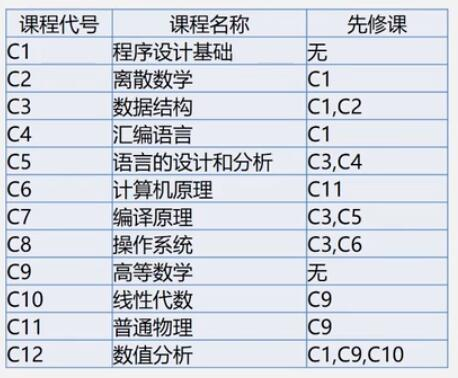
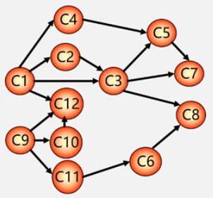
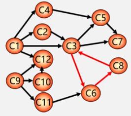
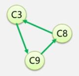

# 拓扑排序

假如要求安排一个课程表：

有些课程的学习需要有其他课程的基础才能进行，可以把这个问题抽象成一个 **AOV 网**，**顶点**代表**课程**，**弧**代表**学习课程的优先要求**，示意图如下：

AOV 网的特点如下：

- 若从 $$V_i$$ 到 $$V_j$$ 有一条有向路径，则 $$V_i$$ 是 $$V_j$$ 的前驱，$$V_j$$ 是 $$V_i$$ 的后继。
- 若 $$<V_i,V_j>$$ 是网中的有向边，则 $$V_i$$ 是 $$V_j$$ 的直接前驱，$$V_j$$ 是 $$V_i$$ 的直接后继。
- AOV 网中**不允许存在回路**，因为如果有回路存在，那么就表明某项活动可以以自己为先决条件，这显然是不符合实际逻辑的。

> 可以用拓扑排序来判断 AOV 网中是否存在回路。

在 AOV 网中没有回路的前提下，将全部活动排列成一个**线性序列**，并规定：**若 AOV 网中有 $$<i,j>$$ 存在，则在这个序列中，$$i$$ 一定排在 $$j$$ 的前面**。

一般将具有这种性质的线性序列称为**拓扑有序序列**，相应的拓扑有序排序的算法称为**拓扑排序**。

拓扑排序的步骤如下：

1. 在有向图中（任）选一个（一般选序号最小的）没有直接前驱的顶点（并输出）。
2. 从图中删除该顶点以及所有以它为始点的弧。
3. 重复 1 和 2，直到全部顶点均已操作（输出）或者当图中不存在无直接前驱的顶点为止。

例如上图 AOV 网的一种拓扑序列为：

$$
C_1\to{C_2}\to{C_3}\to{C_4}\to{C_5}\to{C_7}\to{C_9}\to{C_{10}}\to{C_{11}}\to{C_6}\to{C_{12}}\to{C_8}
$$

> **一个 AOV 网的拓扑序列是不唯一的。**

对有向图构造其顶点的拓扑有序序列，**若网中所有顶点都在它的拓扑有序序列中，则该 AOV 网必定不存在环**。

例如在上图中增加一条弧，使 AOV 网存在一个环：

进行拓扑排序后，剩下一个环：

**由于它们都是其他一个顶点的直接前驱，谁也删不掉，这些结点就添加不到 AOV 网的拓扑序列中**，这样就解决了检测 AOV 网中是否存在环的问题。