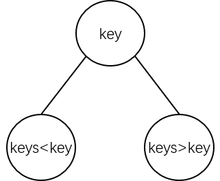
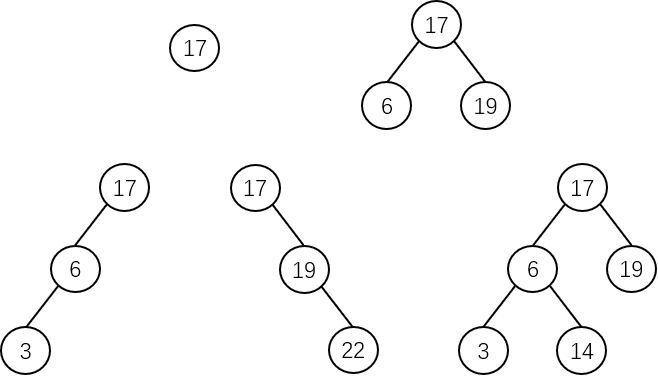
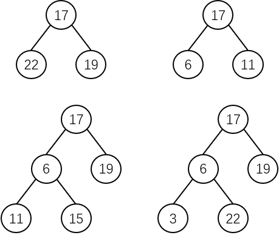
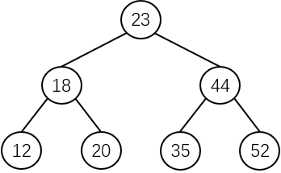
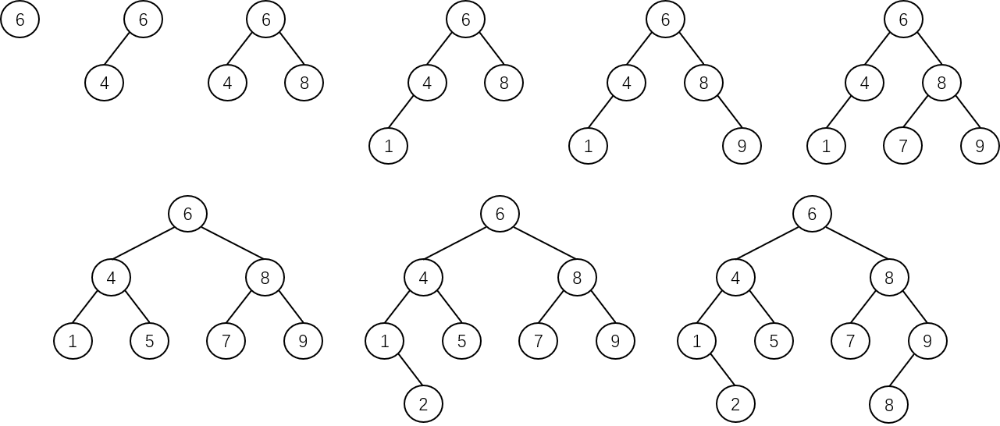
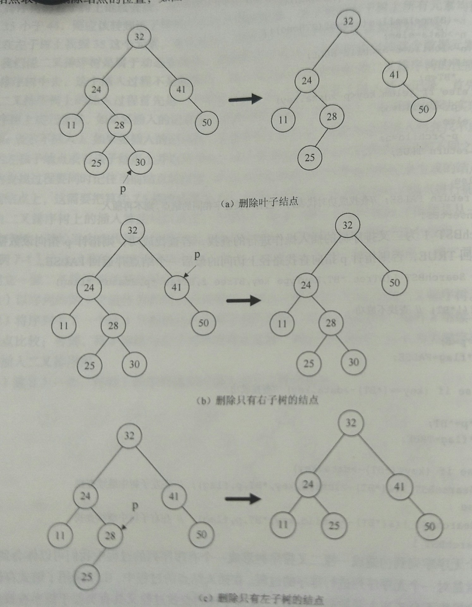
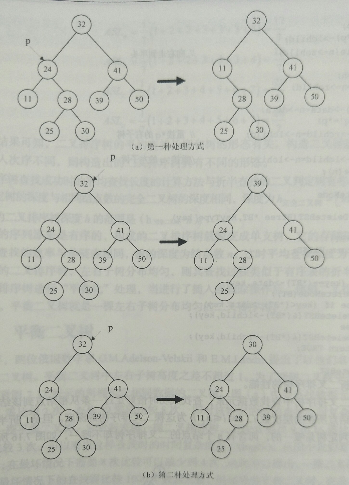
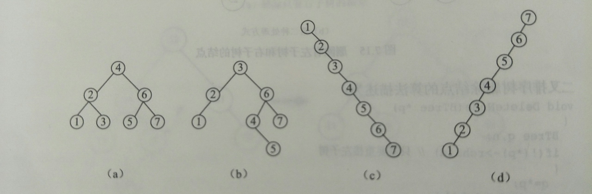

# 定义

**二叉排序树（Binary Sort Tree）**又称**二叉查找树（Binary Search Tree）**，简称 **BST**，可以是一棵**空树**，也可以是一棵具有以下性质的**二叉树**：

1. 若结点的左子树非空，则**左子树**上所有结点关键字的值均**小于**其根结点关键字的值。
2. 若结点的右子树非空，则**右子树**上所有结点关键字的值均**大于**其根结点关键字的值。
3. 结点的左、右子树也是二叉排序树。

二叉排序树的示意图如下：



显然二叉排序树也是一种**递归**的定义方式。

下图包含了 5 种不同的二叉排序树：



下图是几棵不具有 BST 性质的二叉树：



# 遍历特性

有二叉排序树：



对上图二叉排序树进行遍历后得到遍历序列：

- **前序遍历** - 23,18,12,20,44,35,52
- **中序遍历** - 12,18,20,23,35,44,52
- **后序遍历** - 12,20,18,35,52,44,23

很明显地可以看出来，二叉排序树的**中序遍历**是按照结点关键字值**升序遍历**的。中序遍历**投影法**同理：


而如果按照 **RDL** 的顺序进行遍历，就会得到 (52,44,35,23,20,18,12) 的序列，也就是按照结点关键字值**降序遍历**。

# 存储结构

上文的折半查找的查找表是顺序存储结构的有序表，而二叉排序树可以看成**树形结构的有序表**，可以把这两种不同存储结构之上的查找算法联系起来，它们具有相似的二分方法。

以二叉树的**二叉链表**作为二叉排序树的存储结构，并假设动态查找表只存储数据元素的关键字，另设两个指针分别指向左、右孩子结点。一般数据结构定义如下：

```c
typedef struct BTNode {
    ElemType data;
    struct BTNode *LChild, *RChild;
} BTNode, *BTree;
```

二叉排序树的一般查找算法实现如下：

```c
// 二叉排序树查找算法
BTree SearchBST(BTree BT, KeyType key) {
    // 如果二叉排序树为空，则查找失败，返回原树
    // 如果根结点就与 key 相等，直接返回根结点
    if (!BT || key == BT->data.key) {
        return BT;
    }
    // key 小于（根）结点关键字，查找左子树
    if (key < BT->data.key) {
        return SearchBST(BT->LChild, key);
    }
    // key 大于（根）结点关键字，查找右子树
    if (key > BT->data.key) {
        return SearchBST(BT->RChild, key);
    }
}
```

# 构造二叉排序树

构造一棵二叉排序树的过程就是**从一棵空的二叉排序树上开始逐个查找插入位置并插入结点**的过程。

例如有关键字序列 (6,4,8,1,9,7,5,2,8)，构造一棵二叉排序树的过程如下：

1. 以序列的**第一个值**作为**树的根结点**的关键字。
2. 将序列的下一个值与**树的根结点**的关键字进行比较：
   1. 如果 key 值**小于**根结点，则将 key 继续与（根）结点的**左孩子**（子树）比较。
   2. 如果 key 值**大于（或等于）**根结点，则将 key 继续与（根）结点的**右孩子**（子树）比较。
3. 到达**空子树**时，以 key 为关键字在二叉排序树中建立新结点。
4. 重复 2 和 3 的操作，将剩下的序列值依次插入到二叉排序树中。

该二叉排序树的构造过程如下：



从一个无序列表到构造成一棵二叉排序树形成一个有序序列的过程中可以得知，**构造二叉排序树的过程就是对一个无序序列进行排序的过程**。

# 插入操作

二叉排序树属于动态查找表，如果查找不成功，应该把给定的这个数据元素插入到二叉排序树中去。这个插入过程不是随意的，插入该记录后应该**保持二叉排序树的性质**。

二叉排序树的插入过程首先是一个查找过程，一般算法实现如下：

```c
// BT = 目标二叉排序树，key = 关键字，f = 上一个状态的 BT，p = BT 的替身，flag = 查找是否成功的标志
void SearchBST(BTree BT, KeyType key, BTree f, BTree *p, Status *flag) {
    // 空树查找失败
    if (!BT) {
        *p = f;
        *flag = FALSE;
        return;
    }
    // 查找成功
    if (key == BT->data.key) {
        *p = BT;
        *flag = TRUE;
        return;
    }
    
    // 查找失败则继续找子树
    if (key < BT->data.key) {
        SearchBST(BT->LChild, key, BT, p, flag);
    } else {
        SearchBST(BT->RChild, key, BT, p, flag);
    }
}
```

二叉排序树的插入的一般算法实现如下：

```c
Status InsertBST(BTree BT, ElemType elem) {
    // p = BT 的替身，n = 存储新结点
    BTree p, n;
    Status flag;
    
    SearchBST(BT, elem.key, NULL, &p, &flag);
    // 如果 BT 中没有 elem
    if (!flag) {
        // 创建新结点，数据元素为 elem
        n = (BTree) malloc(sizeof(BTNode));
        n->data = elem;
        n->LChild = n->RChild = NULL;
        
        // 如果原树是空树，则 n 为树的根结点
        if (!p) {
            BT = n;
            return TRUE;
        }
        
        // 否则比较关键字以判断是左孩子还是右孩子
        if (elem.key < p->data.key) {
            p->LChild = n;
        } else {
            p->RChild = n;
        }
        return TRUE;
    }
    return FALSE;
}
```

在插入结点的过程中，由于采用了**链式存储结构**，插入和删除操作不会造成大量数据的移动，二叉排序树的查找过程又具有类似**折半查找**的特性，所以是一种很好的动态查找表。

# 删除操作

在二叉排序树上的删除操作也很方便，删去树上一个结点相当于删去有序序列中的一个数据元素，只有在删除某个结点后依然保持二叉排序树的特点即可。二叉排序树的删除有以下几种情况：

1. **叶结点** - 若被删除的结点是叶结点，那么直接删除。
2. **只有左子树或右子树的结点** - 若被删除的结点只有左子树或右子树，那么就删除该结点，并将左子树或右子树的根结点代替该结点的位置。
3. **既有左子树又有右子树的结点** - 若被删除的结点既有左子树又有右子树，那么有两种处理方式：
   1. 将其左子树作为新的根结点，而原来的右子树则链接到左子树最右下的结点的右子树上。
   2. 将其在中序序列中的直接前驱或直接后继作为代替。

删除的几种情况的示意图如下：





二叉排序树的删除的一般算法实现如下：

```c
void DeleteNode(BTree p) {
    // q = p 的替身，n = 临时变量
    BTree q, n;
    
    // 若右子树为空，则将左子树的根结点替代被删除结点
    if (!p->RChild) {
        q = p;
        p = p->LChild;
        free(q);
        return;
    }
    // 若左子树为空，则将右子树的根结点替代被删除结点
    if (!p->LChild) {
        q = p;
        p = p->RChild;
        free(q);
        return;
    }
    // 若左、右子树均非空，这里采用第三种情况的第二点方法
    q = p;
    // 走到左子树的右尽头
    n = p->LChild;
    while (n->RChild) {
        q = n;
        n = n->RChild;
    }
    // 重接 q 的右子树
    if (q != p) {
        q->RChild = n->LChild;
    } 
    // 重接 q 的左子树
    else {
        q->LChild = n->LChild;
    }
    free(n);
}

Status DeleteBST(BTree BT, KeyType key) {
    // 如果树为空
    if (!BT) {
        return FALSE;
    }
    
    // 查找需要删除的结点，然后进入 DeleteNode()
    if (key == BT->data.key) {
        DeleteNode(BT);
    } else if(key < BT->data.key) {
        DeleteBST(BT->LChild, key);
    } else {
        DeleteBST(BT->RChild, key);
    }
    return TRUE;
}
```

# ASL

在一棵**深度为 $$h$$** 的二叉排序树中查找数据元素时，查找成功时恰好走过一条从根结点到该结点的路径，**比较次数**为该结点所在的**层次数 $$i(1{\leq}i{\leq}h)$$**。

但是在折半查找中，长度为 $$n$$ 的表的二叉判定树是**唯一**的；而含有 $$n$$ 个结点的二叉排序树却是**不唯一**的，示意图如下：



这四棵二叉排序树的**构造序列**分别为：

- **a** - 4,2,6,1,3,5,7
- **b** - 3,6,2,4,5,7,1
- **c** - (1,2,3,4,5,6,7)，属于**右单支二叉排序树**。
- **d** - (7,6,5,4,3,2,1)，属于**左单支二叉排序树**。

假设 7 个数据元素的查找概率相等，均为 1/7，则分别计算四棵树的 ASL 为：

$$
ASL_a=\frac{1}{7}(1+2\times2+3\times4)=\frac{17}{7}
$$

$$
ASL_b=\frac{1}{7}(1+2\times2+3\times3+4)=\frac{18}{7}
$$

$$
ASL_c=\frac{1}{7}(1+2+3+4+5+6+7)=\frac{28}{7}
$$

$$
ASL_d=\frac{1}{7}(1+2+3+4+5+6+7)=\frac{28}{7}
$$

从计算结果可知，**二叉排序树的 ASL 和树的形态有关**。构造二叉排序树时，如果数据元素的输入顺序不同，则构造出的二叉排序树也具有不同的形态。

二叉排序树查找成功时的 ASL 的计算方法与折半查找的二叉判定树有相似之处但不完全相同。**二叉排序树的深度与相同结点数的完全二叉树的深度相同**，深度为 $$[{\log}_{2}n]+1$$。

而一棵 n 个结点的**二叉排序树深度 h 的范围**是 $$[{\log}_{2}n]+1-n$$。

若给定的构造序列是**有序的**，构造的二叉树就是**单支树**，存储结构就可以简化成**单链表**，查找的效率就和单链表相同，这时的 ASL 为 **$$n+1/2$$**；若由构造序列建立的二叉排序树的**左、右子树分布均匀**，则其查找过程类似于有序表的**折半查找**。

因此，应该对二叉排序树进行**平衡化**处理，即**当进行了插入或删除操作后，使得二叉排序树的左、右子树分布均匀**。