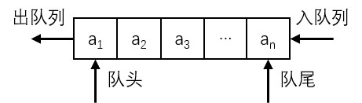

# 队列的基本概念

在实际生活中，经常需要靠排队来维持正常的秩序。众人排成一排，先到先操作，操作完毕后退出队列；后到的，则排在队列的尾部，且不能在队列的中间插入（插队）。数据结构中的队列就是对这种事务的抽象。

**队列（Queue）**也是一种受限的线性表，是一种**先进先出（First In First Out）**的线性表，简称为 **FIFO 表**。**删除端**称为**队头**，**插入端**称为**队尾**。队列的示意图如下：

和栈一样，队列的运算也是线性表的一个子集，其常用的基本运算有：

- **InitQueue** - 初始化队列。
- **QueueEmpty** - 判断队列是否为空队列。
- **InsertQueue** - 在队列中插入元素。
- **DeleteQueue** - 删除队列的队头元素。
- **GetHead** - 获取队头元素。