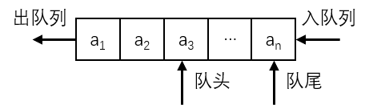

# 顺序队列

队列的顺序存储结构也用**一维数组**来模拟实现。

与栈的顺粗存储结构相似，也需要变量来记录队列中元素的数目，但是栈的元素增减变化只发生在顶端，底端固定不变，所以只需要设置一个变量来记录栈顶即可。而队列中元素的插入在队尾进行，删除在队头进行，因此需要两个变量来分别记录**队头**和**队尾**在数组中的位置，分别称为**队头指针**和**队尾指针**。

队列的顺序存储的一般数据结构定义如下：

```c
#define MAX_SIZE 100

// Sequential Queue
typedef struct {
    ElemType Elem[MAX_SIZE];
    // 队头指针（队头元素的下标）
    int Front;
    // 队尾指针（队尾元素的下标）
    int Rear;
} Squeue;
```

和栈一样，为了在 C 语言中描述方便，规定初始化队列时，令 **Front=Rear=-1**，也可以依此确定队列为空。

顺序队列的一般算法实现如下：

```c
void InitSque(Squeue &q) {
	q.Front = -1;
    q.Rear = -1;
}

Status IsEmpty(Squeue q) {
    if (q.Front == q.Rear) {
        return TRUE;
    }
    return FALSE;
}

Status IsFull(Squeue q) {
    if (q.Rear >= MAX_SIZE - 1) {
        return TRUE;
    }
    return FALSE;
}

Status InsertSque(Squeue &q, ElemType e) {
    if (IsFull(q) == TRUE) {
        printf("Queue Overflow\n");
        return ERROR;
    }
    
    // 修改队尾指针下标，并在数组的对应位置赋值
    q.Elem[++q.Rear] = e;
    return OK;
}

Status DelSque(Squeue &q, ElemType &e) {
    if (IsEmpty(q) == TRUE) {
        printf("Queue Empty\n");
        return ERROR;
    }
    
    // 修改队头指针下标，并返回原队头元素
    e = q.Elem[++q.Front];
    return OK;
}

void ListSque(Squeue q, void (*f)(ElemType e)) {
    for (int i = 0; i <= q.Rear; i++) {
        (*f) (q.Elem[i]);
    }
}
```

在顺序队列中需要考虑到**假溢出**的情况：



在上图中，队头指针指向第三个元素，说明队列中还有前三个元素的空间可用，但根据队满判断算法（IsFull），会认为队列已满，而队列的实际可用空间并未占满，这就是一种队列的假溢出。

为了能充分利用空间解决假溢出问题，可以采用将数据向前移动，让空的存储单元留在队尾的方法，修改后的算法如下：

```c
Status IsFull(Squeue &q) {
    if (q.Rear - q.Front >= MAX_SIZE - 1) {
        return TRUE;
    }
    
    // 解决假溢出
    if (q.Front > -1) {
        for (int i = 0; i < q.Rear - q.Front; i++) {
            q.Elem[i] = q.Elem[q.Front + i + 1];
        }
        q.Rear -= q.Front + 1;
        q.Front = -1;
    }
    
    return FALSE;
}
```
