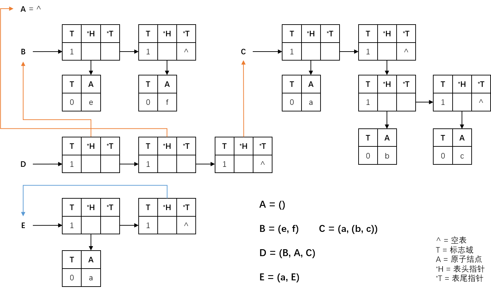
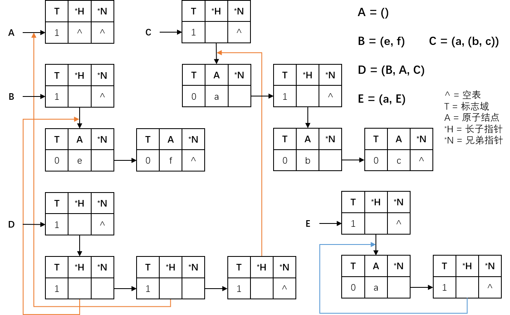

# 广义表的存储结构

由于广义表中的数据元素可以具有不同的结构，因此难以用顺序的存储结构来表示。而**链式的存储结构**分配较为灵活，易于解决广义表的**共享**与**递归**问题，所以通常采用链式的存储结构来存储广义表。

在链式存储结构下，数据元素可以用一个结点来表示。按照结点形式的不同，又可以分为不同的两种存储结构：**头尾表示法**和**孩子兄弟表示法**。

## 头尾表示法

若广义表非空，则可以分解成表头和表尾，也就是说，**一对确定的表头和表尾可以唯一地确定一个广义表**。头尾表示法就是根据这一性质设计而成的一种存储方法。

由于广义表中的数据元素既可能是单元素，也可能是列表，相应地，在头尾表示法中，结点的结构形式有两种：

- **原子结点** - 用于表示单元素，应该包括所表示单元素的元素值。

- **表结点** - 用于表示列表，应该包括指向表头和指向表尾的指针。

为了区分这两类结点，在结点中还要设置一个标志域。规定，如果标志为 0，则表示该结点为原子结点；如果标志为 1，则表示该结点为表结点。

头尾表示法的一般数据结构定义如下：

```c
typedef enum {
    // 原子结点标志
    ATOM = 0,
    // 表结点标志
    LIST = 1
} ElemTag;

// General Lists
typedef struct GLNode {
    // 标志域，区分表结点和原子结点和表结点
    ElemTag tag;
    // 以联合体作为结构成员，实现广义表结构的多层次表示
    union {
        // 原子结点
        AtomType atom;
        // 表结点
        struct {
            // 表头指针，表尾指针
            struct GLNode *head, *tail;
        } ptr;
    } val;
} *GList;
```

采用头尾表示法容易分清列表中单元素或子表所在的层次，示意图如下：



## 孩子兄弟表示法

在孩子兄弟表示法中，也有两种结点形式：

- **无孩子结点** - 用于表示单元素，包括一个指向兄弟的指针和该元素的元素值。
- **有孩子结点** - 用于表示列表，包括一个指向第一个孩子（长子）的指针和一个指向兄弟的指针。

同样地，设置一个标志域以区分这两类结点。如果标志为 0，则表示该结点为无孩子结点；如果标志为 1，则表示该结点为有孩子结点。

孩子兄弟表示法的一般数据结构定义如下：

```c
typedef enum {
    // 无孩子结点
    ATOM = 0,
    // 有孩子结点
    LIST = 1
} ElemTag;

typedef struct GLNode {
    // 标志域
    ElemTag tag;
    // 多层次结构
    union {
        // 无孩子结点的元素值
        AtomType atom;
        // 有孩子结点的指向长子的指针
        struct GLNode *head;
    } val;
    // 指向兄弟的指针
    struct GLNode *next;
}
```

采用孩子兄弟表示法时，表达式中的左括号对应存储表示中的有孩子结点，而且**最高层结点的 *next 必为 NULL**，示意图如下：


