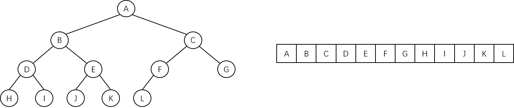
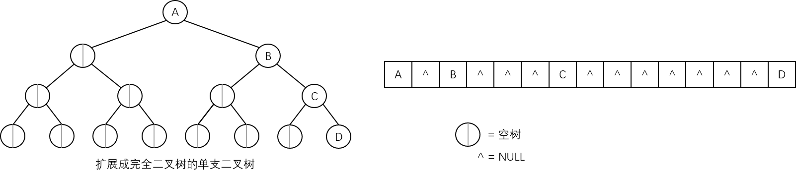
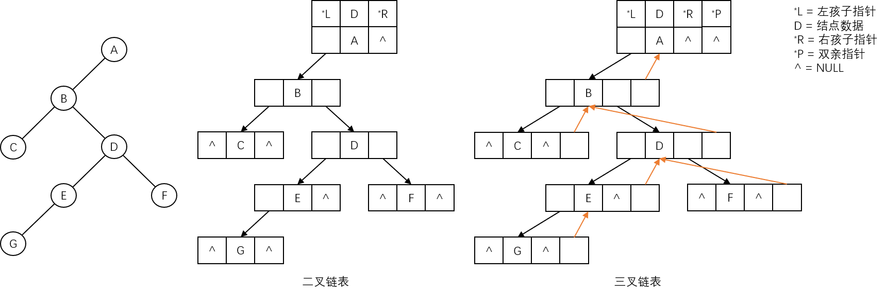

# 二叉树的存储结构

## 顺序存储结构

顺序的存储结构是用一组连续的存储单元来存放二叉树的数据元素，因此，必须把结点安排成一个适当的线性序列，使得结点在这个序列中的相互位置能反映出结点之间的逻辑关系。

在一棵具有 $$n$$ 个结点的完全二叉树中，**从树根起，从上层到下层，每层从左到右地给所有结点编号**，就能得到一个足以反映整个二叉树结构的线性序列，示意图如下：



对于二叉树中的满二叉树和完全二叉树，用**向量**进行存储既不浪费内存，又可以利用地址公式确定其结点的位置：

- 结点 $$i$$ 的左孩子的位置为：
  
  $$
  Loc\_LChild(i)=2\times i
  $$

- 结点 $$i$$ 的右孩子的位置为：
  
  $$
  Loc\_RChild(i)=2\times i+1
  $$

**但对于一般的二叉树，也必须按照完全二叉树的形式来进行存储，这样就造成了内存的浪费**。一种极端的情况如下图所示：



从上图可以看出，对于一个深度为 $$k$$ 的二叉树，在最坏的情况下，每个结点只有右孩子，此时需要占用 **$$2^{k}-1$$** 个存储单元，而实际该二叉树只有 $$k$$ 个结点，**空间浪费太多**。这是顺序存储结构的一大缺点。

## 链式存储结构

用顺序存储结构来存储一般的二叉树会浪费存储空间，并且若在树中需要经常插入和删除结点时，需要大量地移动结点，顺序存储方式就更不可取了。因此，**存储树的最自然的方法是链接的方法**。

对于任意的二叉树来说，每个结点只有两个孩子和一个双亲结点，因此，结点应至少包括三个域：

- **Data 数据域** - 记录结点的信息。
- **LChild 左孩子域** - 指向结点的左孩子结点。
- **RChild 右孩子域** - 指向结点的右孩子结点。

二叉树的链式存储的一般数据结构定义如下：

```c
typedef struct Node {
    ElemType Data;
    struct Node *LChild, *RChild;
} BinaryTreeNode, *BinaryTreePoint;
```

有时，为了方便找到双亲结点，可以增加一个 **Parent 域**，指向结点的双亲结点。

**只包含左、右孩子指针的结点结构**形成的二叉树的链式存储结构称为**二叉链表**；**包含左、右孩子指针和双亲指针的结点结构**形成的二叉树的链式存储结构称为**三叉链表**。示意图如下：



在二叉树中，**每个结点不一定都有左孩子或右孩子**，所以二叉链表或三叉链表中也会出现许多空域，进而浪费存储空间。

一般地，在具有 $$n$$ 个结点的二叉链表中，共有 **$$2n$$** 个指针域，其中只有 **$$n-1$$** 个用来指示结点的左、右孩子，其余的 **$$n+1$$** 个指针域为空。

> 在线索二叉树中会进一步讨论如何利用这些空域。

不同的存储结构实现的二叉树操作也不同。例如需要查找某个结点的父结点，在三叉链表中很容易就能实现，而在二叉链表中需要从根指针出发遍历查找。可见，**在实际应用中，需要根据二叉树的形态和需要进行的操作来决定二叉树的存储结构**。