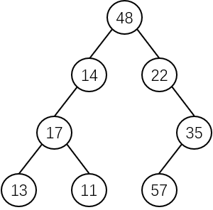
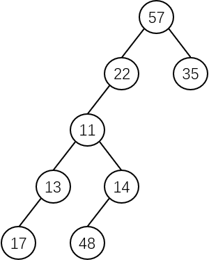
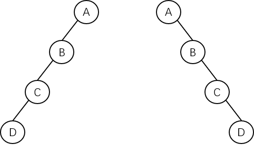

对于给定的二叉树，经过先序、中序和后序遍历，可以得到该二叉树相应的三种顺序序列，即先序序列、中序序列和后序序列。

假设已知某二叉树的先序序列 PreOrder 和中序序列 InOrder，那么通过 PreOrder 和 InOrder 是否可以唯一地构造出相应的二叉树？这就是要讨论的二叉树的唯一性的问题。

# 由先序序列和中序序列唯一确定一棵二叉树

由二叉树的遍历定义可知，在二叉树结点的**先序序列**中，**第一个结点是二叉树的根结点**；在二叉树结点的**中序序列**中，**根结点将序列分割成为了两部分**，根结点**之前**是**左子树结点的中序序列**，根结点**之后**是**右子树结点的中序序列**。

例如，已知某二叉树的先序序列和中序序列分别为：

- **先序序列** - $$T=(48,14,17,13,11,22,35,57)$$。
- **中序序列** - $$T=(13,17,11,14,48,22,57,35)$$。

首先，由先序序列得二叉树的**根结点为 48**，则其**左子树的中序序列为 (13,17,11,14)**、**右子树的中序序列为 (22,57,35)**；其**左子树的先序序列为 (14,17,13,11)**、**右子树的先序序列为 (22,35,57)**。这样，就得到了根结点的左子树的中序和先序序列以及右子树的中序和先序序列：

- **根结点** - 48。
- **根结点的左子树**
  - **中序序列** - $$T=(13,17,11,14)$$。
  - **先序序列** - $$T=(14,17,13,11)$$。
- **根结点的右子树**
  - **中序序列** - $$T=(22,57,35)$$。
  - **先序序列** - $$T=(22,35,57)$$。

继续从**根结点的左、右子树的序列**中可以得到：

- **根结点** - 48。
- **根结点的左子树**
  - **中序序列** - $$T=(13,17,11,14)$$。
  - **先序序列** - $$T=(14,17,13,11)$$。
  - **根结点** - 14。
  - **根结点的左子树**
    - **中序序列** - $$T=(13,17,11)$$。
    - **先序序列** - $$T=(17,13,11)$$。
    - ……
  - **根结点的右子树** - 不存在。
- **根结点的右子树**
  - **中序序列** - $$T=(22,57,35)$$。
  - **先序序列** - $$T=(22,35,57)$$。
  - **根结点** - 22。
  - **根结点的左子树** - 不存在。
  - **根结点的右子树**
    - **中序序列** - $$T=(57,35)$$。
    - **先序序列** - $$T=(35,57)$$。
    - ……

如此反复地**求各个根结点左、右子树的序列**，就可以唯一求得整棵二叉树，示意图如下：

# 由后序序列和中序序列唯一确定一棵二叉树

由后序和中序序列求二叉树的步骤与由先序和中序序列的步骤类似。

例如，已知某二叉树的后序序列和中序序列分别为：

- **后序序列** - $$T=(17,13,48,14,11,22,35,57)$$。
- **中序序列** - $$T=(17,13,11,48,14,22,57,35)$$。

由二叉树的遍历定义可知，在二叉树结点的**后序序列**中，**最后一个结点是二叉树的根结点**，故可得：

- **根结点** - 57。
- **根结点的左子树**
  - **中序序列** - $$T=(17,13,11,48,14,22)$$。
  - **后序序列** - $$T=(17,13,48,14,11,22)$$。
  - **根结点** - 22。
  - **根结点的左子树**
    - **中序序列** - $$T=(17,13,11,48,14)$$。
    - **后序序列** - $$T=(17,13,48,14,11)$$。
    - ……
  - **根结点的右子树** - 不存在。
- **根结点的右子树**
  - **中序序列** - $$T=(35)$$。
  - **后序序列** - $$T=(35)$$。
  - **根结点** - 35。

如此反复地**求各个根结点左、右子树的序列**，就可以唯一求得整棵二叉树，示意图如下：

# 证明

**定理：已知二叉树的先序序列和中序序列，可唯一确定一棵二叉树。**

证明：用数学归纳法证明。

设二叉树的先序序列和中序序列分别为 **PreOrder** 和 **InOrder**。易知，PreOrder 和 InOrder 序列中的数据元素个数都是相等的，设其为 **$$m$$**。

当 **$$m=1$$** 时，PreOrder 和 InOrder 中仅含有一个相同的数据元素。根据先序遍历和中序遍历的规则可知，所确定的二叉树的根结点就是该元素，并且它无左、右孩子，**这样的二叉树必然是唯一的**。

假设：当 $$m<i$$ 时，由 PreOrder 和 InOrder 可以唯一确定一棵二叉树。

现证明：当 **$$m=i$$** 时，由 PreOrder 和 InOrder 也可以唯一确定一棵二叉树。

设 PreOrder[k] 和 InOrder[k] 分别表示二叉树先序序列和中序序列的第 $$k$$ 个元素。

根据先序遍历的规则可知，**PreOrder[1]** 是二叉树的**根结点**（此处证明以 1 作为数组的起始下标）。

由于 InOrder 是同一棵二叉树的中序序列，所以根 PreOrder[1] 必在 InOrder 中。假设 PreOrder[1] 元素在 InOrder 中的下标是 **$$j$$**，即 PreOrder[1]=InOrder[j]。根据中序遍历的规则可知：

- **PreOrder[1] 元素的左子树的中序序列** - $$T=(InOrder[1],InOrder[2],...,InOrder[j-1])$$。
- **PreOrder[1] 元素的右子树的中序序列** - $$T=(InOrder[j+1],InOrder[j+2],...,InOrder[i])$$。

显然，PreOrder[1] 的左子树先序序列的长度等于其左子树中序序列的长度，即 **$$j-1$$**；PreOrder[1] 的右子树先序序列的长度等于其右子树中序序列的长度，即 **$$i-j$$**。因此：

- **PreOrder[1] 元素的左子树的先序序列** - $$T=(PreOrder[2],PreOrder[3],...,PreOrder[j])$$。
- **PreOrder[1] 元素的右子树的先序序列** - $$T=(PreOrder[j+1],PreOrder[j+2],...,PreOrder[i])$$。

由于 $$j-1<i$$、$$i-j<i$$，所以，根据归纳假设可知，由根结点 PreOrder[1] 的左子树先序序列和中序序列可以唯一确定其左子树；同样地，由根结点 PreOrder[1] 的右子树先序序列和中序序列可以唯一确定其右子树。

所以，**当 $$m=i$$ 时，可以唯一确定一棵二叉树**。

根据归纳原理，证毕。

> 证明二叉树的后序序列和中序序列能唯一确定二叉树的过程和上述类似，这里不再过多赘述。
>

需要注意的是，**不能由先序序列和后序序列唯一确定一棵二叉树**。例如已知先序序列 $$(A,B,C,D)$$ 和后序序列 $$(D,C,B,A)$$ 可以得到两棵不同的二叉树，示意图如下：

