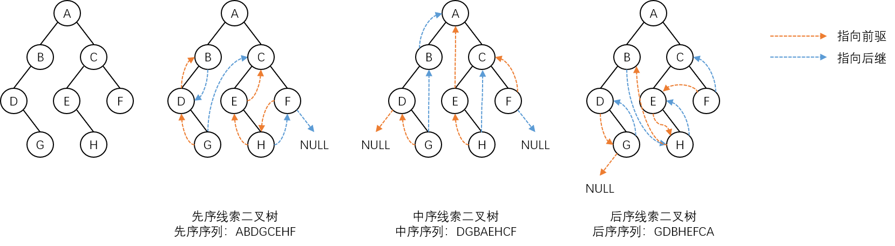

# 二叉树的线索化

线索化实质上是**将二叉链表中的空指针域填上相应结点的遍历前驱或遍历后继结点的地址**，而前驱和后继的地址只能在动态的遍历过程中才能得到，因此，**线索化的过程即为在遍历过程中修改空指针域的过程**。

对二叉树按照不同的遍历顺序进行线索化，可以得到不同的线索二叉树，包括**先序线索二叉树**、**中序线索二叉树**和**后续线索二叉树**。

下面以中序线索化为例来介绍二叉树线索化的算法。

只要按照中序遍历二叉树，并在遍历过程中用线索取代空指针域即可。为此，另设一个指针 Pre，使它始终指向遍历过程中刚刚访问过的结点：

- **设置前驱** - 如果遍历过程中当前结点的 LChild 指针域为空，则设置前驱线索，把 Pre 的值填入 LChild 指针域，并修改 LTag 域的值为 1。
- **设置后继** - 如果遍历过程中 Pre 结点不为 NULL 且 Pre 结点的 RChild 指针域为 NULL，则进行设置后继线索操作，把当前结点的地址填入 Pre->RChild 域中，Pre->RTag 域的值设置为 1。

```c
void ThreadBinaryTree(BinaryTreeNode *Root) {
    BinaryTreeNode *Pre;
    if (Root != NULL) {
        ThreadBinaryTree(Root->LChild);
        if (Root->LChild == NULL) {
            Root->LChild = Pre;
            Root->LTag = 1;
        }
        if (Pre != NULL && Pre->RChild == NULL) {
            Pre->RChild = Root;
            Pre->RTag = 1;
        }
        Pre = Root;
        ThreadBinaryTree(Root->RChild);
    }
}
```

递归过程中对每一个结点仅做一次访问，因此对于 $$n$$ 个结点的二叉树，进行线索化算法的时间复杂度为 **$$O(n)$$**。

**对于同一棵二叉树，遍历的方法不同，得到的线索二叉树也不同**，示意图如下：


