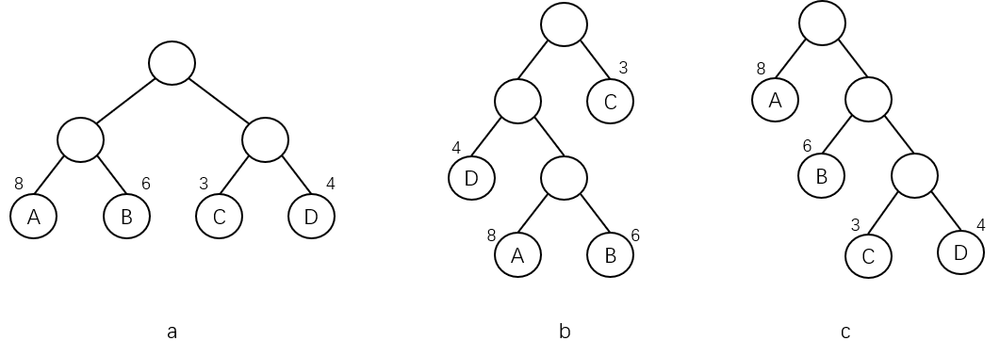

哈夫曼树又称**最优树**，是一种**带权路径长度**最短的树，有着广泛的应用。

> **哈夫曼树并不局限于二叉树，有多叉树的形式，只是二叉树的形式较为常见。**

与哈夫曼树有关的术语如下：

- **路径** - 从一个结点到另一个结点之间的**分支序列**。

- **路径长度** - 一个结点到另一个结点所经过的**分支数目**，即**连接线的根数**。

- **结点的权/权值** - 在实际应用中，常常给树的每个结点赋予**一个具有某种实际意义的实数**，这个实数就是该结点的权。

- **带权路径长度** - 从树根结点到某一结点的路径长度与该结点的权的乘积。

- **树的带权路径长度** - 树中所有叶结点的带权路径长度之和，通常记为：
  
  $$
  WPL=\sum_{i}^{n}w_i\times l_i
  $$
  
  其中 $$n$$ 为叶结点的个数，$$w_i$$ 为第 $$i$$ 个叶结点的权值，$$l_i$$ 为第 $$i$$ 个叶结点的路径长度。

**如果给定一组具有权值的叶结点，可以构造出不同的带权二叉树。**

例如，给出 4 个叶结点 A、B、C、D，其权值分别为 3、4、6、8，可以构造出形状不同的许多个二叉树，这些形状不同的二叉树的带权路径长度将各不相同。示意图如下：

上图三树的带权路径长度分别为：

- $$WPL(a)=8{\times}2+6{\times}2+3{\times}2+4{\times}2=42$$。
- $$WPL(b)=8{\times}3+6{\times}3+3{\times}1+4{\times}2=53$$。
- $$WPL(c)=8{\times}1+6{\times}2+3{\times}3+4{\times}3=41$$。

其中，**带权路径长度最小的二叉树称作最优二叉树或哈夫曼树**。

一般来说，在叶结点数目和权值相同的二叉树里，完全二叉树不一定是最优二叉树；最优二叉树也不一定是深度最小的二叉树。

根据哈夫曼树的定义，一棵二叉树要使其 WPL 值最小，必须**使权值越大的叶结点越靠近根结点，而权值越小的叶结点越远离根结点**。

哈夫曼（Huffman）最早给出了一个带有一般性规则的算法——**哈夫曼算法**，其操作步骤如下：

1. 用给定的 $$n$$ 个权值 $$W=\{w_1,w_2,...,w_n\}$$ 对应的 $$n$$ 个结点构成 $$n$$ 棵二叉树的森林 $$F=\{T_1,T_2,...,T_n\}$$，其中每一棵二叉树 $$T_i(1{\leq}i{\leq}n)$$ 都只有一个权值为 $$w_i$$ 的根结点，其左、右子树均为空。
1. 在森林 $$F$$ 中选择两棵根结点权值最小的二叉树，作为一棵新二叉树的左、右子树（一般约定权值小的在左，权值大的在右，但并不是硬性要求），标记新二叉树的根结点权值为其左、右子树的根结点权值之和。
1. 从 $$F$$ 中删除被选中的那两棵二叉树，同时把新构成的二叉树加入到森林 $$F$$ 中。
1. 重复 2 和 3 的操作，直到森林中只含有一棵二叉树为止，此时得到的这棵二叉树就是哈夫曼树。

例如，给出 4 个叶结点 A、B、C、D，其权值分别为 6、4、8、3，其哈夫曼树的构造过程的示意图如下：

> **同一组权值构造的哈夫曼树不是唯一的。因为没有限定左右子树，并且有权值重复时，可能树的高度都不唯一，唯一的只是带权路径长度之和最小。**