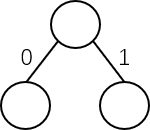
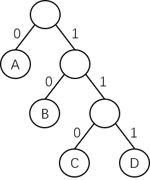

# 哈夫曼编码的基本概念

哈夫曼树应用十分广泛，**在不同的应用中，结点的权值可以有不同的解释**。在信息编码中，权可以看成是某个符号出现的频率；在排序问题中，权可以看成是已经排好序而且待合并的序列的长度等。

下面以哈夫曼编码为例来说明哈夫曼树的应用。

在数据通信中，经常需要将传送的信息转换成**由二进制组成的字符串**来传送。在发送端，需要将电文中的字符转换成二进制，这个过程称为**编码**；在接收端，需要将接收到的二进制编码串转换成对应的字符串，这个过程称为**译码**。

在传送电文时，总是希望传送时间尽可能地快，这就要求电文代码尽可能短。如果对每个字符设计长度不等的编码，且让电文中出现次数较多的字符采用尽可能短的编码，则传送电文的总长度便可以减少。

假设设计 A、B、C、D 的编码分别为 0、00、1 和 01，则电文 "ABACCDA" 可以转换成总长度为 9 的字符串 "000011010"。但是这样的电文无法正确地翻译，例如传送过去的字符串中前 4 个字符的子串 "0000" 就有多种翻译方法，有 "AAAA"、"ABA"、"BB" 等。

因此，若要设计变长的编码，那么这种编码必须满足一个条件：**必须使任何一个字符的编码都不是另一个字符编码的前缀，这样才能保证译码的唯一性**。通常把满足这个条件的编码叫做**前缀编码**。

在哈夫曼树中，由于**每个待编码的结点都是叶结点**（此处设计为字符结点），它们不可能在根结点到其他结点的路径上，所以任意一个字符的哈夫曼编码不可能是另一个字符的哈夫曼编码的前缀，从而保证了译码的非二义性。

下面来讨论哈夫曼编码的算法，可以利用二叉树来设计编码。

首先规定二叉树的**左分支表示 "0" 字符**，**右分支表示 "1" 字符**，示意图如下：

假设有一棵二叉树：

其 4 个叶结点分别表示 A、B、C、D 四个字符，**从根结点到叶结点的路径上的分支字符组成的字符串作为该叶结点字符的编码，这样得到的编码一定是二进制前缀编码**。

上图中 A、B、C、D 的二进制前缀编码分别为：0、10、110、111。

若要得到使电文总长度最短的二进制前缀编码，可以设置每种字符在电文中出现的频率为 $$w_i$$，其编码长度为 $$l_i$$，电文中只有 $$n$$ 种字符，则电文总长为：

$$
\sum_{i=1}^{n}{w_i}\times{l_i}
$$

对应到二叉树上，设 $$w_i$$ 为叶结点的权，$$l_i$$ 为根结点到叶结点的路径长度，则电文总长恰好为**二叉树的带权路径长度**。

由此可见，可以利用哈夫曼树构造使电文的编码总长度最短的编码方案，即**以 $$n$$ 种字符出现的次数或频率作为权值来构造相应的哈夫曼树**，这样就把问题转换为设计一棵哈夫曼树的问题，由此得到的二进制前缀编码便成为**哈夫曼编码**，又称**最优编码**。