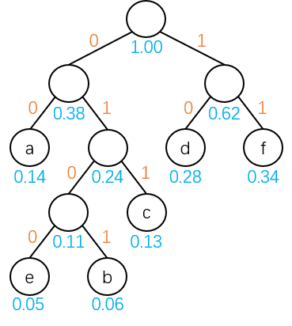

初始时，把每个待编码的叶结点都看成一棵独立的二叉树，则 $$n$$ 个叶结点可以看成由 $$n$$ 棵二叉树构成的森林，其中每棵二叉树中有且仅有一个孤立的结点，它们既是根结点，又是叶结点。

由哈夫曼算法可知，将当前森林中两棵根结点权值最小的二叉树合并成一棵新二叉树，每合并一次森林中就减少一棵哈夫曼树，这需要进行 **$$n-1$$ 次合并**才能使森林中的二叉树的数目由 $$n$$ 棵减少至剩下一棵最终的哈夫曼树。

并且每次合并，都要产生一个新结点，合并 $$n-1$$ 次共产生 **$$n-1$$ 个新结点**，显然它们都是拥有两个孩子的分支结点，最终求得的哈夫曼树中共有 **$$2n-1$$ 个结点**，其中 $$n$$ 个结点是初始森林中的 $$n$$ 个孤立结点，并且哈夫曼树中没有度为 $$1$$ 的分支结点——这类树又叫做**正则二叉树**。

在哈夫曼树构造完成之后，为求**编码**需要从叶结点出发，走一条从叶结点到根的路径；为求**译码**需要从根结点出发，走一条从根结点到叶结点的路径。

例如，由信息集合 $$M=\{a,b,c,d,e,f\}$$，且这些信息在某应用领域出现的概率依次是 0.14、0.06、0.13、0.28、0.05、0.34。

为了对信息集合 $$M$$ 进行最优编码，首先构造由权值 0.14、0.06、0.13、0.28、0.05、0.34 所决定的哈夫曼树，示意图如下：



从哈夫曼树的根结点开始到每个叶结点的路径上所有标记的序列即为叶结点所对应的字符的编码。显而易见的，信息集合 $$M$$ 的编码依次是：00、0101、011、10、0100、11。

需要注意的是，**哈夫曼树的性质决定了哈夫曼编码使得任何信息序列的编码总长度最短**。

由于哈夫曼树中没有度为 $$1$$ 的结点，则**一棵有 $$n$$ 个叶结点的哈夫曼树共有 $$2n-1$$ 个结点**，可以用一个大小为 $$2n-1$$ 的一维数组存放哈夫曼树的各个结点。由于结点同时还包含其双亲信息和孩子信息。

构造哈夫曼树的一般算法实现如下：

```c
// 最大权值
#define MAX_WEIGHT 10000
// 最大叶结点数量
#define MAX_LEAF_COUNT 40
// 最大结点数量
#define MAX_NODE_COUNT MAX_LEAF_COUNT * 2 - 1

typedef struct {
    // 权值
	int Weight;
    // 双亲结点下标
	int Parent;
    // 左孩子下标
	int LChild;
    // 右孩子下标
	int RChild;
} HNode;

void HuffmanTree(HNode HuffmanNode[]) {
	int n;
	puts("请输入叶结点的个数：");
	scanf("%d", &n);
	
	// 初始化数组 
	for (int i = 0; i < 2 * n - 1; i++) {
		HuffmanNode[i].Weight = 0;
		HuffmanNode[i].Parent = -1;
		HuffmanNode[i].LChild = -1;
		HuffmanNode[i].RChild = -1;
	}
	
	// 初始化叶结点的权值 
	for (int i = 0; i < n; i++) {
		printf("请输入第 %d 个叶结点的权值：", i + 1);
		scanf("%d", &HuffmanNode[i].Weight);
	}
	
	// 构造哈夫曼树
	int a1, a2, b1, b2;
	for (int i = 0; i < n - 1; i++) {
		a1 = a2 = MAX_WEIGHT;
		b1 = b2 = 0;
		for (int j = 0; j < n + i; j++) {
			if (HuffmanNode[j].Weight < a1 && HuffmanNode[j].Parent == -1) {
				a2 = a1;
				b2 = b1;
				a1 = HuffmanNode[j].Weight;
				b1 = j;
			} else if (HuffmanNode[j].Weight < a2 && HuffmanNode[j].Parent == -1) {
				a2 = HuffmanNode[j].Weight;
				b2 = j;
			}
		}
		// 将找出来的两棵二叉树合并为一棵二叉树，作为新二叉树的左、右子树 
		HuffmanNode[b1].Parent = HuffmanNode[b2].Parent = n + i; 
		HuffmanNode[n + i].Weight = HuffmanNode[b1].Weight + HuffmanNode[b2].Weight;
		HuffmanNode[n + i].LChild = b1;
		HuffmanNode[n + i].RChild = b2;
	} 
}
```

求哈夫曼编码的一般算法实现如下：

```c
// 哈夫曼编码的最大长度
#define MAX_CODE_LENGTH 20

typedef struct {
	int Code[MAX_CODE_LENGTH];
	int Start;
} HCodeType;

void HuffmanCode() {
	HNode HuffmanNode[MAX_NODE_COUNT];
	HCodeType HuffmanCode[MAX_LEAF_COUNT], cd;

	// 建立哈夫曼树
	int n = HuffmanTree(HuffmanNode);

	// 求每个叶结点的哈夫曼编码
	int a, p;
	for (int i = 0; i < n; i++) {
		cd.Start = n - 1;
		a = i;
		p = HuffmanNode[a].Parent;
		while (p > 0) {
			if (HuffmanNode[p].LChild == a) {
				cd.Code[cd.Start]=0;
			} else {
				cd.Code[cd.Start]=1;
			}
			cd.Start--;
			a = p;
			p = HuffmanNode[a].Parent;
		}
		for(int j = cd.Start + 1; j < n; j++) {
			HuffmanCode[i].Code[j] = cd.Code[j];
		}
		HuffmanCode[i].Start=cd.Start;
	}

	// 输出每个叶结点的哈夫曼编码
	for (int i = 0; i < n; i++) {
		for (int j = HuffmanCode[i].Start + 1; j < n; j++) {
			printf("%1d", HuffmanCode[i].Code[j]);
		}
		printf("\n");
	}
}
```
