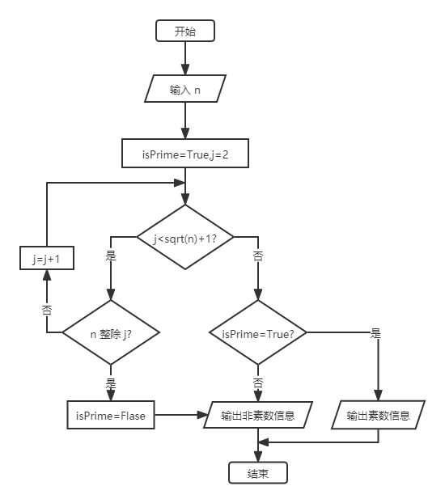

# 算法描述和算法分析

## 算法的概念

**算法（Algorithm）**是计算机科学中的重要概念之一，是程序设计的精髓。程序设计的实质就是对要解决的问题选择一个好的数据结构，同时在此结构上运用一种好的算法，并将其转化为计算机语言，也就是说：`数据结构+算法=程序`。

本篇中，认为算法是**一组有穷的且定义明确的规则**，它们规定了解决某一特定类型问题的一系列运算，是对解题方案的准确与完整的描述。通常一个问题可以有多个算法，一个给定的算法解决一个特定的问题。

算法一般应具备以下五个基本特征：

1. **有穷性/有限性（Finiteness）** - 一个算法必须在执行有穷步之后结束，且每一步都可在有穷时间内完成（有穷不是纯数学概念，是指在实际应用中是合理的、可接受的）。
2. **确定性（Definiteness）** - 算法中的每一步都必须有确切的含义，且无多义性。
3. **可行性/有效性（Effectiveness）** - 算法中的每一步都是可行的，即都可以通过已实现的基本操作执行有限次并得以实现。
4. **输入（Input）** - 一个算法有**零个或多个**输入，在运算开始之前给出算法所需数据的初始值，这些输入取自特定的对象集合，另外有些输入可以在算法执行过程中提供。
5. **输出（Output）** - 作为算法运算的结果，一个算法产生**一个或多个**输出，这些输出是同输入有某种特定关系的量。

要设计一个好的算法，除了具备以上五个基本特征之外，通常还应该考虑以下几个要求：

- **正确性（Correctness）** - 一个正确的算法是指在合理的数据输入下，能够**正确地执行**预先规定的功能和性能要求，在有限的运行时间内得出**正确的结果**。正确性是设计和评价一个算法的**首要条件**。
- **可读性（Readability）** - 一个算法应该**便于阅读和交流**，好的可读性有助于对算法的理解，也有助于程序的调试和维修。在保证算法正确性的前提下，应该强调算法的可读性，为了达到这个目的，需要有一个清晰的算法逻辑和保持良好的编程风格。
- **健壮性（Robustness）** - 一个健壮的算法应该能够对不合理的输入进行**检查和异常处理**，以提高算法的容错性，减少出现异常中断或死机现象的概率。
- **高效性（Efficiency）** - 指算法的执行效率高，包括时间效率和空间效率两个方面。对于同一个算法，如果执行时间越短，所需存储量越小，则算法效率越高。效率和存储量都与问题的规模有关。

## 算法的描述

设计出来的算法需要一种语言来描述，可以清楚地表达问题的求解步骤，一般有自然语言、流程图、程序设计语言、伪代码等。

下面以判断一个自然数 n 是否为素数为例，列出几种算法描述的说明。

### 自然语言

用自然语言描述算法，最大的优点是**容易理解**，但缺点是**算法表达不够精确，容易出现二义性**。

用自然语言判断素数的算法步骤如下：

1. 输入自然数 n。
2. 判断 n 能否被 2 到 n+1 的平方根之间任意一个数整除。
3. 如果能被整除，则输出非素数的信息，否则就输出素数的信息。
4. 程序结束。

### 流程图

用流程图来描述算法，就是使用国际标准的流程图图形符号来表示算法的求解步骤，通常有 **ANSI 标准**和 **ISO 标准**。

以 ANSI 标准绘制判断素数的算法流程图如下：



### 程序设计语言

用程序设计语言来描述算法，就是直接用某种程序设计语言来表达算法的求解过程，其特点是**算法描述准确、严谨和结构化程度高**，通过编译器编译和链接生成机器代码后就可以直接运行，**不足是细节过多，直观性差**，经常需要借助程序注释才能明白算法的含义。

编写判断素数的算法如下：

```c
#include <stdio.h>
#include <math.h>

int main() {
	// 输入数据
	int n;
	printf("请输入一个自然数：\n");
	scanf("%d", &n);

	// 默认为素数
	int isPrime = 1;
	// 判断的区间为 2 到 n+1 的平方根
	for(int i = 2; i <= (int)sqrt(n) + 1; i++) {
		// 如果出现能整除的数，就结束循环，并标志为非素数
		if (!(n % i)) {
			isPrime = 0;
			break;
		}
	}

	// 输出结果
	if (isPrime) {
		printf("这个数是素数");
	} else {
		printf("这个数不是素数");
	}

	// 结束程序
	return 0;
}
```

### 伪代码

伪代码介于程序设计语言和自然语言之间，它忽略了程序设计语言中的一些严格语法规则与描述细节，可以采用英文和中文混合书写，以便把注意力主要集中在算法处理步骤的描述上。

伪代码**比程序设计语言更容易理解**，同时又**比自然语言更接近程序语言**，很多算法都是用伪代码进行描述的。

用伪代码描述判断素数的算法如下：

```tex
BEGIN
	step 1: isPrime←1; i←2;
	step 2: n←自然数;
	step 3: DO UNTIL (i<(int)sqrt(n)+1)
	step 4: 	IF (n能整除i) THEN isPrime←0;
	step 5: 	i←i+1;
	step 6: END DO
	step 7: IF isPrime=1 THEN PRINT "这个数是素数" ELSE PRINT "这个数不是素数"
END
```

## 算法分析

一个算法设计好了之后会评价算法的效率和优劣，估算算法效率的方法就称作**算法分析（Algorithm Analysis）**，通常考虑对算法所消耗的资源进行估算，采用的方法有**事后统计法**和**事前分析估算法**。

### 事后统计法

利用计算机内部的计时功能，得到一组统计数据以分辨算法执行效率的优劣，但事后统计必须先运行依据算法编制的程序，所有得到的时间统计都依赖于计算机的硬件、软件等环境因素（例如与计算机的指令集或编译系统的质量有关），有时容易掩盖算法本身的优劣。

因此，往往采用事前分析估算的方法分析算法。

### 事前分析估算法

一个用高级程序语言编写的程序在计算机上运行时所消耗的时间取决于以下因素：

- 依据算法选用何种策略。
- 问题的规模。例如求 100 以内的素数还是求 1000 以内的素数，**规模越大，执行效率越低**。
- 书写程序的语言。对于同一个算法，**实现语言的级别越高，执行效率越低**。
- 编译程序所产生的机器代码的质量。
- 机器执行指令的速度。

后三种因素都与具体的机器有关，抛开这些因素，仅考虑算法本身的效率高低，可以认为**一个特定算法的运行工作量的大小只依赖于问题的规模**（通常用整数 n 表示），或者说**效率是问题规模的函数**。

一个算法是由**控制结构**（顺序、分支和循环）和**原操作**（指固有数据类型的操作）构成的，**算法时间**取决于两者的综合效果。

为了便于比较同一问题下的不同算法，通常的做法是从算法中选取一种对于所研究的问题来说是基本运算的原操作，以该基本运算重复执行的次数作为算法的时间度量。

评价一个算法，通常用时间复杂度和空间复杂度进行衡量。

- **时间复杂度** - 指执行算法所需要的计算工作量。
- **空间复杂度** - 指执行算法所需要的内存空间。

### 时间复杂度

例如矩阵求和算法：

```c
int sum = 0;
for (int i = 0; i < n; i++) {
    for (int j = 0; j < n; j++){
        sum += arr[i][j];
    }
}
```

该程序中，外层循环的频度是 $$n+1$$，但它的循环体却只能执行 $$n$$ 次，$$1$$ 是指结束循环的判断；内层循环作为外层循环的循环体，应该执行 $$n$$ 次，但内层循环本身也要执行 $$n+1$$ 次，所以内层循环的频度是 $$n(n+1)$$；同理，求和赋值语句的频度为两个循环体执行次数的积，即 $$n^2$$。

因此，这一段算法的时间消耗（即所有语句的频度之和）为：


$$
n+1+n(n+1)+n^{2}=2n^{2}+2n+1
$$


它是矩阵阶数 $$n$$ 的函数。

一般用问题规模 $$n$$ 的函数 $$T(n)$$ 表示算法的**时间复杂度（Time Complexity）**，当规模 $$n$$ 趋向无限大时，把 $$T(n)$$ 的数量级（阶）称为**渐进时间复杂度**，通常用 $$O$$、$$Ω$$、$$θ$$、$$o$$ 表示。

- **$$O$$** - 设 $$f(n)$$ 和 $$g(n)$$ 是从自然数集到非负数集的两个函数，如果存在一个自然数 $$n_0$$ 和一个常数 $$c>0$$，使得 $$⋁n≥n_0$$、$$f(n)≤cg(n)$$，则记为 $$f(n)=O(g(n))$$，且称 $$g(n)$$ 是 $$f(n)$$ 的上界。
- **$$Ω$$** - 设 $$f(n)$$ 和 $$g(n)$$ 是从自然数集到非负数集的两个函数，如果存在一个自然数 $$n_0$$ 和一个常数 $$c>0$$，使得 $$∀n≥n_0$$、$$f(n)≥cg(n)$$，则记为 $$f(n)=Ω(g(n))$$，且称 $$g(n)$$ 是 $$f(n)$$ 的下界。
- **$$θ$$** - 设 $$f(n)$$ 和 $$g(n)$$ 是从自然数集到非负数集的两个函数，如果存在一个自然数 $$n_0$$ 和两个正常数 $$c_1>0$$、$$c_2>0$$，使得 $$∀n≥n_0$$、$$c_1g(n)≤f(n)≤c_2g(n)$$，则记为 $$f(n)=θ(g(n))$$，且称 $$g(n)$$ 和 $$f(n)$$ 同阶。
- **$$o$$** - 设 $$f(n)$$ 和 $$g(n)$$ 是从自然数集到非负数集的两个函数，如果存在一个自然数 $$n_0$$ 和一个常数 $$c>0$$，使得 $$∀n≥n_0$$、$$f(n)<cg(n)$$，则记为 $$f(n)=o(g(n))$$，且称 $$g(n)$$ 是 $$f(n)$$ 的严格上界。

设 $$T(n)$$ 为算法的时间复杂度，问题规模为 $$n$$，$$f(n)$$ 为 $$n$$ 的某个函数，若 $$T(n)=O(f(n))$$，则称 $$f(n)$$ 为算法的时间复杂度上界。

在上例中可得：


$$
T(n)=2n^{2}+2n+1
$$


由于当 $$n$$ 趋向于无穷大时，有下式成立：


$$
{\lim_{n\to\infty}}{\frac{T(n)}{n^{2}}}={\lim_{n\to\infty}}{\frac{2n^{2}+2n+1}{n^{2}}}=2
$$


这表明，当规模 $$n$$ 趋向无穷大时，$$T(n)$$ 和 $$n^2$$ 是同阶的（数量级相同），即 **$$T(n)=O(n^2)$$**（取最大的项），这就是上例的渐进时间复杂度（简称为时间复杂度）。

- 在一个没有循环的算法中，基本运算次数与问题规模 $$n$$ 无关，通常记为 **$$O(1)$$**，也称为**常阶数**。
- 在一个只有一重循环的算法中，基本运算次数与问题规模 $$n$$ 的增长呈线性增长关系，记作 **$$O(n)$$**，也称为**线性阶**。
- 其余的还有**平方阶 $$O(n^2)$$**、**立方阶 $$O(n^3)$$**、**对数阶 $$O(log^2n)$$** 和**指数阶 $$O(2^n)$$** 等。

各种不同数量级对应的值存在如下关系：


$$
O(1)<O(\log_{2}n)<O(n)<O(n\log_{2}n)<O(n^{2})<O(n^{3})<O(2^{n})<O(n!)
$$


通常应尽可能地选用**多项式阶 $$O(n^k)$$** 的算法，而不是选用**指数阶 $$O(2^n)$$** 及以上的算法（此时称算法在计算上是不可行的）。

当评价一个算法的时间性能时，主要观察其时间复杂度的**数量级**，即渐进时间复杂度。在分析一个算法的时间复杂度前，需要先了解计算**增长率**的加法规则和乘法规则。

设 $$T_1(n)=O(f(n))$$、$$T_2(n)=O(g(n))$$，则有以下两条规则：

1. **加法规则** - 设 $$T_1(n)$$ 和 $$T_2(n)$$ 是程序片段 $$p_1$$ 和 $$p_2$$ 的运行时间。执行 $$p_1$$ 之后紧接着执行 $$p_2$$ 的运行时间得到 $$T_1(n)+T_2(n)$$，即 $$O(max{f(n),g(n)})$$。
2. **乘法规则** - $$T_1~(n){\times}T_2(n)=O(f(n){\times}g(n))$$。

算法的时间复杂度依赖于**输入的初始数据（数据的初态和问题的规模）**。

一般地，以最坏情况下的时间复杂度作为算法的时间复杂度，也就是说**时间复杂度是估算算法执行时间的一个上界**。

简单来说，分析一段程序的时间复杂度只需要：

1. 找出语句**频度最高**的那条语句作为**基本语句**。
2. 计算基本语句的频度得到关于规模 $$n$$ 的函数 $$f(n)$$。
3. 忽略所有低次幂项和最高次幂系数。
4. 取其数量级，并用符号 $$O$$ 表示，如 $$O(n)$$。

例如：

```c
int sum = 0;
for (int i = 0; i < n; i++) {
	for (int j = 0; j < n; j++) {
        // 基本语句
		sum += i + j;
	}
}
```

只需要计算**基本语句**的频度，就能求出这段程序的时间复杂度为 **$$O(n^2)$$**。

#### 空间复杂度

对于算法空间资源占用的讨论可以类似于时间复杂度，估算渐进空间复杂度简称为**空间复杂度（Space Complexity）**，表示为：


$$
S(n)=O(f(n))
$$


一个算法所占用的存储空间包括：

- 算法程序所占的空间。
- 输入的初始数据所占的存储空间。
- 算法执行过程中需要的额外空间。

其中，额外空间包括：

- 算法程序执行过程中的工作单元。
- 某种数据结构所需要的附加存储空间（例如在链式结构中，除了要存储数据本身外，还需要存储链接信息）。

如果额外空间量相对于问题规模来说是常数，则称此算法为**原地工作的**。

在许多实际问题中，为了减少算法所占的存储空间，通常采用压缩存储技术，以便减少不必要的额外空间。
