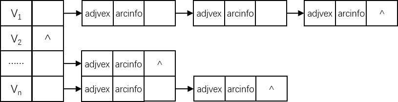

# 图的邻接表表示

## 存储结构

图的**邻接表（Adjacency List）**采用的是**线性和链式存储相结合**的一种存储方式，其主要特点是图中的顶点序列采用普通数组（或线性表）来实现，与每一个顶点相连的边采用链式存储的方式，以构成由每一个顶点组成的边的链表。具体结构示意图如下：



邻接表的一般数据结构定义如下：

```c
// 描述邻接表的弧的信息
typedef struct ArcNode {
    // 弧的终点在顶点数组的下标
    int adjVex;
    // 弧的描述信息
    ArcCell arcInfo;
    // 指向下一条以 node 作为始点的弧（一般按照弧的终点在顶点数组中的下标从小到大的顺序链接剩下的弧）
    ArcNode *nextArc;
} ArcNode;

// 描述邻接表中的某一个顶点
typedef struct VNode {
    // 这个顶点的基本信息
    GNode node;
    // 指向第一条以 node 作为始点的弧（一般是指向在顶点数组中下标最小的终点的那条弧）
    ArcNode *firstArc;
} VNode;

// 邻接表
typedef struct AdjacencyListGraph {
    // 邻接表的所有顶点
    VNode vexs[MAX_VERTEX_NUM];
    // 邻接表的所有顶点个数，弧的个数，最多的顶点个数
    int vexNum, arcNum, maxVexNum;
    // 图的类型
    GraphKind graphKind;
} AdjacencyListGraph;
```

有图 $$G_1$$：


根据存储结构的定义，可以给出 $$G_1$$ 的信息如下：

$$
G_1.vexs={
\left\{\begin{array}{l}
(0,a)\to(1,null,\to)\to(2,null,\to)\to(3,null,null)\\
(1,b)\to(0,null,\to)\to(2,null,\to)\to(3,null,null)\\
(2,c)\to(0,null,\to)\to(1,null,\to)\to(3,null,null)\\
(3,d)\to(0,null,\to)\to(1,null,\to)\to(2,null,null)
\end{array}\right\}
}
$$

$$
G_1.vexNum=4
$$

$$
G_1.arcNum=6
$$

$$
G_1.maxVexNum=4
$$

$$
G_1.graphKind=AG
$$

$$vexs$$ 中的右箭头表示指针，以顶点 $$a$$ 举例说明 $$vexs$$ 元素代表的意义：

- $$(0,a)$$ 对应的是 **node** 域：
  - $$0$$ 代表**顶点 $$a$$ 在数组中的下标**，即 **node.nodeID**。
  - $$a$$ 表示**顶点的基本信息**，即 **node.nodeName**。
- 第一个 → 对应的是 $$vexs$$ 元素的 **firstArc** 指针域，指向**以 $$a$$ 作为始点的第一条弧（一般是指向在顶点数组中下标最小的终点的那条弧）**。
- $$(1,null,{\rightarrow})$$ 表示弧的信息，对应的是 **ArcNode** 类型：
  - 1 表示**弧头（终点）顶点所在的数组中的下标**，即 **adjVex** 域。
  - $$null$$ 表示**弧的基本信息**，即 **arcInfo** 域。由于在 $$G_1$$ 中，弧上没有任何信息，所以为 $$null$$。
  - → 指向**下一条以 node 作为始点的弧（一般按照弧的终点在顶点数组中的下标从小到大的顺序链接剩下的弧）**，即 **nextArc** 域。

有图 $$G_2$$：


$$G_2$$ 的信息如下：

$$
G_2.vexs={
\left\{\begin{array}{l}
(0,a)\to(1,null,\to)\to(2,null\to)\to(3,null,null)\\
(1,b)\to{null}\\
(2,c)\to(1,null,null)\\
(3,d)\to(2,null,\to)\to(4,null,null)\\
(4,e)\to{null}
\end{array}\right\}
}
$$

$$
G_2.vexNum=5
$$

$$
G_2.arcNum=6
$$

$$
G_2.maxVexNum=5
$$

$$
G_2.graphKind=DG
$$

## 算法实现

图的邻接表的一般算法实现如下：

```c
// 创建邻接表，仅初始化
void Create(AdjacencyListGraph *alg, GraphKind gk, int n) {
    alg->graphKind = gk;
    alg->vexNum = n;
    alg->maxVexNum = n;
}

// 增加一个顶点
BOOL AddNode(AdjacencyListGraph *alg, GNode *gn) {
    if (alg->vexNum > MAX_VERTEX_NUM) {
        return FALSE;
    }
    
    CopyNode(&(alg->vexs[alg->vexNum], node), gn);
    alg->vexs[alg->vexNum].firstArc = NULL;
    alg->vexNum++;
    return TRUE;
}

// 增加一条边
BOOL AddEdge(AdjacencyListGraph *alg, int i, int j, ArcCell *ac) {
    if (i > alg->vexNum || j > alg->vexNum) {
        return FALSE;
    }
    
    ArcNode *an;
    
    {
        an = alg->vexs[i].firstArc;
        // 遍历弧的链表，找到最后一条弧
        while (an->nextArc != NULL) {
        	an = an->nextArc;
	    }
	    // 将最后一条弧指向新增的弧
	    an->nextArc = (ArcNode*) malloc(sizeof(ArcNode));
	    an->nextArc->adjVex = j;
	    CopyArc(&(an->nextArc->arcInfo), ac);
	    // 新增的弧指向 NULL
	    an->nextArc->nextArc = NULL;
    }
    
    // 如果是无向图，再增加其对称位置的边
    if (alg->graphKind == AG) {
        an = alg->vexs[j].firstArc;
        while (an->nextArc != NULL) {
        	an = an->nextArc;
	    }
	    an->nextArc = (ArcNode*) malloc(sizeof(ArcNode));
	    an->nextArc->adjVex = i;
	    CopyArc(&(an->nextArc->arcInfo), ac);
	    an->nextArc->nextArc = NULL;
    }
    
    alg->arcNum++;
    return TRUE;
}

// 判断某条边 (i, j) 是否存在，只需要在顶点 i 引出的弧链表中，查找是否存在序号为 j 的结点即可
BOOL Exist(AdjacencyListGraph *alg, int i, int j) {
    if (i > alg->vexNum || j > alg->vexNum) {
        return FALSE;
    }
    
    ArcNode *an = alg->vexs[i].firstArc;
    if (an->adjVex == j) {
        return TRUE;
    }
    while (an->nextArc != NULL) {
        an = an->nextArc;
        if (an->adjVex = j) {
            return TRUE;
        }
    }
    return FALSE;
}

// 删除某条弧
ArcCell* DeleteEdge(AdjacencyListGraph *alg, int i, int j) {
    if (i > alg->vexNum || j > alg->vexNum) {
        return FALSE;
    }
    
    ArcNode *an, *pn;
    ArcCell *temp;
    
    {
	    an = pn = alg->vexs[i].firstArc;
        // 就是单链表的删除结点的算法
	    while (an != NULL) {
	        if (an->adjVex == j) {
	            CopyArc(temp, &(an->arcInfo));
	            // 如果两弧结点相等，则说明被删除的结点是第一个结点
	            if (an == pn) {
	                free(an);
	                alg->vexs[i].firstArc = NULL;
	            } else {
	                pn = an->nextArc;
	                free(an);
	            }
	        }
	        pn = an;
	        an = an->nextArc;
	    }        
    }
    
    // 如果是无向图，还要删除其对称位置的弧
    if (alg->graphKind == AG) {
	    an = pn = alg->vexs[j].firstArc;
	    while (an != NULL) {
	        if (an->adjVex == i) {
	            CopyArc(temp, &(an->arcInfo));
	            // 如果两弧结点相等，则说明被删除的结点是第一个结点
	            if (an == pn) {
	                free(an);
	                alg->vexs[j].firstArc = NULL;
	            } else {
	                pn = an->nextArc;
	                free(an);
	            }
	        }
	        pn = an;
	        an = an->nextArc;
	    }
    }
    
    alg->arcNum--;
    return temp;
}

// 求某个顶点的出度
int InDegree(AdjacencyListGraph *alg, int i) {
    if (i > alg->vexNum) {
        return FALSE;
    }
    
    ArcNode *an = alg->vexs[i].firstArc;
    int count = 0;
    // 只需要计算该顶点有多少个链接的弧即可
    while (an != NULL) {
        count++;
        an = an->nextArc;
    }
    return count;
}

// 求某个顶点的入度
int OutDegree(AdjacencyListGraph *alg, int i) {
    if (i > alg->vexNum) {
        return FALSE;
    }
    
    ArcNode *an;
    int count = 0;
    // 入度要遍历所有结点，并同时查看每一个结点的值是否为 i
    for (int j = 0; j < alg->vexNum; j++) {
        an = alg->vexs[j].firstArc;
        while (an != NULL) {
            if (an->adjVex == i) {
                count++;
                break;
            }
            an = an->nextArc;
        }
    }
    return count;
}

// 求某个顶点的度
int Degree(AdjacencyListGraph *alg, int i) {
    if (i > alg->vexNum) {
        return FALSE;
    }
    
    // 如果是无向图，返回出度或者入度都行
    if (alg->graphKind == AG) {
        return OutDegree(alg, i);
    }
    // 如果是有向图，返回出度与入度之和
    return OutDegree(alg, i) + InDegree(alg, i);
}

// 返回边的个数
int EdgeCount(AdjacencyListGraph *alg) {
    return alg->arcNum;
}

// 返回顶点的个数
int VertexCount(AdjacencyListGraph *alg) {
    return alg->vexNum;
}
```
