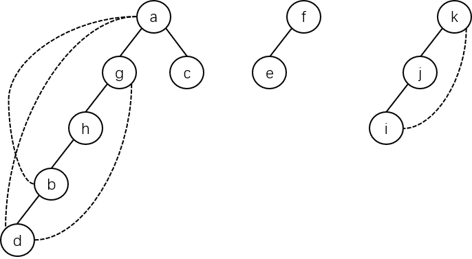

# 图的连通性

## 无向图的连通性

无向图的连通性是指**从无向图的任意一个顶点出发，采用图的 DFS 算法或是 BFS 算法都可以一次性访问到图中的所有顶点**，像这样的图，就称之为**连通图**；反之称为**非连通图**，也就是说，**遍历一个图需要从图的多个顶点出发进行遍历才能访问完图的顶点**。

有图 $$G_3$$：

在图 $$G_3$$ 中，无论是 DFS 还是 BFS，都不能**一次性**遍历图的所有顶点，故 $$G_3$$ 是非连通图。

对于非连通图，**每一次从一个新的顶点遍历过程得到得遍历序列**，称为图的一个连通分量的**顶点集**。这个顶点集和图的遍历过程中走的边构成了一棵树，称为非连通图的**生成树**；一个非连通图的所有连通分量生成的树，就成为非连通图的**生成森林**。

对于 $$G_3$$，如果采用 DFS 遍历算法，生成的森林如下所示：

## 有向图的连通性

有向图的连通性是指**有向图的连通分量**。因为有向图有时虽然有边链接在一起，但从某个顶点出发，未必能遍历全部的顶点。

所以对于有向图，其**连通分量**是指从某个顶点出发，采用 DFS 算法进行遍历所得到的一个**有向连通树**。