# 最小生成树

## 生成树的基本概念

生成树指的是**所有顶点均由边连接在一起，但不存在回路的图**。

一个图可以有许多棵不同的生成树，所有的生成树具有以下共同特点：

- 生成树的顶点个数与图的顶点个数相同。
- 生成树是图的极小连通子图，去掉一条边则非连通。
- 一个有 $$n$$ 个顶点的连通图的生成树有 $$n-1$$ 条边。
- 在生成树中再加一条边必然会形成一条回路。
- 生成树中任意两个顶点间的路径是唯一的。

> 含有 $$n$$ 个顶点 $$n-1$$ 条边的图不一定是生成树。

例如有无向图 $$G$$：

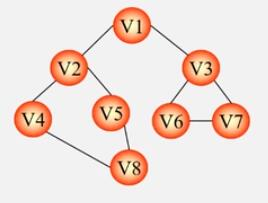

使用 DFS 算法遍历得到的生成树为：

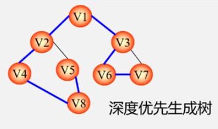

其路径选择规则为：**任意选择一个顶点作为开端，再任意选择它的一个邻接点进行连接，随后任意选择邻接点的邻接点进行连接，如此重复，直到生成树上的结点数量等于图中的顶点数量**。上图的连接序列为：

$$
V_1\to{V_2}\to{V_4}\to{V_8}\to{V_5}\to{V_3}\to{V_6}\to{V_7}
$$

使用 BFS 算法遍历得到的生成树为：

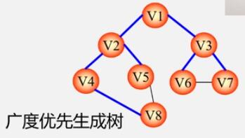

其路径选择规则为：**任意选择一个顶点作为开端，按照任意顺序连接它的邻接点，再按照连接的邻接点的顺序，将邻接点依次与其邻接点连接，如此重复，直到生成树上的结点数量等于图中的顶点数量**。上图的连接序列为：

$$
V_1\to{V_2}\to{V_3}\to{V_4}\to{V_5}\to{V_6}\to{V_7}\to{V_8}
$$

## 最小生成树的抽象

有带有权值的无向网，示意图如下：

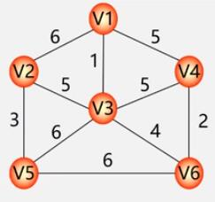

可求得其两个生成树：

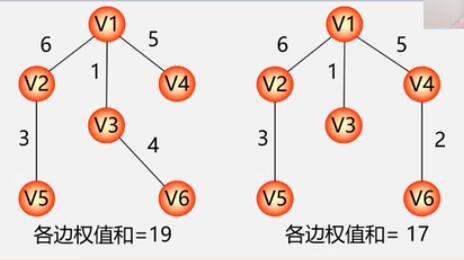

如果给定一个无向网，在该网的所有生成树中，使得**各边权值之和最小的那棵生成树**就称为该网的**最小生成树**，也叫**最小代价生成树**。

例如，需要在 $$n$$ 个城市之间建立通信网，则 $$n$$ 个城市应该铺设 $$n-1$$ 条线路，但因为每条线路都会有对应的经济成本，而 $$n$$ 个城市最多有 $$n(n-1)/2$$ 条路线，那么**如何选择 $$n-1$$ 条路线，才能使总费用最少**？

将这个现实问题抽象出数学模型可以得到：

| 现实事物       | 图结构       |
| -------------- | ------------ |
| $$n$$ 个城市   | $$n$$ 个顶点 |
| $$n-1$$ 条线路 | $$n-1$$ 条边 |
| 线路的经济代价 | 边的权值     |
| 城市间的通信网 | 连通网       |

很显然这个连通网就是一个生成树，解决此问题的关键就是**如何求得最小生成树**。

## MST 性质

构造**最小生成树（Minimum Spanning Tree）**的算法很多，其中多数算法都利用到了 **MST** 性质：设 $$N=(V,E)$$ 是一个连通网，$$U$$ 是顶点集 $$V$$ 的一个非空子集。若边 $$(u,v)$$ 是一条具有最小权值的边，其中 $$u{\in}U$$，$$v{\in}V-U$$，则必然存在一棵包含边 $$(u,v)$$ 的最小生成树。

例如有顶点和边的集合的无向网：

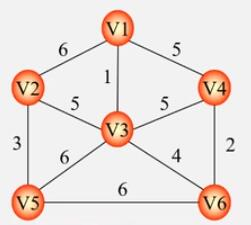

其中：

- $$N=(V,\{E\})$$。
- $$V=\{v_1,v_2,v_3,v_4,v_5,v_6\}$$。
- $$E=\{(v_1,v_2),(v_1,v_3),(v_1,v_4),(v_2,v_3),(v_2,v_5),(v_3,v_4),(v_3,v_5),(v_3,v_6),(v_4,v_6),(v_5,v_6)\}$$。

假设先将 $$v_1$$ 存入集合 $$U$$ 中，即：$$U=\{v_1\}$$。那么与 $$v_1$$ 构成最小权值的边的顶点必然属于 $$V-U=\{v_2,v_3,v_4,v_5,v_6\}$$ 集合。这就是 MST 性质的一个简单举例解释。

在生成树的构造过程中，图中 $$n$$ 个顶点分属于两个集合：

- **集合 $$U$$** - 已经落在生成树上的顶点集。
- **集合 $$V-U$$** - 尚未落在生成树上的顶点集。

接下来则应在所有连接 $$U$$ 中顶点和 $$V-U$$ 中顶点的边中**选取权值最小的边加入到生成树中，且加入这条边之后生成树不会存在回路**。

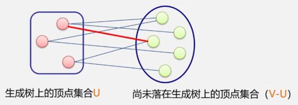

## Prim 算法

**普里姆算法（Prim 算法）**是图论中的一种算法，可以在加权连通图中搜索最小生成树，它的算法思想如下：

1. 设 $$N=(V,E)$$ 是连通网，$$TE$$ 是 $$N$$​ 上最小生成树中的边的集合。
2. 初始令 $$U=\{u_0\}(u_0{\in}V)$$，$$TE=\{\emptyset\}$$。
3. 在所有 $$u{\in}U$$，$$v{\in}V-U$$ 的边 $$(u,v){\in}E$$ 中，找一条代价最小的边 $$(u_0,v_0)$$，将其并入集合 $$TE$$，同时 $$v_0$$ 并入集合 $$U$$。
4. 重复 3 的操作，直至 $$U=V$$ 为止，则 $$T=(V,TE)$$ 为 $$N$$ 的最小生成树。

例如有连通网：

设从 $$v_1$$ 开始：

1. 将 $$v_1$$ 加入到集合 $$U$$ 中，此时在 $$V-U$$ 中与 $$U$$ 中顶点相连的边有 $$v_1-v_2$$、$$v_1-v_3$$、$$v_1-v_4$$，显而易见的最小权值边为 $$v_1-v_3$$，故将 $$v_1$$ 与 $$v_3$$ 相连，并将 $$v_3$$ 也加入到集合 $$U$$ 中。
2. 现在 $$V-U$$ 与 $$U$$ 相连的边有 $$v_1-v_2$$、$$v_1-v_4$$、$$v_3-v_2$$、$$v_3-v_4$$、$$v_3-v_5$$、$$v_3-v_6$$，其中最小权值的边为 $$v_3-v_6$$，故将 $$v_3$$ 与 $$v_6$$ 相连，并将 $$v_6$$ 也加入到集合 $$U$$ 中。
3. 同样地，找到最小权值边为 $$v_6-v_4$$。
4. 现在剩下 $$v_2$$ 和 $$v_5$$，显而易见的，$$V-U$$ 与 $$U$$ 的最小权值边为 $$v_2-v_3$$，故将 $$v_3$$ 与 $$v_2$$ 相连，并将 $$v_2$$ 也加入到集合 $$U$$ 中。
5. 最后再将 $$v_2$$ 与 $$v_5$$ 相连，至此就构成了最小生成树。

通过 Prim 算法求得的最小生成树为：

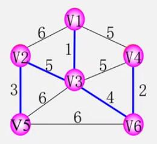

连接过程为：

$$
V_1\to{V_3}\to{V_6}\to{V_4}\to{V_2}\to{V_5}
$$

## Kruskal 算法

**克鲁斯卡尔算法（Kruskal 算法）**，是更直截了当的贪心算法，它的算法思想如下：

1. 设连通网 $$N=(V,E)$$，令最小生成树初始状态为只有 $$n$$ 个顶点而无边的非连通图 $$T=(V,\{\emptyset\})$$，**每个顶点自成一个连通分量**。
2. 在 $$E$$ 中选取代价最小的边，若该边依附的顶点落在 $$T$$ 中不同的连通分量上（**即不能形成环**），则将此边加入到 $$T$$ 中；否则舍去此边，选取下一条代价最小的边。
3. 以此类推，直到 $$T$$ 中所有顶点都**在同一连通分量上**为止。

例如有连通网：

将其转化为无边的非连通图：

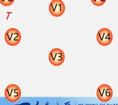

构造过程如下：

1. 选择最小的权值边 $$v_1-v_3$$，将这两个顶点连接，加入生成树。
2. 选择未连接的最小的权值边 $$v_4-v_6$$，将这两个顶点连接，加入生成树。
3. 选择未连接的最小的权值边 $$v_2-v_5$$，将这两个顶点连接，加入生成树。
4. 选择未连接的最小的权值边 $$v_3-v_6$$，将这两个顶点连接，加入生成树。
5. 现在有 3 条权值为 5 的边，分别是 $$v_1-v_4$$、$$v_3-v_4$$、$$v_2-v_3$$，依次将其连接判断：
   1. 当连接 $$v_1$$ 和 $$v_4$$ 时，$$v_1-v_4-v_3$$ 形成了环路，所以不考虑连接。
   2. 当连接 $$v_3$$ 和 $$v_4$$ 时，$$v_3-v_4-v_6$$ 形成了环路，所以也不考虑连接。
   3. 当连接 $$v_2$$ 和 $$v_3$$ 时，没有形成环路，所以将这两个顶点连接，加入生成树。
6. 至此，生成树中已经拥有 $$n-1$$ 条边，通过 Kruskal 算法构造出了最小生成树。

通过 Kruskal 算法求得的最小生成树为：

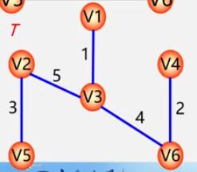

连接过程为：
$$
V_1\to{V_3}
$$

$$
{V_4}\to{V_6}
$$

$$
{V_2}\to{V_5}
$$

$$
{V_3}\to{V_6}
$$

$$
{V_2}\to{V_3}
$$
在上图中，若把 $$v_5-v_6$$ 的权值改成 5，那么可以得到另一棵最小生成树，示意图如下：

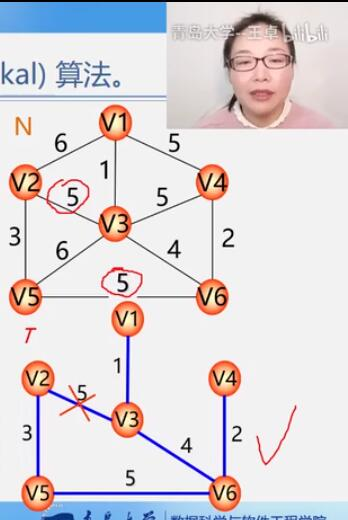

所以，Kruskal 算法构造的最小生成树**可能不是唯一的**。

## 两种算法的比较

|            | Prim 算法                  | Kruskal 算法                        |
| ---------- | -------------------------- | ----------------------------------- |
| 算法思想   | 选择点                     | 选择边                              |
| 时间复杂度 | $$O(n^2)$$，$$n$$ 为顶点数 | $$O(e{\times}log_e)$$，$$e$$ 为边数 |
| 适用范围   | 稠密图                     | 稀疏图                              |
