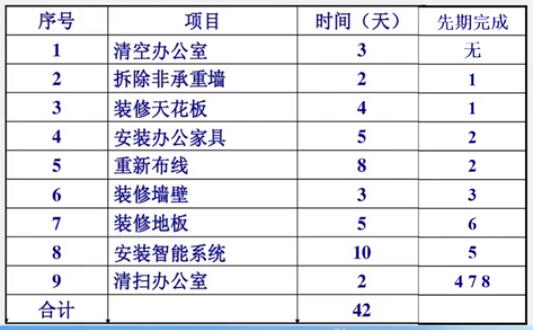
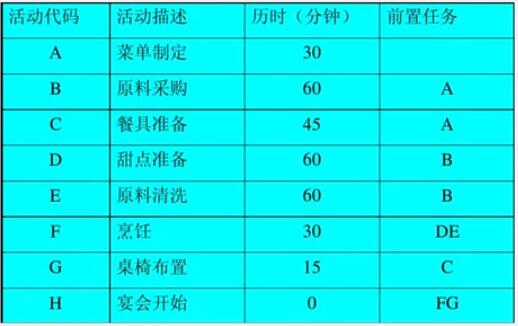
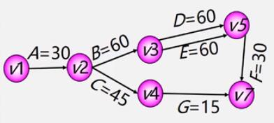
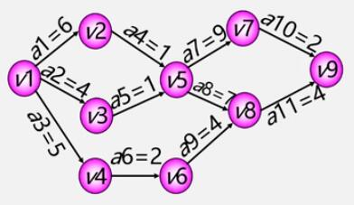
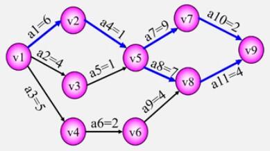
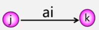
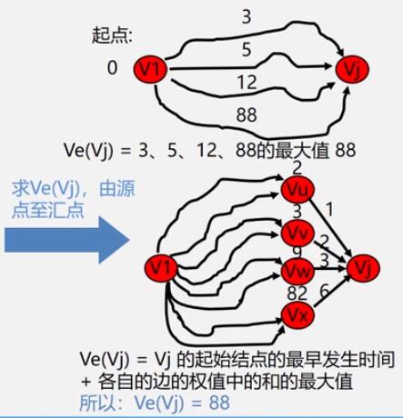
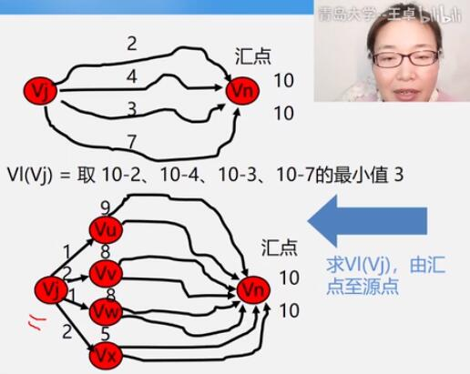

# 关键路径

## 关键路径的实际问题

假如某项目的任务是对 A 公司的办公室重新装修，需要在 10 月 1 日前完成装修工程，那么项目最迟应该何时开始？

需要完成的活动、活动所需时间以及先期需完成工作如下图所示：

又假如准备一个小型家庭宴会，晚 6 点宴会开始，需要最迟几点开始准备？压缩哪项活动时间可以使总时间减少？

需要完成的活动、活动所需时间以及前置任务如下图所示：

对于这些问题，可以把工程计划表示为**边表示活动的网络**，即 **AOE 网**，用**顶点**表示**事件**，用**弧**表示**活动**，**弧的权**表示**活动持续时间**。

例如可以从晚宴中抽象出如下 AOE 网：

其中：

- $$V_1$$ 表示活动开始。
- $$V_2$$ 表示活动 A，$$<V_1,V_2>$$ 表示活动 A 花费的时间。
- $$V_3$$ 表示活动 B，$$<V_2,V_3>$$ 表示活动 B 花费的时间。
- $$V_4$$ 表示活动 C，$$<V_2,V_4>$$ 表示活动 C 花费的时间。
- ……

## 关键路径的定义

例如，设一个工程有 11 项活动，9 个事件，AOE 网示意图如下：

其中事件 $$V_1$$ 表示整个工程的开始，称为**源点**，**入度为 0**；$$V_9$$ 表示整个工程的结束，称为**汇点**，**出度为 0**。

对于 AOE 网，关心的问题主要有：

1. 完成整项工程至少需要多少时间？
2. 哪些活动是影响工程进度的关键？

这样的问题都可以归结成为**关键路径**的问题，即求**路径长度最长的路径**。上图的关键路径示意图如下：

> 关键路径不唯一。

## 寻找关键活动

例如有 AOE 网：

确定关键路径需要定义 4 个描述量：

1. **$$VE(v_j)$$** - 事件 $$v_j$$ 的最早发生时间。例如 $$VE(v_1)=0$$、$$VE(v_2)=30$$。
2. **$$VL(v_j)$$** - 事件 $$v_j$$ 的最迟发生时间。例如 $$VL(v_4)=165$$。
3. **$$E(a_i)$$** - 活动 $$a_i$$ 的最早开始时间。例如 $$E(a_3)=30$$。
4. **$$L(a_i)$$** - 活动 $$a_i$$ 的最迟开始时间。例如 $$L(a_3)=120$$。

由描述量可以得到：

- **$$L(a_i)-E(a_i)$$** - 完成活动 $$a_i$$ 的**时间余量**。例如 $$L(a_3)-E(_3)=90$$，表示 $$a_3$$ 有 90 分钟可以自由支配。
- **$$L(a_i)-E(a_i)==0$$** - 关键路径上的活动，简称**关键活动**，即 **$$L(a_i)==E(a_i)$$**。

> **由若干个关键活动组成的路径就是关键路径。**

设活动 $$a_i$$ 用弧 $$<j,k>$$ 表示，其持续时间记为 $$w_{j,k}$$，示意图如下：

则有：

1. **$$E(i)=VE(j)$$** - 活动 $$a_i$$ 的最早开始时间等于事件 $$v_j$$ 的最早发生时间。
2. **$$L(i)=VL(k)$$** - 活动 $$a_i$$ 的最迟开始时间等于事件 $$v_k$$ 的最迟发生事件。

**$$VE(j)$$ 和 $$VL(k)$$ 的寻找过程**如下：

1. 从 **$$VE(1)=0$$** 开始向前递推，根据公式求 $$VE(j)$$：
   
   $$
   VE(j)=MAX\{VE(i)+w_{i,\ j}\}\ \ (<i, j>{\in}T,\ 2{\leq}j{\leq}n)
   $$
   
   即**求 $$j$$ 的前驱中，最早发生时间（前面持续时间最多的活动结束之后才是最早的发生时间）+活动的持续时间的值最大的那一个**。

   其中 **$$T$$ 是所有以 $$j$$ 为始点的弧的集合**。
   
   

2. 从 **$$VL(n)=VE(n)$$** 开始向后递推，根据公式求 $$VL(i)$$：
   
   $$
   VL(i)=MIN\{VL(j)-w_{i,\ j}\}\ \ (<i, j>{\in}S,\ 1{\leq}i{\leq}n-1)
   $$
   
   即**求 $$i$$ 的后继中，最晚发生时间-活动的持续时间的值最小的那一个**。

   **其中 $$S$$ 是所有以 $$i$$ 为终点的弧的集合**。
   
   

## 求解关键路径

例如有 AOE 网：

求解关键路径的步骤如下：

1. 求 $$VE(i)$$ 和 $$VL(j)$$。
   - **$$VE(i)$$** - **当前顶点 $$v_i$$ 的值加上与直接后继相连的弧的权值的最大值**，就是直接后继的**最早发生时间**。
   - **$$VL(j)$$** - **当前顶点 $$v_j$$ 的值减去与直接前驱相连的弧的权值的最小值**，就是直接前驱的**最晚发生时间**。
2. 求 $$E(i)$$ 和 $$L(i)$$。
   - **$$E(i)$$** - **当前弧的始点的 $$VE$$ 值**。
   - **$$L(i)$$** - **当前弧的终点的 $$VL$$ 值减去弧的权值**。
3. 计算 $$L(i)-E(i)$$，**余量为 0 的活动就是关键活动**。

图中各顶点的 $$VE(i)$$ 和 $$VL(j)$$ 的值如下：

| 顶点     | $$VE$$ 从源点往汇点算 $$VE(j)=MAX\{VE(i)+w_{i,j}\}$$ | $$VL$$ 从汇点往源点算 $$VL(i)=MIN\{VL(j)-w_{i,j}\}$$ |
| -------- | --------------------------------------------------- | --------------------------------------------------- |
| **$$v_1$$** | 0（源点默认为 0）                                   | 0（$$v_2-a_1$$，选最小的值，不过源点一般也都是 0） |
| **$$v_2$$** | 6（$$v_1+a_1$$）                                  | 6（$$v_5-a_4$$）                                  |
| **$$v_3$$** | 4（$$v_1+a_2$$）                                  | 6（$$v_5-a_5$$）                                  |
| **$$v_4$$** | 5（$$v_1+a_3$$）                                  | 8（$$v_6-a_6$$）                                  |
| **$$v_5$$** | 7（$$v_2+a_4$$，选最大的值）                      | 7（$$v_7-a_7$$，相同的话任选一个）                |
| **$$v_6$$** | 7（$$v_4+a_6$$）                                  | 10（$$v_8-a_9$$）                                 |
| **$$v_7$$** | 16（$$v_5+a_7$$）                                 | 16（$$v_9-a_10$$）                                |
| **$$v_8$$** | 14（$$v_5+a_8$$，选最大的值）                     | 14（$$v_9-a_11$$）                                |
| **$$v_9$$** | 18（$$v_7+a_10$$，相同的话任选一个）              | 18（同 $$VE(v_9)$$）                               |

图中各顶点的 $$E(i)$$、$$L(i)$$ 和 $$L(i)-E(i)$$ 的值如下：

| 活动      | $$E$$ $$E(i)=VE(j)$$ | $$L$$ $$L(i)=VL(k)-w_{j,k}$$ | $$L-E$$ 0=关键活动    |
| --------- | ----------------- | ------------------------ | ------------------------------ |
| **$$a_1$$** | 0（$$VE(v_1)$$） | 0（$$VL(v_2)-a_1$$）   | **0** |
| **$$a_2$$** | 0（$$VE(v_1)$$）     | 2（$$VL(v_3)-a_2$$）       | 2                              |
| **$$a_3$$**  | 0（$$VE(v_1)$$）     | 3（$$VL(v_4)-a_3$$）       | 3                              |
| **$$a_4$$**  | 6（$$VE(v_2)$$）     | 6（$$VL(v_5)-a_4$$）       | **0** |
| **$$a_5$$**  | 4（$$VE(v_3)$$）     | 6（$$VL(v_5)-a_5$$）       | 2                              |
| **$$a_6$$**  | 5（$$VE(v_4)$$）     | 8（$$VL(v_6)-a_6$$）       | 3                              |
| **$$a_7$$**  | 7（$$VE(v_5)$$）     | 7（$$VL(v_7)-a_7$$）       | **0** |
| **$$a_8$$**  | 7（$$VE(v_5)$$）     | 7（$$VL(v_8)-a_8$$）       | **0** |
| **$$a_9$$**  | 7（$$VE(v_6)$$）     | 10（$$VL(v_8)-a_9$$）      | 3                              |
| **$$a_10$$** | 16（$$VE(v_7)$$）    | 16（$$VL(v_9)-a_10$$）     | **0** |
| **$$a_11$$** | 14（$$VE(v_8)$$）    | 14（$$VL(v_9)-a_11$$）     | **0** |

**将关键活动连接起来**，就是该 AOE 网的（几个）关键路径：

关键路径有以下几条性质：

1. 若网中有多条关键路径，则需要加快同时在多条路径上的关键活动。例如：$$a_8$$、$$a_9$$、$$a_{10}$$、$$a_{11}$$。
2. 如果一个活动处于所有的关键路径上，那么提高这个活动的速度，就能缩短整个工程的完成时间。例如：$$a_1$$、$$a_4$$。
3. 处于所有的关键路径上的活动完成时间**不能缩短太多**，否则会使原来的关键路径变成非关键路径，这样就必须重新寻找关键路径。例如：$$a_1$$ 由 6 天缩短成 3 天，就会改变关键路径。