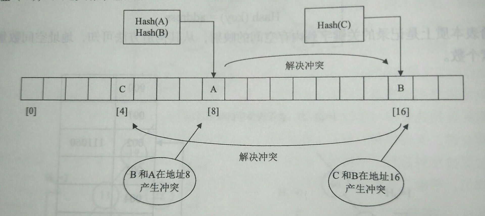

# 处理哈希冲突的概念

哈希函数在计算中会存在一些问题。

对于两个关键字 key1 和 key2，若 $$key1{\neq}key2$$，但有：

$$
Hash(key1)=Hash(key2)
$$

由于**一个地址空间只能存储一个数据元素**，而这两个数据元素要存储在相同的地址空间，这种情况就称为**哈希冲突**。

如果不同的关键字计算某哈希函数得到相同的哈希地址，那么称这些关键字相对该哈希函数来说是**同义词**，由同义词引起的冲突就称作**同义词冲突**。在哈希表中，同义词冲突通常是很难避免的。

如果哈希表的存储空间足够大，使得所有数据元素的关键字与其存储位置是**一对一**的关系，则不会产生冲突，这是理想情况，很难实现。这也是不可能，也没有必要的，因为这样会导致**当关键字的值取值不连续时非常浪费存储空间**。

从理论上讲，**数据量是无限的**，而**系统的存储空间资源是有限的**，系统不能提供无限数量的空间。一般情况下，数据元素的关键码的变化范围远远大于哈希地址的变化范围，所以**冲突是不可避免的**。

解决哈希冲突的方法有很多，其基本思想是：**当发生哈希冲突时，通过处理哈希冲突的函数来产生一个新的哈希地址，使得原为同义词的数据元素的哈希地址不同。但哈希冲突函数产生的哈希地址仍有可能发生冲突，此时需要再使用新的哈希冲突函数得到新的哈希地址，直到不存在哈希冲突为止**。

上图**解决哈希冲突的过程就是哈希表的构造过程**，它把 $$m$$ 个数据元素通过哈希函数映射到了 $$n$$ 个连续的内存空间中。**构造哈希表的目的是进行哈希查找**，哈希表的查找过程必须与其构造过程相对应。

- 查找过程要以查找的数据元素的关键字为自变量，使用与构造过程相同的哈希函数得到一个哈希地址，然后去比较要查找数据元素的关键字与哈希地址中的数据元素的关键字，如果相等，则查找成功。
- 否则，使用与构造过程相同的处理哈希冲突的函数得到一个新的哈希地址，再比较二者的关键字，如果相等，则查找成功。
- 否则，再以与构造过程相同的心的处理哈希冲突的函数得到新的哈希地址，继续比较，**直到查找成功或者使用完所有的处理哈希冲突的函数都查找失败为止**。

特别要注意的是**哈希查找过程中使用的哈希函数和处理冲突的函数需要使用和构造过程相同的哈希函数与处理冲突的函数**。另外，如果需要使用多次处理冲突的函数，需要与构造过程处理冲突函数有**相同的使用顺序**。

所以，**哈希表既是一种存储形式，又是一种查找方法**，通常将这种查找方法称为**哈希查找**。