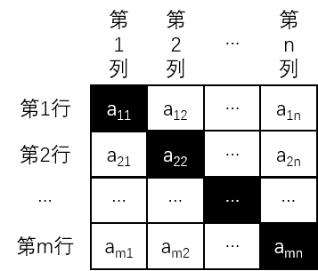
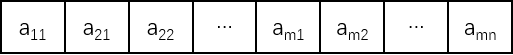
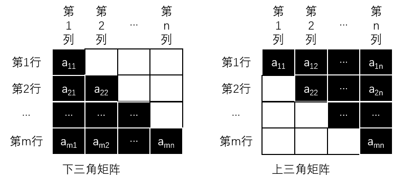

# 特殊矩阵及其压缩矩阵

矩阵是常常研究的数学对象，通常被用来**组织数据**，例如在数字图像处理中的图像数据。在数据结构中，主要研究如何存储矩阵中的元素以有效地进行数学运算。

如果矩阵中有很多**零元素**（即值为 0 的元素）或大量的**非零元素**具有某种**分布规律**，就称这类矩阵为**特殊矩阵**。

存储特殊矩阵中的全部数据元素时，例如存储大量的重复的数据元素或零元素，会浪费存储单元，如果通过某种交换处理，例如利用大量相同的非零元素共享一个存储单元，零元素不分配存储空间等方式，就能压缩矩阵的存储空间，这就是特殊矩阵的**压缩矩阵**。

对特殊矩阵进行压缩时，应该充分利用**元素值的分布规律**，选择压缩存储的方法应遵循两条原则：

1. 尽可能地压缩数据量。
2. 压缩后仍然可以比较容易地进行各项基本操作。

在高级编程语言中，通常将一个矩阵描述为一个**二维数组**。

## 对称矩阵

若 $$n$$ 阶矩阵 $$A$$ 中的元素满足条件：

$$
a_{ij}=a_{ji}\ (1{\leq}i,j{\leq}n)
$$

则称 $$A$$ 为 $$n$$ 阶**对称矩阵**，其**主对角线两侧的数据元素相等**，示意图如下：

对称矩阵的压缩存储方式为：**让每一对对称的相同元素共享一个存储空间**，就可以将原来需要的 **$$n^2$$** 个存储空间，压缩到 **$$n(n+1)/2$$** 个存储空间。

不失一般性，以行优先的顺序存储**对称矩阵的下三角元素（包括对角线）**，示意图如下：

假设以一维数组 $$B[1...n(n+1)/2]$$ 作为 $$n$$ 阶对称矩阵 $$A$$ 的存储结构，则 $$B[k]$$ 和矩阵元素 $$a_{ij}$$ 之间存在映射关系：

$$
k=\left\{\begin{array}{l}
{\frac{i(i-1)}{2}+j}&{i\geq j}
\\
\frac{j(j-1)}{2}+i & ij
\end{array}\right.
$$

对于任意的下标 $$i$$ 和 $$j$$，都可以在一维数组 $$B$$ 中找到矩阵元素 $$a_{ij}$$；反之，对一维数组 $$B$$ 的下标 $$k=1,2,...,n(n+1)/2$$，也都能确定 $$B[k]$$ 中的元素在矩阵中的下标 $$i$$ 和 $$j$$。

采用压缩存储后计算元素在存储序列中的地址的方法：设 $$a_{11}$$ 的地址为 $$Loc(a_{11})$$，在矩阵的下三角中，元素 $$a_{ij}(i{\geq}j)$$ 上面有 $$i-1$$ 行，第一行有 $$1$$ 个元素，第二行有 $$2$$ 个元素，依次递增，则上面共有 $$i(i-1)/2$$ 个元素，元素 $$a_{ij}$$ 在所在行上处于第 $$j$$ 位，则其地址偏移量为 $$i(i-1)/2+j$$，所以可得矩阵数据元素 $$a_{ij}$$ 在内存中的地址：

$$
Loc(a_{i,j})=Loc(a_{11})+(i\times(i-1)/2+j)\times{c}
$$

## 三角矩阵

与对称矩阵的压缩存储处理方式相似的是**三角矩阵**，分为**下三角矩阵**和**上三角矩阵**，示意图如下：

在下三角矩阵中，整个上三角部分为 0 或一个相同的常数，可以采用与对称矩阵相同的下标变换公式：

$$
k=\left\{\begin{array}{l}
{\frac{i(i-1)}{2}+j}&{i\geq{j}}
\\
{0}&{i<j}
\end{array}\right.
$$

同理可得上三角矩阵的下标变换公式：

$$
k=\left\{\begin{array}{l}
{\frac{(i-1)(2n-i+2)}{2}+j-i+1}&{j\geq{i}}
\\
{0}&{j<i}
\end{array}\right.
$$

## 对角矩阵

还有一类特殊矩阵是**对角矩阵**，这种矩阵的非零元素都集中在以对角线为中心的带状区域，其他元素都为 0，示意图如下：

上图为 3 对角矩阵，**带宽**为 3。

对于对角矩阵，可以**以行序为主序**或**以对角线的顺序**将其**压缩存储**到**一维数组**中。