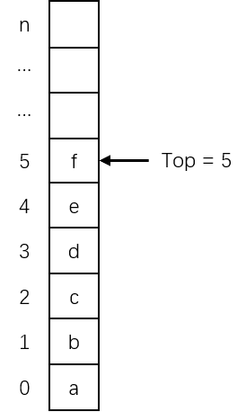
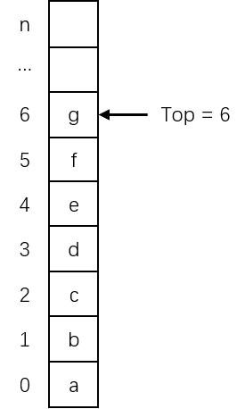
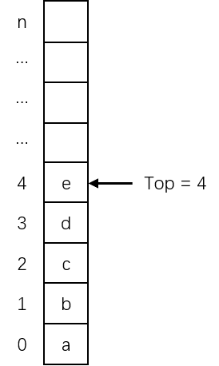

# 基于静态存储分配的顺序栈

栈既然是一种线性表，所以**线性表的存储结构也同样适用于栈**。

类似于顺序表的定义，栈的顺序存储结构也可以利用数组来实现。首先给栈分配一个较大的数组空间用于存放栈的元素，由于某一时刻栈中元素可能少于**数组的分量数**（长度），故应有一个变量记录目前栈中有多少个元素。

可以规定**数组的第一个元素为栈底**，则压栈时，栈会向数组下标增大的方向增长；出栈时，向数组下标减小的方向缩减。

这样，就可以将记录栈中元素个数的变量定义为一个整型变量，可以用它存放栈顶元素所占数组分量的下标，称这个变量为**栈顶指针 Top**（栈顶元素的下标）。

当栈为空时，Top 的值应为 0，但由于 C 语言规定数组下标从 0 开始，若用 Top=0 表示栈为空就浪费了一个数组分量，所以规定**当 Top=-1 时，表示空栈**。

在栈的顺序存储结构中，当 Top 的值为数组的最大小标值时，说明栈元素已经占据了数组的所有分量，这种情况称为**栈满**。若此时进行压栈操作，将没有数组分量可用，这种情况称为**上溢**，应当避免这种错误发生；当 Top 值为 -1 时，栈中无元素，这种情况称为**栈空**。若此时进行出栈操作，则称为**下溢**，也应当避免这种情况发生。

根据上述讨论，栈的顺序存储的一般数据结构定义如下：

```c
// 栈能够达到的最大深度（即数组的长度）
#define STACK_SIZE 100

// SqStack = Sequence Stack = 栈的顺序存储实现（顺序栈）
typedef struct {
    // ElemType 是自定义的元素的类型，Elem 域用来顺序地存储栈的元素
    ElemType Elem[STACK_SIZE];
    // Top 域用来存储栈顶元素所在单元的编号（即元素的下标）
    int Top;
} SqStack;
```

设一个栈为：


$$
T=(a,b,c,d,e,f)
$$


则栈 T 所对应的顺序存储结构为：



若在栈 T 中插入一个元素 g，对应的顺序存储结构图如下：



若在栈 T 中连续删除两个元素，对应的顺序存储结构图如下：



在栈的顺序存储结构中，为了形象地表示栈顶在上、栈底在下，所以采用的**单元编号是向上递增的**。

在顺序存储结构上，栈的一般算法实现也是比较简单的：

```c
// 栈的初始化
void InitStack(SqStack &S) {
    S.Top = -1;
}

// 判断栈是否为空
Status StackEmpty(SqStack S) {
    if (S.Top == -1) {
        return TRUE;
    } else {
        return FALSE;
    }
}

// 判断是否栈满
Status StackFull(SqStack S) {
    if (S.Top >= STACK_SIZE - 1) {
        return TRUE;
    } else {
        return FALSE;
    }
}

// 压栈
Status Push(SqStack &S, ElemType e) {
    // 避免上溢
    if (StackFull(S) == TRUE) {
        printf("Stack Overflow\n");
        return ERROR;
    }
    
    // 先修改栈顶下标，再存储对应位置的元素
    S.Elem[++S.Top] = e;
    return OK;
}

// 出栈，并将栈顶元素返回给 e
Status Pop(SqStack &S, ElemType &e) {
    // 避免下溢
    if (StackEmpty(S) == TRUE) {
        printf("Stack Underflow\n");
        return ERROR;
    }
    
    // 先返回出栈的元素，再修改栈顶下标
    e = S.Elem[S.Top--];
    return OK;
}
```

# 基于动态存储分配的顺序栈

静态存储分配的顺序结构存储为栈分配的空间大小是一个固定值，容易造成该**空间的浪费和上溢**，在实际应用中都是使用动态存储分配的顺序存储结构，一般数据结构可以定义为：

```c
// 初始量
#define STACK_INIT_SIZE 100
// 增量
#define STACK_INCREMENT 10

typedef struct {
    // 栈当前已分配的存储空间大小
    int StackSize;
    // 以元素指针作为栈底和栈顶指针（也可以用整型类型存储为下标），栈底指针指向数组的首元素，栈顶指针指向栈顶元素的下一个位置
    ElemType *Bottom, *Top;
} SqLStack;
```

> 以指针指向元素，相当于用下标求元素。在 C 语言中，数组名就是组数元素的首地址，数组名+1 就是第二个元素的地址，\*(数组名+1) 就是第二个元素的值。

动态存储分配的顺序存储结构的一般算法实现如下：

```c
// 初始化栈
Status InitStack(SqLStack &S) {
    // 以栈底为基础，为栈分配存储空间
    S.Bottom = (ElemType*) malloc(STACK_INIT_SIZE * sizeof(ElemType));
    if (!S.Bottom) {
        printf("Memory Error\n");
        return ERROR;
    }
    
    // 空栈时，栈顶等于栈底
    S.Top = S.Bottom;
    S.StackSize = STACK_INIT_SIZE;
    return OK;
}

// 判断是否空栈
Status StackEmpty(SqLStack S) {
    // 规定，当栈顶指针与栈底指针指向同一个元素时，为空栈
    if (S.Top == S.Bottom) {
        return TRUE;
    } else {
        return FALSE;
    }
}

// 判断是否栈满
Status StackFull(SqLStack S) {
    // 规定，当栈顶指针与栈底指针相减（栈顶元素的下标 +1 减去 0）大于栈的长度时，为栈满
    if (S.Top - S.Bottom >= S.StackSize) {
        return TRUE;
    } else {
        return FALSE;
    }
}

// 获取栈顶元素
Status GetTop(SqLStack S, ElemType &e) {
    // 判断是否空栈
    if (StackEmpty(S) == TRUE) {
        return ERROR;
    }
    
    // 返回栈顶元素，规定栈顶指针指向栈顶元素的后一位，所以取得栈顶元素需要 -1
    e = *(S.Top-1);
    return OK;
}

// 压栈
Status Push(SqLStack &S, ElemType e) {
    // 避免上溢
    if (StackFull(S) == TRUE) {
        // 如果栈满就追加栈的空间
        S.Bottom = (ElemType*) realloc(S.Bottom, (S.StackSize + STACK_INCREMENT) * sizeof(ElemType));
    }
    
    if (!S.Bottom) {
        printf("Realloc Error");
        return ERROR;
    }
    
    // 为栈顶元素赋值，并将栈顶指针指向栈顶元素的后一位
    *(S.Top++) = e;
    
    // 更新数组长度
    S.StackSize += STACK_INCREMENT;
    return OK;
}

// 出栈
Status Pop(SqLStack &S, ElemType &e) {
    // 避免下溢
    if (StackEmpty(S) == TRUE) {
        return ERROR;
    }
    
    // 修改栈顶指针，并返回栈顶元素
    e = *(--S.Top);
    return OK;
}

// 清空栈元素
void ClearStack(SqLStack &S) {
    if (S.Bottom) {
        S.Top = S.Bottom;
    }
}

// 销毁栈
void DestroyStack(SqLStack &S) {
    if (S.Bottom) {
        free(S.Bottom);
        S.StackSize = 0;
        S.Bottom = S.Top = NULL;
    }
}
```
