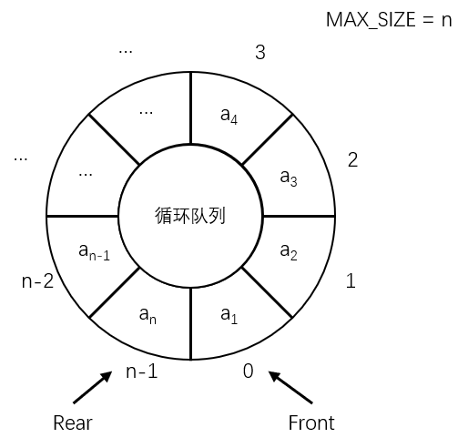

用上述的算法来解决假溢出比较费时，有一个可以**避免移动元素**的方法，即将数组看成一个首尾相接的环，队列的这种组织方式称为**循环队列**。循环队列的示意图如下：



构成一个循环队列后，指针和队列元素的关系保持不变，**与顺序队列的数据结构保持一致**。

在循环队列中需要注意的是**队头队尾指针的变化**和**队空队满的判断**。

假设在插入新元素时，队尾指针已在末尾，队尾指针需要移动至第一个元素处，即又从 0 开始（循环），可以将队尾指针的变化写成：

```c
q.Rear = (q.Rear + 1) % MAX_SIZE;
```

类似的，对于队头元素删除操作，队头指针的变化也可以写成：

```c
q.Front = (q.Front + 1) % MAX_SIZE;
```

> 有模运算 n%m，且 n 和 m 是整数，其值的范围为： [-m+1,m-1]。

与顺序队列不同，循环队列的队空和队满不能以 Front==Rear 为依据，因为在插入或删除的过程中，会使 Front 和 Rear **因循环重叠**，所以需要其他的方法来判断循环队列的队空和队满：

1. 另设一个变量 Count，用于记录元素个数，当 Count=0 时，标识为队空；当 Count=MAX_SIZE-1 时，标识为队满。
2. 另设一个标志变量 Flag，以标识队列的队空（Flag=0）和队满（Flag=1）状态。
3. 少用一个元素空间，规定**队头指针在列尾指针的前一个位置时，标识为队满**。也就是说只允许队列存放 MAX_SIZE-1 个元素，以**浪费数组的空间**来避免无法分辨队空队满的问题。

循环队列的一般算法实现如下：

```c
// 整体算法规定少用一个元素空间，以便标识队满

void InitSque(Squeue &q) {
    // 头指针尾指针设置为 0，队列为空
	q.Front = q.Rear = 0;
}

int GetLength(Squeue q) {
    return (q.Rear - q.Front + MAX_SIZE) % MAX_SIZE;
}

Status IsEmpty(Squeue q) {
    if (q.Front == q.Rear) {
        return TRUE;
    }
    return FALSE;
}

Status IsFull(Squeue q) {
    // 队头指针在队尾指针的前一个位置时，标识为队满
    if ((q.Rear + 1) % MAX_SIZE == q.Front) {
        return TRUE;
    }
    return FALSE;
}

Status InsertSque(Squeue &q, ElemType e) {
    if (IsFull(q) == TRUE) {
        printf("Queue Overflow\n");
        return ERROR;
    }
    
    // 入队尾
    q.Elem[q.Rear] = e;
    // 修改队尾指针，使其 + 1
    q.Rear = (q.Rear + 1) % MAX_SIZE;
    return OK;
}

Status DelSque(Squeue &q, ElemType &e) {
    if (IsEmpty(q) == TRUE) {
        printf("Queue Empty\n");
        return ERROR;
    }
    
    // 返回原队头元素
    e = q.Elem[q.Front];
    // 修改队头指针，使其 + 1
    q.Front = (q.Front + 1) % MAX_SIZE;
    return OK;
}

Status GetHead(Squeue q, ElemType &e) {
    if (IsEmpty(q) == TRUE) {
        return ERROR;
    }
    e = q.Elem[q.Front];
    return OK;
}

void ListSque(Squeue q, void (*f)(ElemType e)) {
    for (int i = 0; i < GetLength(q); i++) {
        (*f) (q.Elem[i]);
    }
}
```
