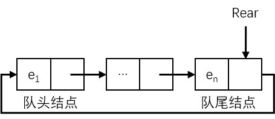

如果让队尾结点的指针指向队头结点，就构成了一个**循环链队列**。以循环链表表示的队列，可以使队列的队头删除和队尾插入的操作**变得比较容易**。循环队列的示意图如下：



因为通过尾指针 Rear 就可以找到队头结点，所以在循环链队列中**没有必要设置头指针**。循环链队列的一般数据结构定义如下：

```c
typedef struct QNode {
    ElemType Elem;
    struct QNode *Next;
} QNode;

typedef struct {
    QNode *Rear;
    int Count;
} LQueue;
```

循环链队列的一般算法实现如下：

```c
Status InitLQueue(LQueue &q) {
    q.Rear = (QNode*) malloc(sizeof(QNode));
    if (!q.Rear) {
        printf("Memory Error\n");
        return ERROR;
    }
    q.Rear->Next = NULL;
    q.Count = 0;
    return OK;
}

Status IsEmpty(LQueue q) {
    if (!q.Rear) {
        return TRUE;
    }
    return FALSE;
}

Status InsertLQueue(LQueue &q, ElemType e) {
	QNode *p = (QNode*) malloc(sizeof(QNode));
	if (!p) {
		printf("Memory Error\n");
		return ERROR;
	}
	p->Elem = e;
    // 如果是第一个结点，就把尾结点和尾结点后继都指向 p
	if (IsEmpty(q)) {
		q.Rear = p;
		q.Rear->Next = p;
	} else {
        // 先设置新结点的后继为队头结点
		p->Next = q.Rear->Next;
        // 再把原队尾结点的后继修改为新结点
		q.Rear->Next = p;
        // 最后把新结点设置为队尾结点
		q.Rear = p;
	}
	q.Count++;
	return OK;
}

Status DeleteLQueue(LQueue &q, ElemType &e) {
	QNode *p = (QNode*) malloc(sizeof(QNode));
	if (!p) {
		printf("Memory Error\n");
		return ERROR;
	}
    // 存储队头结点
    p = q.Rear->Next;
    // 返回要删除的结点
    e = p->Elem;
    // 如果只有一个结点
    if (p == q.Rear) {
        // 将队尾结点置空即可
        q.Rear = NULL;
    } else {
        // 将队头结点设置为原队头结点的后继
        q.Rear->Next = p->Next;
        free(p);
    }
    q.Count--;
    return OK;
}

void ListLQueue(LQueue q, void (*f)(ElemType e)) {
	// 从队头结点开始
	QNode *p = q.Rear->Next;
	for (int i = 0; i < q.Count; i++) {
		(*f) (p->Elem);
		p=p->Next;
	}
}
```
