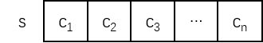

串的顺序存储结构就是用**连续的存储单元**来存储串，示意图如下：



用连续的内存空间存储串，优点是**存储密度高**，缺点是必须预先计划好每个串**可能的最大长度**，需要处理好当容量不足时如何解决的问题，否则将产生**数据溢出**等错误。

串的顺序存储结构也称为**顺序串**，是以一组连续的存储单元存放字符串的**字符序列**，按照存储分配的不同可以分为两类：静态分配存储和动态分配存储。

# 静态顺序串

静态分配存储又称为**定长顺序存储**，类似于线性表的顺序存储结构，可以用**一组地址连续的存储单元**存储串值的**字符序列**。

在 C 语言中，串不是预定义的数据类型，而是以字符数组来表示串，例如：

```c
char str[10];
```

C 语言还规定了一个串的结束标志为 **\0**，即数组中**在该结束标志之前的字符**是串变量的**有效字符**，但**结束标志本身要占一个字符的空间**。

每个串变量按照预定义的空间大小分配一个固定长度的存储区，**串变量的实际长度小于定义长度则可被正确表示，反之超出部分会被舍去**。

串的静态顺序存储的一般数据结构定义如下：

```c
#define STRLEN 255

// 此处数组总长为 256，其中 0 号单元存放串的长度，从 1 号单元开始存放字符序列
typedef char SqString[STRLEN + 1];
```

串的静态顺序存储结构的一般算法实现如下：

```c
Status StringAssign(SqString s, char *ch) {
    // 如果 ch 的长度超出 s 的长度
    if (strlen(ch) > STRLEN) {
        return ERROR;
    }
    // 存储 ch 的长度
    s[0] = strlen(ch);
    for (int i = 1; i <= s[0]; i++) {
        // 顺序将 ch 的字符赋给 s，取值的下标就是从 1 开始了，直到 s[0] 结束（长度）
        // 取值的优先级为2，所以要用括号括起来
        s[i] = *(ch + i - 1);
    }
    return OK;
}

// 辅助算法，打印串
void StringOutput(SqString s) {
    for (int i = 1; i <= s[0]; i++) {
        putchar(s[i]);
    }
    putchar('\n');
}

Status StringEmpty(SqString s) {
    // 以长度判断是否为空
    if (s[0] == 0) {
        return TRUE;
    }
    return FALSE;
}

int StringLength(SqString s) {
    return s[0];
}

Status StringCopy(SqString s1, SqString s2) {
    for (int i = 0; i <= s2[0]; i++) {
        s1[i] = s2[i];
    }
    return OK;
}

int StringCompare(SqString s1, SqString s2) {
    for (int i = 0; i <= s1[0] && i <= s2[0]; i++) {
        // 如果不相等就返回不相等字符的差
        if (s1[i] != s2[i]) {
            return s1[i] - s2[i];
        }
    }
    // 默认返回长度差
    return s1[0] - s2[0];
}

// 清空串
Status ClearString(SqString s) {
    // 只把长度设置为 0
    s[0] = 0;
    return OK;
}

// 返回串 s 中在指定位置上的指定长度的子串
// sub = 子串，position = 起始位置，len = 子串的长度
Status SubString(SqString s, SqString sub, int position, int len) {
    // 位置有效性检验
    if (position < 1 || position > s[0] || len < 0 || len > s[0] - position + 1) {
        return ERROR;
    }
    sub[0] = s[0];
    for (int i = 1; i <= len; i++) {
        sub[i] = s[position + i - 1];
    }
    return OK;
}

// 辅助算法，判断两个串的长度和是否超长
int IsOverlength(SqString s1, SqString s2) {
    if (s1[0] + s2[0] > STRLEN) {
        return TRUE;
    }
    return FALSE;
}

// 将两串拼接成一个新串
Status StringConcat(SqString s, SqString s1, SqString s2) {
    // 定义变量，判断是否超长
    int overlength = IsOverlength(s1, s2);
    // 若超长，则截断至 STRLEN 处，否则就拼接完 s2 的字符
    s[0] = overlength == TRUE ? STRLEN : s1[0] + s2[0];
    for (int i = 1; i <= s1[0]; i++) {
        s[i] = s1[i];
    }
    for (int i = 1; i <= s[0]; i++) {
        s[s1[0] + i] = s2[i];
    }
    return overlength;
}

// 在串的指定位置插入一个子串
Status StringInsert(SqString s, int position, SqString sub) {
    if (position < 1 || position > s[0] + 1) {
        return ERROR;
    }
    int overlength = IsOverlength(s, sub);
    // 插入子串后的串长度
    int length = overlength == TRUE? STRLEN : s[0] + sub[0];
    // 新串分为三部分：position 前的原串 + 子串 + position 及其后的原串
    // 先保存 position 及其后的原串
    char ch[s[0] - position]; 
    for (int i = position, j = 0; i <= s[0]; i++, j++) {
        ch[j] = s[i];
    }
    // 再把子串插入到原串
    for (int i = position, j = 1; i <= position + sub[0]; i++, j++) {
        s[i] = sub[j];
    }
    // 最后把 position 及其后的原串拼接到原串
	for (int i = position + sub[0], j = 0; i <= length; i++, j++) {
		s[i] = ch[j];
	} 
    // 设置新长度
    s[0] = length;
    return overlength;
}

// 删除从串中指定位置开始的指定长度的子串
Status StringDelete(SqString s, int position, int len) {
    if (len < 0 || position < 1 || position > s[0] - len + 1) {
        return ERROR;
    }
    for (int i = position + len; i <= s[0]; i++) {
        // 将从 position 往后的字符替换为 position+len 往后（即删除字串）的字符
        s[i - len] = s[i];
    }
    s[0] -= len;
    return OK;
}

int StringIndex(SqString S, SqString T, int position) {
    // 位置有效性校验
	if (position < 1 || position > S[0]) {
        return ERROR;
    }
    int i = position, j = 1;
    while (i <= S[0] && j <= T[0]) {
        if (S[i] == T[j]) {
            i++, j++;
        } else {
            i = i - j + 2;
            j = 1;
        }
    }
    if (j > T[0]) {
        return i - T[0];
    }
    return 0;
}

// 把串 s 中的 _old 子串替换成 _new 子串
Status StringReplace(SqString s, SqString _old, SqString _new) {
    if (StringEmpty(_old)) {
        return ERROR;
    }
    int i = 1;
    do {
        // 获取 _old 在 s 中的位置
        i = StringIndex(s, _old, i);
        // 如果 s 中存在 _old
        if (i) {
            // 删除 _old
            StringDelete(s, i, StringLength(_old));
            // 插入 _new
            StringInsert(s, i, _new);
            // 更新 i 的位置
            i += StringLength(_new);
        }
    } while (i);
}
```

> 在实现 StringIndex() 和 StringReplace() 算法之前，可以先移步至[模式匹配算法](./04 模式匹配算法.html)阅读。

# 动态顺序串

串的动态顺序存储结构又称为**堆存储结构**。

在串的**静态分配存储**中，串值空间大小是**静态的**，难以适应插入和链接等操作。而在 C 语言中，提供了一个称为**堆**的共享空间，可以在程序运行过程中，由系统利用函数（**malloc()**、**realloc()** 和 **free()** 等）来**动态地申请或释放一块连续的空**间，这样就能克服以上问题并能**实现存储空间的灵活利用**。

串的动态顺序存储的一般数据结构定义如下：

```c
// DString = Dynamic String，也可以命名为 HString = Heap String
typedef struct {
    // 仍以一维数组存储的字符序列表示串
    char *base;
    int length;
} DString;
```

串的动态顺序存储的一般算法实现如下：

```c
void InitString(DString &s) {
    s.base = NULL;
    s.length = 0;
}

// 为串赋值
Status StringAssign(DString &s, char *ch) {
    // 若基地址非空，则释放其内存，在下方重新为其分配内存空间
    if (s.base) {
        free(s.base);
    }
    
    // 获取字符串的长度
    int length = strlen(ch);
    // 如果字符串是空串
    if (!length) {
        // 基地址为空
        s.base = NULL;
        // 长度为 0
        s.length = 0;
        return OK;
    }
    
    // 为基地址申请内存空间，大小为串长度乘以一个字符所占用的空间大小
    s.base = (char*) malloc(length * sizeof(char));
    // 如果申请失败
    if (!s.base) {
        printf("Memory Error\n");
        return ERROR;
    }
    
    // 字符从 0 下标开始赋值
    for (int i = 0; i < length; i++) {
        s.base[i] = ch[i];
    }
    // 存储串长度
    s.length = length;
    
    return OK;
}

// 辅助算法，打印串
void StringOutput(DString s) {
    for (int i = 0; i < s.length; i++) {
        putchar(s.base[i]);
    }
    putchar('\n');
}

// 将串 s1 复制为串 s2
Status StringCopy(DString &s1, DString s2) {
    // 释放原空间
    if (s1.base) {
        free(s1.base);
    }
    
    // 申请新空间
    s1.base = (char*) malloc(s2.length * sizeof(char));
    if (!s1.base) {
        printf("Memory Error\n");
        return ERROR;
    }
    
    // 逐个赋值
    for (int i = 0; i < s2.length; i++) {
        s1.base[i] = s2.base[i];
    }
    s1.length = s2.length;
    
    return OK;
}

Status StringEmpty(DString s) {
    // 空串判定为：基地址为空，且串长度为 0
    if (s.base == NULL && s.length == 0) {
        return OK;
    }
    return FALSE;
}

// 判断字符是否相等
int StringCompare(DString s1, DString s2) {
    for (int i = 0; i < s1.length && i < s2.length; i++) {
        // 若不相等，则返回第一个不相等的字符差
        if (s1.base[i] != s2.base[i]) {
            return s1.base[i] - s2.base[i];
        }
    }
    // 若其中一个串已经比较完毕，且没有发现不相等的字符，则返回两串长度差
    return s1.length - s2.length;
}

int StringLength(DString s) {
    return s.length;
}

Status ClearString(DString &s) {
    if (!StringEmpty(s)) {
        free(s.base);
        s.length = 0;
    }
    return OK;
}

// 将 s1 和 s2 拼成一个新串 s
Status StringConcat(DString &s, DString s1, DString s2) {
    if (s.base) {
        free(s.base);
    }
    
    s.length = s1.length + s2.length;
    s.base = (char*) malloc(s.length * sizeof(char));
    if (!s.base) {
        printf("Memory Error\n");
        return OK;
    }
    
    for (int i = 0; i < s1.length; i++) {
        s.base[i] = s1.base[i];
    }
    for (int i = 0; i < s2.length; i++) {
        s.base[s1.length + i] = s2.base[i];
    }
    return OK;
}

// 从串 s 的 position - 1 处开始获取 length 长度的子串并返回给 sub
Status SubString(DString s, Dstring &sub, int position, int length) {
    if (position < 1 || position > s.length || length < 0 || length > s.length - position + 1) {
        return ERROR;
    }
    if (sub.base) {
        free(sub.base);
    }
    if (!length) {
        sub.base = NULL;
        sub.length = 0;
        return OK;
    }
    
    sub.base = (char*) malloc(length * sizeof(char));
    if (!sub.base) {
        printf("Memory Error\n");
        return ERROR;
    }
    
    for (int i = 0 ; i < length; i++) {
        sub.base[i] = s.base[position - 1 + i];
    }
    sub.length = length;
    return OK;
}

int StringIndex(DString S, DString T, int position) {
    // 与静态串不同，动态串的字符下标从 0 开始，所以需要略作修改
    if (position < 0 || position > S.length) {
        return ERROR;
    }
    int i = position, j = 0;
    while (i < S.length && j < T.length) {
        if (S.base[i] == T.base[j]) {
            i++, j++;
        } else {
            i = i - j + 1;
            j = 0;
        }
    }
    if (j >= T.length) {
        return i - T.length;
    }
    // 不存在的返回值改为 -1
    return -1;
}

Status StringInsert(DString &s, int position, DString sub) {
    if (position < 0 || position > s.length) {
        return ERROR;
    }
    if(!sub.length) {
        return ERROR;
    }
    
    s.length += sub.length;
    s.base = (char*) realloc(s.base, s.length * sizeof(char));
    if (!s.base) {
        printf("Realloc Error\n");
        return ERROR;
    }
    
    // 将原 position 往后的部分向后挪
    for (int i = s.length - 1; i >= position; i--) {
        s.base[i + sub.length] = s.base[i];
    }
    // 将子串插入
    for (int i = position; i < position + sub.length; i++) {
        s.base[i] = sub.base[i - position];
    }
    return OK;
}

Status StringDelete(DString &s, int position, int length) {
    if (length < 0 || position < 0 || position + length > s.length) {
        return ERROR;
    }
    
    for (int i = position + length; i < s.length; i++) {
        // 将从 position 往后的字符替换为 position+length 往后（即删除字串）的字符
        s.base[i - length] = s.base[i];
    }
    s.length -= length;
    
    // 重新分配内存空间
    s.base = (char*) realloc(s.base, s.length * sizeof(char));
    return OK;
}

Status StringReplace(DString &s, DString _old, DString _new) {
    if (StringEmpty(_old)) {
        return ERROR;
    }
    int i = 0;
    do {
        i = StringIndex(s, _old, i);
        if (i != -1) {
            StringDelete(s, i, _old.length);
            StringInsert(s, i, _new);
            i += StringLength(_new);   
        }
    } while (i != -1);
    return OK;
}
```
