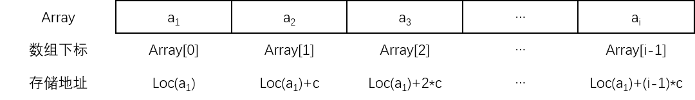

一维数组是由 $$n(n{\geq}1)$$ 个相同数据类型的数据元素构成的，是占用一块地址连续的内存单元的有限序列，$$n$$ 称为数组的**长度**。一维数组存储结构的示意图如下：

除了第一个元素和最后一个元素外，每个数据元素都有直接前驱和直接后继。

当系统为数组分配内存空间时，数组的首地址就确定了，假设数组的首地址为 $$Loc(a_1)$$，每个数据元素占用 $$c$$ 个存储单元，则第 $$i$$ 个数据元素的地址为：

$$
Loc(a_{i})={Loc(a_{1})+(i-1)}\times{c}
$$

对于一维数组，可以根据公式的计算得到数组元素的下标，即它的存储地址，进而访问对应的数据元素，这正是随机存储方式的体现。