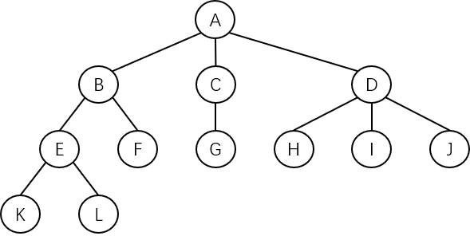

# 树的基本概念

## 树的定义

树是 $$n(n{\geq}0)$$ 个结点的有限集合 $$T$$，当 $$n=0$$ 时，称为**空树**；当 $$n>0$$ 时，该集合满足以下条件：

- 集合中必有一个称为**根（Root）**的特定结点，**它没有直接前驱，但有零个或多个直接后继**。
- 集合中其余 $$n-1$$ 个结点可以划分为 $$m(m>0)$$ 个互不相交的有限集 $$(T_1,T_2,T_3,...,T_m)$$。
  - 其中 $$T_i$$ 又是一棵树，称为**根的子树**。
  - 每棵子树的根结点**有且仅有一个直接前驱，但有零个或多个直接后继**。

树的定义是一个**递归**定义，是树的固有特性。树中每一个结点都是该树种某一棵子树的**根**，示意图如下：

上图给出了一棵树的逻辑结构。$$A$$ 是根结点，其余结点分为三个互不相交的有限子集：

- $$T_1={B,E,F,K,L}$$
- $$T_2={C,G}$$
- $$T_3={D,H,I,J}$$

$$T_1$$、$$T_2$$、$$T_3$$ 都是根 $$A$$ 的**子树，且本身也是一棵树**，例如在 $$T_1$$ 中，$$B$$ 为该子树的根，其余结点又构成两个互不相交的子集：

- $$T_{1,1}={E,K,L}$$
- $$T_{1,2}={F}$$

$$T_{1,1}$$ 和 $$T_{1,2}$$ 都是根 $$B$$ 的子树，而且它们本身又是一棵树……

## 树的术语

与树有关的术语如下：

| 术语                | 说明                                                         |
| ------------------- | ------------------------------------------------------------ |
| 结点                | 包含一个数据元素及若干指向其他结点的分支信息                 |
| 结点的度            | 一个结点的子树的个数                                         |
| 叶结点/终端结点     | 没有后继的结点，相当于度为 0                                 |
| 分支结点/非终端结点 | 度不为 0 的结点                                              |
| 树的度              | 树中所有结点的度的最大值                                     |
| 孩子结点            | 一个结点的直接后继被称为该结点的孩子结点 例如上图的 $$B$$、$$C$$、$$D$$ 是 $$A$$ 的孩子结点 |
| 双亲结点/父结点     | 一个结点的直接前驱称为该结点的双亲结点 例如上图的 $$A$$ 是 $$B$$、$$C$$、$$D$$ 的双亲结点 |
| 兄弟结点            | 同一双亲结点的孩子结点之间互称兄弟结点 例如上图的 $$B$$、$$C$$、$$D$$ 互为兄弟结点 |
| 结点的层次          | 从根结点开始定义，根结点的层次为 1，根的直接后继的层次为 2，依此类推 |
| 树的深度/高度       | 树中所有结点的层次的最大值 例如上图的树的深度为 4       |
| 祖先结点            | 一个结点的祖先结点是指从根结点到该结点的路径上的所有结点 例如上图的 $$L$$ 的祖先结点是 $$E$$、$$B$$、$$A$$ |
| 子孙结点            | 一个结点的直接后继和间接后继称为该结点的子孙结点 例如上图的 $$B$$ 结点的子孙结点是 $$E$$、$$F$$、$$K$$、$$L$$ |
| 有序树              | 在树 $$T$$ 中，如果各子树 $$T_i$$ 之间是有先后顺序的，则称之为有序树 |
| 森林                | $$m(m>0)$$ 棵互不相交的树的集合 将一棵非空树的根结点删去，树就变成了一个森林；反之，给森林增加一个统一的根结点，森林就变成一棵树 |

## 树的基本操作

树的基本操作如下：

- **Init(Tree)** - 将 Tree 初始化为一棵空树。
- **Create(Tree)** - 创建树 Tree。
- **Destory(Tree)** - 销毁树 Tree。
- **Empty(Tree)** - 判断树是否为空。
- **Root(Tree)** - 返回树 Tree 的根。
- **Parent(Tree,x)** - 返回树 Tree 中结点 x 的**双亲结点**。若结点 x 是**根结点**或树中不存在结点 x，则返回空。
- **FirstChild(Tree,x)** - 返回树 Tree 中结点 x 的**第一个孩子结点**。若结点 x 是**叶结点**或树中不存在结点 x，则返回空。
- **NextSibling(Tree,x)** - 返回树 Tree 中结点 x 的**下一个兄弟结点**。若结点 x 是**其双亲的最后一个孩子结点**或树中不存在结点 x，则返回空。
- **InsertChild(Tree,p,Child)** - 假设树 Tree 存在，且 p 指向 Tree 中的某个结点、非空树 Child 与 Tree 不相交。将 Child 插入 Tree 中，当作 p 所指向结点的子树。