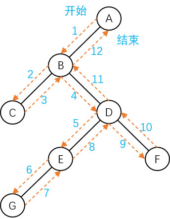

# 三种遍历方式

树的遍历是指按照指定的规则访问树中的每个结点，**每个结点都要被访问一次，且只能被访问一次**。

遍历是二叉树经常遇到的一种操作，在遍历过程中，对结点的访问具有普遍的含义，可以是输出各结点的数据域信息，也包括对结点进行其他操作。

由于二叉树是**非线性的结构**，通过遍历可以将二叉树中的结点访问一遍，得到访问结点的线性序列。从这个意义上说，**遍历操作就是将二叉树中的结点按照一定的规律线性化的操作，目的在于将非线性化的结构变成线性化的访问序列**。二叉树的遍历操作是二叉树中最基本的运算。

二叉树的定义是**递归**的。一棵非空的二叉树是由根结点、左子树和右子树这三个基本部分组成，因此只需要依次遍历这三部分，就遍历了整个二叉树。

以 **D、L 和 R** 分别表示**访问根结点、遍历左子树和遍历右子树**，那么对二叉树的遍历顺序就有六种方式：

1. **DLR** - 访问根，遍历左子树，遍历右子树。
2. **DRL** - 访问根，遍历右子树，遍历左子树。
3. **LDR** - 遍历左子树，访问根，遍历右子树。
4. **LRD** - 遍历左子树，遍历右子树，访问根。
5. **RDL** - 遍历右子树，访问根，遍历左子树。
6. **RLD** - 遍历右子树，遍历左子树，访问根。

在以上六种遍历方式中，如果规定按照**先左后右**的顺序，那么就只剩下 DLR、LDR 和 LRD 这三种遍历方式。根据**对根的访问先后顺序不同**，分别称其为：

- **DLR** - 先序遍历/先根遍历/前序遍历。
- **LDR** - 中序遍历/对称遍历。
- **LRD** - 后序遍历/后根遍历。

**先序、中序和后序遍历是递归定义的，即在其子树中亦按照上述规律进行遍历。**

# 三种遍历方式的递归定义

- **先序遍历操作过程** - 若二叉树为空，则空操作，否则依次执行以下三种操作：
  1. 访问根结点。
  2. 按先序遍历左子树。
  3. 按先序遍历右子树。
- **中序遍历操作过程** - 若二叉树为空，则空操作，否则依次执行以下三种操作：
  1. 按中序遍历左子树。
  2. 访问根结点。
  3. 按中序遍历右子树。
- **后序遍历操作过程** - 若二叉树为空，则空操作，否则依次执行以下三种操作：
  1. 按后序遍历左子树。
  2. 按后序遍历右子树。
  3. 访问根结点。

# 递归遍历算法

- **先序遍历二叉树**

  ```c
  void PreOrder(BinaryTreeNode *Root) {
      if (Root != NULL) {
          // 访问根结点的函数，自行定义
          VisitTreeNode(Root->Data);
          // 先序遍历左子树
          PreOrder(Root->LChild);
          // 先序遍历右子树
          PreOrder(Root->RChild);
      }
  }
  ```

- **中序遍历二叉树**

  ```c
  void InOrder(BinaryTreeNode *Root) {
      if (Root != NULL) {
          InOrder(Root->LChild);
          VisitTreeNode(Root->Data);
          InOrder(Root->RChild);
      }
  }
  ```

- **后序遍历二叉树**

  ```c
  void PostOrder(BinaryTreeNode *Root) {
      if (Root != NULL) {
          PostOrder(Root->LChild);
          PostOrder(Root->RChild);
          VisitTreeNode(Root->Data);
      }
  }
  ```

显而易见地，这三种遍历算法的区别就在于**调用访问根结点的函数的位置不同**，但都采用了**递归**的方法。为了便于理解递归，就以先序遍历为例，说明先序遍历二叉树的递归过程，示意图如下：



上图先序遍历得到的列表为：$$T=(A,B,C,D,E,G,F)$$。