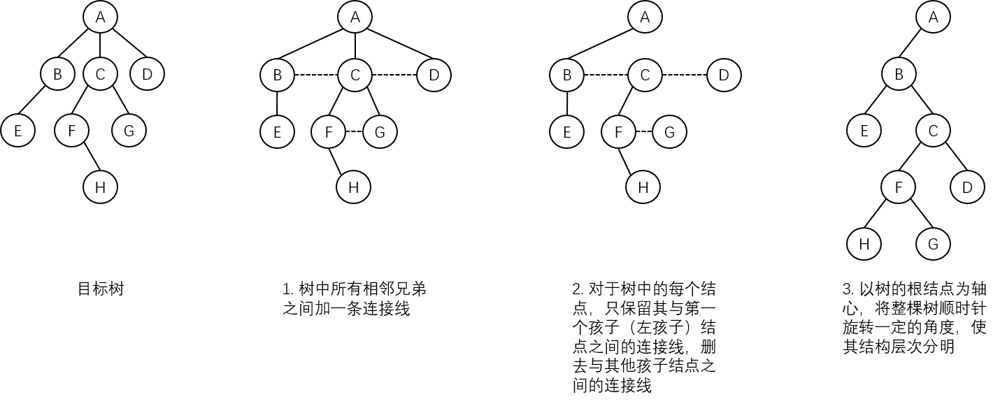
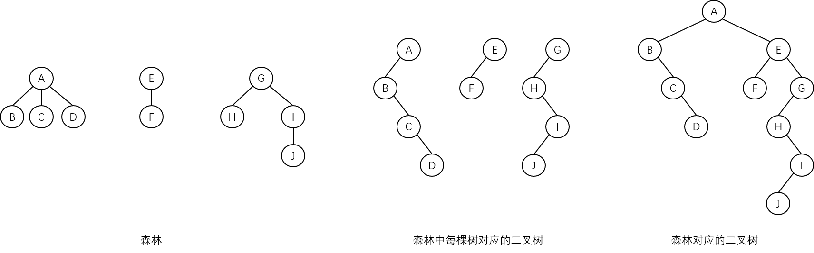
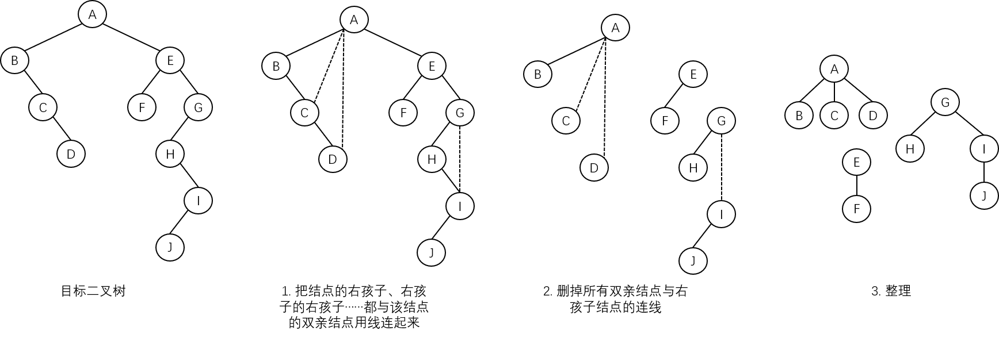

# 树转换为二叉树

从树的存储结构中可以看出，**树的孩子兄弟表示法**与**二叉树的二叉链表结构**在物理结构上是完全相同的，只是它们的逻辑含义不同，所以树和森林与二叉树之间有着密切的关系。

对于一棵无序树，树中结点的各孩子的顺序是无关紧要的；而二叉树中结点的左、右孩子结点是有区别的。为了避免混淆，约定对树中每一个结点的孩子按照从左到右的顺序编号，也就是说，**把树当作有序树看待**。

将一棵树转换为二叉树的步骤如下：

1. 树中所有相邻兄弟之间加一条连接线。
2. 对于树中的每个结点，只保留其与第一个孩子（左孩子）结点之间的连接线，删去与其他孩子结点之间的连接线。
3. 以树的根结点为轴心，将整棵树顺时针旋转一定的角度，使其结构层次分明。

**树做这样的转换所构成的二叉树是唯一的**，示意图如下：

从转换过程中可以看出：

- 树中某结点的**第一个孩子**在二叉树中是对应结点的**左孩子**。
- 树中某结点的**右兄弟结点**在二叉树中是对应结点的**右孩子**。
- 二叉树中的**左分支**代表原来树中的**父子关系**。
- 二叉树中的**右分支**代表原来树中的**兄弟关系**。
- 由于树的根结点**没有兄弟**，所以变换后的二叉树的根结点的**右孩子必然为空**。

一棵树采用兄弟孩子表示法所建立的存储结构与它所对应的二叉树的二叉链表存储结构是完全相同的，只是两个指针域的名称以及解释不同而已。

# 森林转换为二叉树

**森林是若干棵树的集合。**树可以转换为二叉树，森林同样也可以转换为二叉树，因此，森林也可以方便地用孩子兄弟链表表示。

森林转换为二叉树的步骤如下：

1. 将森林中的每棵树转换成相应的二叉树。
2. 第一棵二叉树不动，从第二棵二叉树开始，依次把后一棵二叉树的根结点作为前一棵二叉树根结点的右孩子，当所有二叉树连到一起后，所得到的二叉树就是由森林转换得到的二叉树。

森林转换为二叉树的示意图如下：

如果将森林 $$F$$ 看作树的有序集合 **$$F=\{T_1,T_2,...,T_N\}$$**，那么可以把上述森林转换为二叉树的方法做如下定义（即可以按照如下规则将森林转换成一棵二叉树 **$$B(F)=(Root,LTree,RTree)$$**）：

1. 若 $$F$$ 为空，即 $$N=0$$，则 $$B(F)$$ 为空树。
2. 若 $$F$$ 为非空，即 $$N>0$$，则：
   1. $$B(F)$$ 的**根结点**为森林中第一棵树 $$T_1$$ 的根结点。
   2. $$B(F)$$ 的**左子树**是从树 $$T_1$$ 中根结点的子树所构成的森林 $$F_{1}=\{T_{1,1},T_{1,2},...,T_{1,m}\}$$ 转换而成的二叉树 $$B(T_{1,1},T_{1,2},...,T_{1,m})$$。
   3. $$B(F)$$ 的**右子树**是从树 $$T_2$$、...、$$T_N$$ 构成的森林 $$F_{2}=\{T_2,...,T_N\}$$ 转换而成的二叉树 $$B(T_2,...,T_N)$$。

根据上述定义，可以**递归**地将森林转换为二叉树。

# 二叉树还原为树或森林

树和森林转换为二叉树的不同是：

- 树转换成的二叉树，其根结点必然**没有右孩子**。
- 森林转换成的二叉树，其根结点**有右孩子**。

将一棵二叉树还原为树或森林的步骤如下：

1. 若某结点是去双亲结点的左孩子，则把该结点的右孩子、右孩子的右孩子……都与该结点的双亲结点用线连起来。
2. 删掉原二叉树中所有双亲结点与右孩子结点的连线。
3. 整理由 1、2 两步所得到的树或森林，使之结构层次分明。

将一棵二叉树还原为森林的示意图如下：

同样，可以使用**递归**的方法描述上述转换过程。

若 $$B$$ 是一棵二叉树，$$T$$ 是 $$B$$ 的根结点，$$L$$ 是 $$B$$ 的左子树，$$R$$ 是 $$B$$ 的右子树，且 $$B$$ 对应的森林 $$F(B)$$ 中含有的 $$n$$ 棵树为 $$T_1$$，$$T_2$$，...，$$T_n$$，则有：

1. $$B$$ 为空，则 $$F(B)$$ 为空的森林（$$n=0$$）。
2. $$B$$ 非空，则：
   1. $$F(B)$$ 中**第一棵树 $$T_1$$ 的根结点**为二叉树 $$B$$ 的根结点。
   2. **$$T_1$$ 中根结点的子树森林**由 $$B$$ 的左子树 $$L$$ 转换而成，即 $$F(L)=\{T_{1,1},...,T_{1,m}\}$$。
   3. $$B$$ 的右子树 $$R$$ 转换为 $$F(B)$$ 中**其余树组成的森林**，即 $$F(R)=\{T_2,...,T_n\}$$。
