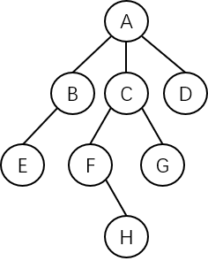
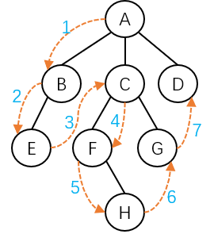
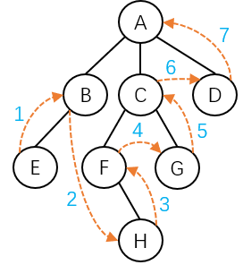

树的遍历方法主要有以下两种：

1. **先根遍历** - 若树非空，则遍历步骤为：
   1. 访问根结点。
   2. **从左到右**，依次先根遍历根结点的每一棵子树。
2. **后根遍历** - 若树非空，则遍历步骤为：
   1. **从左到右**，依次后根遍历根结点的每一棵子树。
   2. 访问根结点。

有一棵树，示意图如下：

其**先根遍历**序列为：$$ABECFHGD$$，示意图如下：

> **一句话总结：从根结点开始，按照从左到右、从上到下的顺序遍历结点，最后一个结点必定是最右分支底部的结点。**

其**后根遍历**序列为：$$EBHFGCDA$$，示意图如下：

> **一句话总结：从最左分支底部开始，按照从左到右、从下到上的顺序遍历结点，最后一个结点必定是根结点。**
