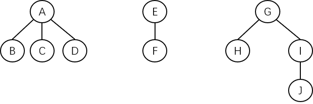
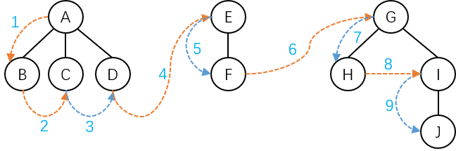
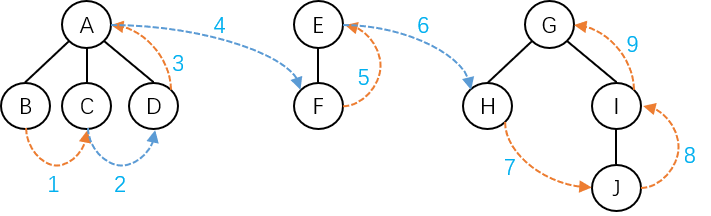
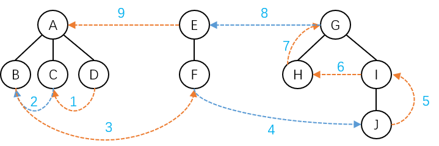

森林的遍历方法主要有以下三种：

1. **先序遍历** - 若森林非空，则遍历步骤为：
   1. 访问森林中第一棵树的根结点。
   2. 先序遍历森林中第一棵树的根结点的子树森林。
   3. 先序遍历森林中除去第一棵树之后剩余的树构成的森林。
2. **中序遍历** - 若森林非空，则遍历步骤为：
   1. 中序遍历森林中第一棵树的根结点的子树森林。
   2. 访问森林中第一棵树的根结点。
   3. 中序遍历森林中除去第一棵树之后剩余的树构成的森林。
3. **后序遍历** - 若森林非空，则遍历步骤为：
   1. 后序遍历森林中第一棵树的根结点的子树森林。
   2. 后序遍历森林中除去第一棵树之后剩余的树构成的森林。
   3. 访问森林中第一棵树的根结点。

有一座森林，示意图如下：

其**先序遍历**序列为：ABCDEFGHIJ，示意图如下：

> **一句话总结：从第一棵树的根结点开始，每棵树都按照从左到右、从上到下的顺序遍历结点，最后一个结点必定是最后一棵树的最右分支底部的结点。**

其**中序遍历**序列为：BCDAFEHJIG，示意图如下：

> **一句话总结：从第一棵树的最左子树底部开始，每棵树都按照从左到右、从下到上的顺序遍历结点，最后一个结点必定是最后一棵树的根结点。**

其**后序遍历**序列为：DCBFJIHGEA，示意图如下：

> **一句话总结：从第一棵树的最右子树底部开始，每棵树都按照从右到左、从下到上的顺序遍历结点，最后一个结点必定是第一棵树的根结点。**

对照二叉树与森林之间的转换关系可以发现，森林的先序遍历、中序遍历和后序遍历与其相应二叉树的先序遍历、中序遍历和后序遍历是对应相同的。

另外，树可以看成只有一棵树的森林，所以树的先根遍历和后根遍历分别与森林的先序遍历和中序遍历对应相同。