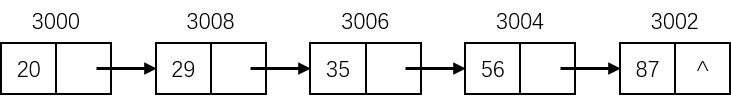

# 数据结构的存储实现

存储实现的基本目的就是**建立数据结构在计算机内部的表示或实现**，包括数据以及逻辑关系的物理表达，也被称为存储结构或物理结构。

存储结构不同于逻辑结构，它与所使用的计算机语言相关，数据结构有四种常用的存储结构类型：**顺序存储结构**、**链式存储结构**、**索引存储结构**和**散列存储结构**。

## 顺序存储结构

**顺序存储结构（Sequential Storage Structure）**将逻辑上相邻的结点存储在物理位置上也相邻的存储单元里，结点之间的逻辑关系则由存储单元的邻接关系来表达，主要用于线性的数据结构。

> 某些非线性的数据结构可以通过线性化处理后进行顺序存储。

顺序存储结构可以借助计算机程序设计语言提供的**数组类型**来描述，它的主要特点有：

- 结点只存储数据本身，结点之间的逻辑关系没有占用额外空间，因此**存储空间利用率高**。

- 数据结构中的每个结点的存储地址**可以通过公式直接计算**，第 i 个结点的存储地址为：

  
  $$
  L_i=L_0+(i-1)\times B
  $$
  

  式中，$$L_0$$ 为第一个结点的存储位置，$$B$$ 为每个结点所占用的存储单位个数。

- 对结点进行插入、删除运算时，会引起大量的结点移动，操作不便，导致**运算操作效率低**。

例如，有一种数据结构：

$$
DS=(D,S)
$$

式中：

$$
D=\{C,O,M,P,U,T,E,R\}
$$

$$
S=\{<C,O>,<O,M>,<M,P>,<P,U>,<U,T>,<T,E>,<E,R>\}
$$

设第一个结点的存储地址为 3000，每一个结点所占用的存储单元个数为 1，那么该数据结构的存储结构如下：

| 存储单元 | C    | O    | M    | P    | U    | T    | E    | R    |
| -------- | ---- | ---- | ---- | ---- | ---- | ---- | ---- | ---- |
| 地址     | 3000 | 3001 | 3002 | 3003 | 3004 | 3005 | 3006 | 3007 |

## 链式存储结构

**链式存储结构（Linked Storage Structure）**不要求逻辑上相邻的结点在物理位置上也相邻，结点之间的逻辑关系是由附加的指针来表达的，指针指向结点的邻接结点，将所有的结点串联在一起，通常可以借助于计算机程序设计语言提供的**指针类型**来描述。

链式存储结构由两部分组成：

1. **数据域** - 存储结点本身的值。
2. **指针域** - 存储该结点的各个后续结点的存储单元地址，可以被多个指针指向。

链式存储结构的主要特点如下：

- 结点除了存储数据本身的值外，还分配了一部分空间用于存储结点之间的逻辑关系，因此相比顺序存储结构，其**存储空间利用率较低**。
- 逻辑上相邻的结点，**物理上不必邻接**，可用于线性表、树和图等多种逻辑结构的存储表达。
- 对结点进行删除和插入操作比较灵活，不必移动结点，只需要改变结点中指针域的值即可，**运算操作效率较高**。

例如，有一种线性结构的结点集：

$$
D=\{20,87,56,35,29\}
$$

且第一个结点的存储地址为 3000，每一个结点所占用的存储单元个数为 2，并以结点的升序为逻辑关系：

$$
S=\{<20,29>,<29,35>,<35,56>,<56,87>\}
$$

则其对应的链式存储结构如下：

| 地址 | 数据 | 指针 |
| ---- | ---- | ---- |
| 3000 | 20   | 3008 |
| 3002 | 87   | ^    |
| 3004 | 56   | 3002 |
| 3006 | 35   | 3004 |
| 3008 | 29   | 3006 |

其对应的线性结构的链式存储如下：

## 索引存储结构

**索引存储结构（Index Storage Structure）**是在存储结点数据的同时，建立一个附加的索引表，表中的每一项称作索引项，利用索引项的值来确定结点的实际存储单元地址，索引项的一般形式为 **(关键字,地址)** ，关键字能**唯一标识**一个结点。

以城市结构，有如下索引表：

| 地址 | 关键字 | 索引 |
| ---- | ------ | ---- |
| 4000 | 023    | 220  |
| 4001 | 010    | 140  |
| 4002 | 027    | 300  |
| 4003 | 028    | 180  |
| 4004 | 024    | 260  |

有如下结点表：

| 地址 | 城市名    | 区号 | 说明       |
| ---- | --------- | ---- | ---------- |
| 140  | Beijing   | 010  | 首都       |
| 180  | Chengdu   | 028  | 四川省省会 |
| 220  | Chongqing | 023  | 重庆直辖市 |
| 260  | Shenyang  | 024  | 辽宁省省会 |
| 300  | Wuhan     | 027  | 湖北省省会 |

在进行关键字查找时，可以先在索引表中快速查找到相应的关键字，然后通过指针指向结点表中的地址，找到结点表中对应的结点。

索引存储结构的主要特点如下：

- **检索速度快**，可以直接对结点进行随机访问。
- 在进行插入、删除操作时，只需要移动存储在索引表中对应结点的存储地址，而无需移动存储在结点表中的结点数据，因此**运算操作效率较高**。
- 由于附加了索引表，导致**存储空间利用率降低**。

## 散列存储结构

**散列存储结构（Hash Storage Structure）**的基本思想是根据结点的关键字直接计算出结点的存储地址，把结点的关键字作为自变量，通过**散列函数（Hash Function）**的计算规则，确定出该结点的存储单元地址，然后将结点存入到此存储单元中。

以城市结构为例，将城市名作为自变量 $$key$$（即关键字），选用散列函数：

$$
H(key)=1000+Sum(ASC(key))\%128
$$

计算结点的存储地址，其中 $$Sum(ASC(key))$$ 表示对 $$key$$ 的所有字符的 ASCII 值进行求和，其计算结果如下：

| *key*           | Beijing | Chengdu | Chongqing | Shenyang | Wuhan |
| --------------- | ------- | ------- | --------- | -------- | ----- |
| *SUM(ASC(key))* | 696     | 702     | 926       | 829      | 515   |
| *H(key)*        | 1056    | 1062    | 1030      | 1061     | 1003  |

于是得到城市结构的散列存储表示：

| 地址 | 城市名    | 区号 | 说明       |
| ---- | --------- | ---- | ---------- |
| 1003 | Wuhan     | 027  | 湖北省省会 |
| ≈    |           |      |            |
| 1030 | Chongqing | 023  | 重庆直辖市 |
| ≈    |           |      |            |
| 1056 | Beijing   | 010  | 首都       |
| ≈    |           |      |            |
| 1061 | Shenyang  | 024  | 辽宁省省会 |
| 1062 | Chengdu   | 028  | 四川省省会 |

散列存储结构的主要特点如下：

- 检索、增加和删除结点的**运算操作速度快**。
- 由于散列存储结构的**核心是散列函数的设计**，因此如果采用了设计不好的散列函数，有可能会出现结点单元的碰撞或冲突（例如不同的结点关键字得到了相同的存储单元地址），此时就需要附加时间和空间开销（例如进行二次散列处理），这样就导致**效率降低**。
- 散列函数具有**单向不可逆性**，因此散列存储结构只适合于存储结点的数据，而不存储结点之间的逻辑关系，一般只适合要求对数据能够进行快速查找、插入和删除等操作的场合。
