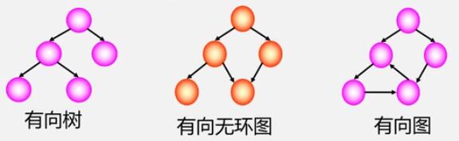

**图（Graph）**是由一些**顶点（Vertex）**和连接多个顶点之间的线组成的，是一种比线性表和树更复杂的数据结构。

> 在线性表中，每一个元素只有一个唯一的直接前驱元素和直接后继元素；在树形结构中，数据元素之间有明显的层次关系，而且是每一层中的元素都只能和上一层中的一个元素（双亲结点）产生关系，但可以和下一层中的多个元素（子节点）产生关系。

在图中，**虽然顶点之间的关系可以是任意的，但图中两个元素之间却可能无关**。图的示意图如下：

## 图的术语

### 顶点序列

一般将图的**顶点序列**记作 **$$V$$**，在上图中：

- 图 $$G_1$$ 有顶点序列 $$V_1=(a,b,c,d)$$。
- 图 $$G_2$$ 有顶点序列 $$V_2=(a,b,c,d,e)$$。
- 图 $$G_3$$ 有顶点序列 $$V_3=(a,b,c,d,e,f,g,h,i,j,k)$$。

### 顶点之间的关系

在图 $$G_1$$ 中，顶点之间的连线，称为图 $$G_1$$ 的**弧（Arc）**或**边（Edge）**或是**顶点之间的关系（Relationship）**，其集合记作 **$$VR$$**。

在图 $$G_2$$ 中，$$G_2$$ 的弧都是**带有箭头的**，这种弧称为**有向弧**，用 **$$<V_i,V_j>$$** 表示，其中 $$V_i$$ 和 $$V_j$$ 是图中的两个顶点，且**存在一条边由 $$V_i$$ 指向 $$V_j$$**，$$V_i$$ 记为**弧尾**或**始点**，$$V_j$$ 记为**弧头**或**终点**，由有向弧组成的图就称为**有向图（Digraph）**。需要注意的是，**在图中存在 $$<V_i,V_j>$$ 时，不一定存在 $$<V_j,V_i>$$**。

从图 $$G_1$$ 和 $$G_3$$ 中可以看出，它们的弧是无向的，称之为**无向弧**，记为 **$$(V_i,V_j)$$**，其中 $$V_i$$ 和 $$V_j$$ 是图中的两个顶点，无向弧也可以表示为 **$$(V_j,V_i)$$**，由无向弧组成的图就称为**无向图（Undigraph）**。在**无向图**中，若存在弧 $$(V_i,V_j){\in}VR$$，则称 $$V_i$$ 与 $$V_j$$ 互为**邻接点**，即 $$V_i$$ 与 $$V_j$$ 之间存在一条边。

在上图中：

- 图 $$G_1$$ 有顶点之间的关系 $$VR_1=\{(a,b),(a,d),(a,c),(b,c),(b,d),(c,d)\}$$。
- 图 $$G_2$$ 有顶点之间的关系 $$VR_2=\{<a,b>,<a,c>,<a,d>,<d,c>,<c,b>,<d,e>\}$$。

### 边数的取值范围

假设 **$$e$$** 表示图中**弧的数目**，**$$n$$** 表示图中**顶点的数目**，且图中不存在弧 $$(V_i,V_j){\in}VR(i=j)$$ 或是弧 $$(V_j,V_i){\in}VR(i=j)$$，即**图中不存在顶点到该顶点自身的弧**，那么：

- **无向图**中弧的取值范围为：$$\{e\}=[0,n(n-1)/2]$$，若弧的数目是取值范围的最大值，则称该无向图为**完全图（Completed Graph）**。
  
- **有向图**中弧的取值范围为：$$\{e\}=[0,n(n-1)]$$，若弧的数目是取值范围的最大值，则称该有向图为**有向完全图**。

不失一般性，一个图的 $$e$$ 往往是小于取值范围的最大值的，通常把具有很少条边的图称之为**稀疏图**。相对的，若一个图接近完全图，即弧的数目比较多的图，称之为**稠密图**。

### 权值

在实际生活中，图的边可能代表的是两城市之间的距离，如公里数；也可能代表两个电气元件之间的之间的电阻大小或电流大小等问题。所以在图中，把和弧相关的数叫做**权值（Weight）**。

带权的图就成为**网**。

### 子图

假设有两个图：

$$
G=(V,VR)
$$

$$
G'=(V',VR')
$$

若有 $$V{\in}V'$$，$$VR{\in}VR'$$，则称 $$G$$ 是 $$G'$$ 的**子图**。

### 度

**度（Degree）**是指和某个顶点 $$V_i$$ 关联的弧的数目，记作 **$$TD(V_i)$$**。例如在上图中，$$G_1$$ 的顶点 $$a$$ 的度为 $$3$$、$$TD(b)=3$$、$$TD(c)=3$$、$$TD(d)=3$$。

对于有向图，如果存在 $$<V_i,V_j>{\in}VR$$，则在有向图中以 $$V_i$$ 为**始点（弧尾）**的弧的数目，称之为 $$V_i$$ 的**出度（Outdegree）**，记作 **$$OD(V_i)$$**；以 $$V_i$$ 为**终点（弧头）**的弧的数目，称之为 $$V_i$$ 的**入度（Indegree）**，记作 **$$ID(V_i)$$**。

> 出度可以理解成从这里射出去的弧有几条，入度可以理解成从别的地方射进来的弧有几条。

有：

$$
TD(V_i)=OD(V_i)+ID(V_i)
$$

例如在上图的 $$G_2$$ 中，有：

$$
OD(c)=1
$$

$$
ID(c)=2
$$

$$
TD(c)=OD(c)+ID(c)=3
$$

**图的边数 $$e$$ 和 $$TD(V_i)$$ 的关系必须满足**：

$$
2e=\sum{TD(V_i)}
$$

### 路径

假设图 $$G$$ 中存在 $$V_i{\in}V$$，$$V_j{\in}V$$，且存在一个顶点序列 $$V=(V_i(0),V_i(1),V_i(2),...,V_i(m))$$，其中 $$V_i(m)=V_j$$，且 $$(V_i(k),V_i(k+1)){\in}VR$$，$$k=(1,2,...,m)$$。则称 $$V_i$$ 和 $$V_j$$ 之间存在**路径（Path）**。

如果图 $$G$$ 是有向图，那么路径也是**有向的顶点序列**，满足 $$(V_i(k),V_i(k+1)){\in}VR$$，$$k=(1,2,...,m)$$。

例如上图 $$G_1$$ 中，从 $$a$$ 到 $$c$$ 有以下路径：

- $$a{\rightarrow}c$$。
- $$a{\rightarrow}b{\rightarrow}c$$。
- $$a{\rightarrow}d{\rightarrow}c$$。
- $$a{\rightarrow}b{\rightarrow}d{\rightarrow}c$$。
- $$a{\rightarrow}d{\rightarrow}b{\rightarrow}c$$。

**路径的长度**就是这个**路径上弧的数目**或其**权值之和**。

例如上图 $$G_1$$ 中，从 a 到 c 的路径长度为：

- **$$a{\rightarrow}c$$** - 1。
- **$$a{\rightarrow}b{\rightarrow}c$$** - 2。
- **$$a{\rightarrow}d{\rightarrow}c$$** - 2。
- **$$a{\rightarrow}b{\rightarrow}d{\rightarrow}c$$** - 3。
- **$$a{\rightarrow}d{\rightarrow}b{\rightarrow}c$$** - 3。

如果在路径中 **$$V_i=V_j$$**，那么这条路径就被称为**回路**或**环（Cycle）**。

如果在路径序列中**不存在重复的顶点**，那么路径就被称为**简单路径**。

### 连通图

在**无向图**中，若**任意两顶点 $$V_i{\in}V$$，$$V_j{\in}V$$，$$V_i$$ 和 $$V_j$$ 之间存在路径**，则称该图为**连通图（Connected Graph）**，其中的每一个**子连通图**就相当于一个**连通分量**。

在**有向图**中，若**任意两顶点 $$V_i{\in}V$$，$$V_j{\in}V$$，$$V_i{\neq}V_j$$，且有路径 $$V_i$$ 到 $$V_j$$ 和路径 $$V_j$$ 到 $$V_i$$**，则称该图为**强连通图**。

### 生成树

一个**连通图**的**生成树**指的是它**含有图中全部顶点，但只有足以构成一棵树的 $$n-1$$ 条边**。

在**有向图**中，如果**恰有一个顶点入度为 0，其余顶点入度均为 1**，则构成一棵树，称之为**有向树**。

在**有向图**中，如果要包含全部结点，则会生成很多个树，这些生成树构成了有向图的**生成森林**。

### 有向无环图

**有向无环图**简称为 **DAG 图（Directed Acycline Graph）**，它是一个有向图，但不存在回路，一个结点可能有多个前驱。示意图如下：

有向无环图通常用来**描述一个工程或者系统的进行过程**，例如计划、施工、生成、程序流程等都可以当成是一个工程。

一个工程又可以分为若干个子工程，只要完成了这些子工程，就可以完成整个工程。

可以用一个有向图表示一个工程的各子工程及其相互制约的关系，并根据应用的不同，将其划分为两类有向图：

1. **AOV 网** - **以顶点表示活动，以弧表示活动之间的优先制约关系**，这种有向图就称为**顶点表示活动的网**，简称 **AOV 网（Activity On Vertex）**，常用于求解**拓扑排序**。
2. **AOE 网** - **以弧表示活动，以顶点表示活动之间的开始或结束事件**，这种有向图就称为**边表示活动的网**，简称 **AOE 网（Activity On Edge）**，常用于求解**关键路径**。