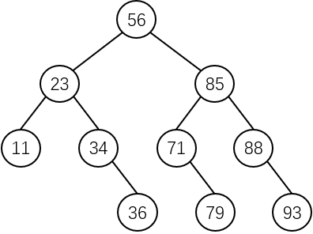

# 算法实现

**二分查找（Binary Search）**也称为**折半查找**，适用于**数据元素已经按照关键字大小排序的顺序存储结构**中。

设有序表的数据元素是按照升序排列的，把给定值 key 和有序表的中间位置的数据元素的关键字进行比较：

- 如果 key **等于**当前数据元素的关键字，则**查找成功**。
- 如果 key **小于**当前数据元素的关键字，则在有序表的**前半区**继续查找。
- 如果 key **大于**当前数据元素的关键字，则在有序表的**后半区**继续查找。

二分查找的一般算法实现如下：

```c
int BinarySearch(SequentialList SL, KeyType key) {
    // 第一个数据元素下标，最后一个数据元素下标，中间数据元素的下标
    int first, last, mid;
    // 根据上文顺序表的数据结构的定义，第一个元素的下标为 1
    first = 1;
    last = SL.length;
    // 正常的区间为 [first, last]，若 first <= last，则说明区间已经崩坏了，没有符合 key 的数据元素
    while (first <= last) {
        // 取两者的中间数；若和为奇数，则根据 int 类型的特性自动取整数部分
        mid = (first + last) / 2;
        if (key == SL.base[mid].key) {
            return mid;
        } else if (key < SL.base[mid].key) {
            // 查找前半区
            last = mid - 1;
        } else {
            // 查找后半区
            first = mid + 1;
        }
    }
    // 查找失败，返回 -1
    return -1;
}
```

二分查找算法的时间复杂度为 **$$O({\log}_{2}n)$$**。

对比顺序查找与二分查找。在每一次比较后，顺序查找算法将查找范围**缩小了一个数据元素**；而二分查找算法则将查找范围**缩小一半**，查找效率大大提高。

# 判定树

一组序列的二分查找的**判定树**如下：



可知，查找有序表中任何一个数据元素的过程，就是**从判定树的根结点到该数据元素结点路径上的各结点关键字与待查找数据元素关键字的比较过程**。

所以，比较次数为该数据元素结点**在判定树中的层数**。

由二叉树的性质可知，二分查找在查找成功时所进行的关键字个数不超过树的深度，而具有 $$n$$ 个结点的二叉树的深度为 **$${\lfloor}{\log}_{2}n{\rfloor}+1$$**。

因此，二分查找算法在查找成功时和待查找数据元素的关键字**进行比较的关键字个数至多为 $${\lfloor}{\log}_{2}n{\rfloor}+1$$**。

# ASL

为了方便讨论，以深度为 $$h$$ 的满二叉树为例。

树中第 1 层的结点有 1 个，第 2 层的结点有 2 个，第 3 层的结点有 4 个，层次为 $$h$$ 的结点有 $$2^{h-1}$$ 个。假设顺序表中每个数据元素的**查找概率是相等的**，即 $$P_{i}=1/n$$，则二分查找查找成功时的 ASL 为：

$$
ASL_{BS}=\sum_{i=1}^{n}P_iC_i=\frac{1}{n}\sum_{j=1}^{h}j.2^{j-1}=\frac{n+1}{n}\log_2(n+1)-1=\log_2(n+1)-1
$$

由此可见，二分查找的效率比顺序查找高，但二分查找要求是**顺序存储的有序表**，**对线性链表无法进行二分查找**，在不满足这样的前提条件下，就只能使用顺序查找。