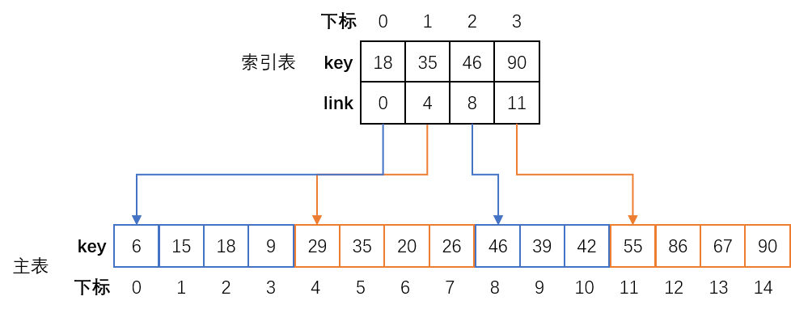

# 分块查找

## 分块查找的定义

**分块查找（Blocking Search）**又称为**索引顺序查找**，是**对顺序查找的一种改进**。

分块查找需要另外在设计一张**索引表（Index）**，用来记录数据块之间的顺序，并把在上面建立索引表的**顺序表**称作**主表**，主表中存放着数据元素的信息，索引表中只存放着主表中要查找数据元素的**主关键字**和**索引信息**。

索引表采用**顺序存储结构**，并且必须**有序**；而主表中的数据元素**不一定**按照关键字有序排列，因为对于数据元素个数非常大的主表而言，要按照关键字排序实现起来需要花费较多的时间。

所以，分块查找**只要求主表中的数据元素按照关键字有序分段，将其分为若干个子表，并对子表建立索引表**。因此，主表的每个子表由索引表中的数据元素确定。

索引表中的数据元素由两个域组成：

- **key 域** - 关键字项，存放子表中的**最大关键字的值**。
- **link 域** - 指针项，存放对应子表的**第一个数据元素在主表中的位置**。

假设不同的数据块按照数据元素的递增顺序排列，**在第 $$n+1$$ 块中任意一个数据元素的关键字都大于第 $$n$$ 块中任意一个数据元素的关键字**，示意图如下：

## 分块查找的算法思想

分块查找的基本思路为：**首先确定索引表里待查找数据元素所在的子表，再根据子表地址在子表中进行查找**。

例如要在上图中查找 key 为 42 的数据元素，其步骤为：

1. 将 42 与索引表中每个数据元素的 key 进行比较。
2. 由于 35<42<46，所以 42 必定在主表的第三个子表中。
3. 主表的第三个子表从下标为 8 的数据元素开始，从这个数据元素向后顺序查找。
4. 当查找到 42 时，说明查找成功；若查找完子表也没有发现，说明查找失败。

## 分块查找的 ASL

分块查找由**索引表查找**和**子表查找**两步完成。

分块查找的 ASL 为**查找索引的 $$ASL(L_b)$$** 和**在子表中进行顺序查找的 $$ASL(L_w)$$** 之和，即：

$$
ASL_{BS}=L_b+L_w
$$

假设**顺序表的表长为 $$n$$**，并**均匀地分成 $$b$$ 块**，设**每块长度为 $$s$$**，即：

$$
b=[n/s]
$$

则在**等概率**查找的情况下，**每块查找的概率为 $$1/b$$**，**子表中每个数据元素的查找概率为 $$1/s$$**，则用顺序查找确定所在块的分块查找的 ASL 为：

$$
ASL_{BS}=L_b+L_w=\frac{1}{b}\sum_{i=1}^{b}i+\frac{1}{s}\sum_{j=1}^{s}j=\frac{b+1}{2}+\frac{s+1}{2}=\frac{1}{2}(\frac{n}{s}+s)+1
$$

可以看出，ASL 不仅和表长 $$n$$ 有关，而且和每一块的数据元素个数 $$s$$ 有关。

在 $$n$$ 一定的情况下，$$s$$ 是可以调整的。当 $$s$$ 取根号下 $$n$$ 时，有**分块查找的 ASL 的最小值**：

$$
ASL_{BS}=\sqrt{n}+1
$$

这与顺序查找相比有较大的改进，但仍然不及折半查找。

## 分块查找的特性

分块查找的 ASL 介于顺序查找和折半查找之间，但表的结构灵活：

- 存储记录的线性表**可以采用链式存储结构**，而且整个表**不要求有序**，方便做**插入**和**删除**操作。
- 索引表中的**索引**不一定要按照**子表最大值**建立，而是可以根据静态查找表的特点建立**分类索引**。
- 当主表中的数据元素个数非常多时，索引表本身可能也很大，此时可以按照建立索引表的方法对索引表再建立索引表，这样的索引表称为**二级索引表**。同样的方法还可以建立**三级索引表**，二级以上的索引结构称为**多级索引结构**。

生活中使用的工具字典就是一种分块查找表，可以用它来进行查找操作。字典是数据量很大的查找表，如果使用顺序查找算法进行查找操作显然太慢，也不便于使用折半查找，而最适合的就是采用分块查找技术。为了方便查找，字典中的关键字通常是按照一定规则排好序的，并且在正文内容之前，都有一个索引表指明关键字所在的页码。

一个包含全校学生的查找表首先可以按照系分类，每个系内再按照年级分类，年级内则按照班分类。