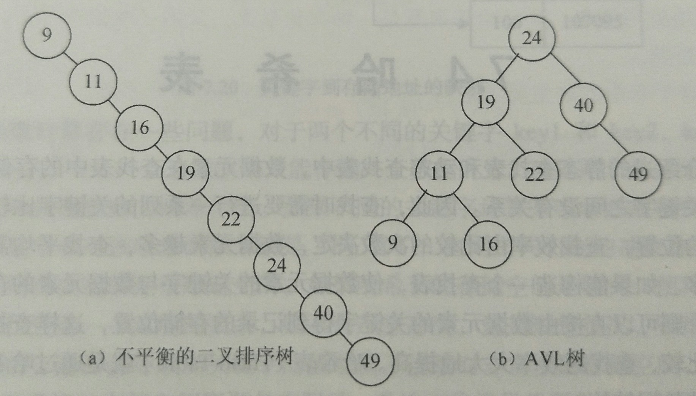
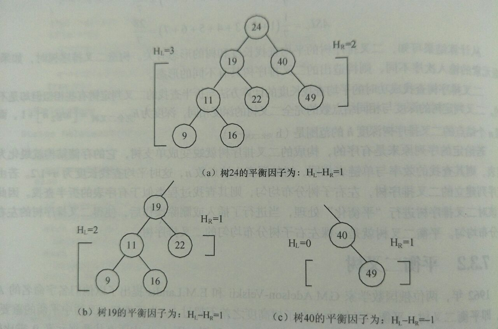

**平衡二叉树（AVL Tree）**就是一棵左、右子树分布均匀的二叉排序树，**左、右子树的高度差不超过 1**。

> 1962年，两位俄国数学家 G.M.Adelson-Velskii 和 E.M.Landis 提出了以他们名字命名的 AVL 树，即平衡二叉树。

下图是含有相同数据元素的构造序列生成的排序二叉树：

显而易见的，a 的查找时间复杂度为 **$$O(n)$$**；而 b 的左、右子树分布均匀，时间复杂度只需要 **$$O({\log}_{2}n)$$**。

当二叉树得到平衡后，在最坏的情况下需要 8 次比较才能找到的最底层结点，可以减少到 4 次比较。由此可以推出，一棵二叉树若是有 $$n$$ 个结点，在最坏的情况下查找需要比较 **$$n$$** 个数据元素；但如果是平衡二叉树，在最坏情况下的查找只需要比较 **$${\log}_{2}n$$** 次。因此，**二叉排序树的平衡化对查找效率影响很大**。

平衡二叉树可以是**空树**，也可以是**两棵 AVL 子树的二叉树**，属于**递归**的定义。

平衡二叉树中**结点的平衡因子的绝对值不超过 1**。平衡因子是二叉排序树中结点的左子树高度减去它的右子树高度，设 **HL** 是**左子树的高度**，**HR** 是**右子树的高度**，则有：
$$
|HL-HR|{\leq}1
$$
即，**平衡因子只能是 -1、0 或 1**。

二叉树的平衡因子计算示意图如下：

通过分析可知，由于 AVL 树上任何结点的左、右子树深度之差都不超过 1，可以证明它的深度和 $${\log}_{2}N$$ 是同数量级的，这样**它的 ASL 就和 $${\log}_{2}N$$ 是同数量级的**。