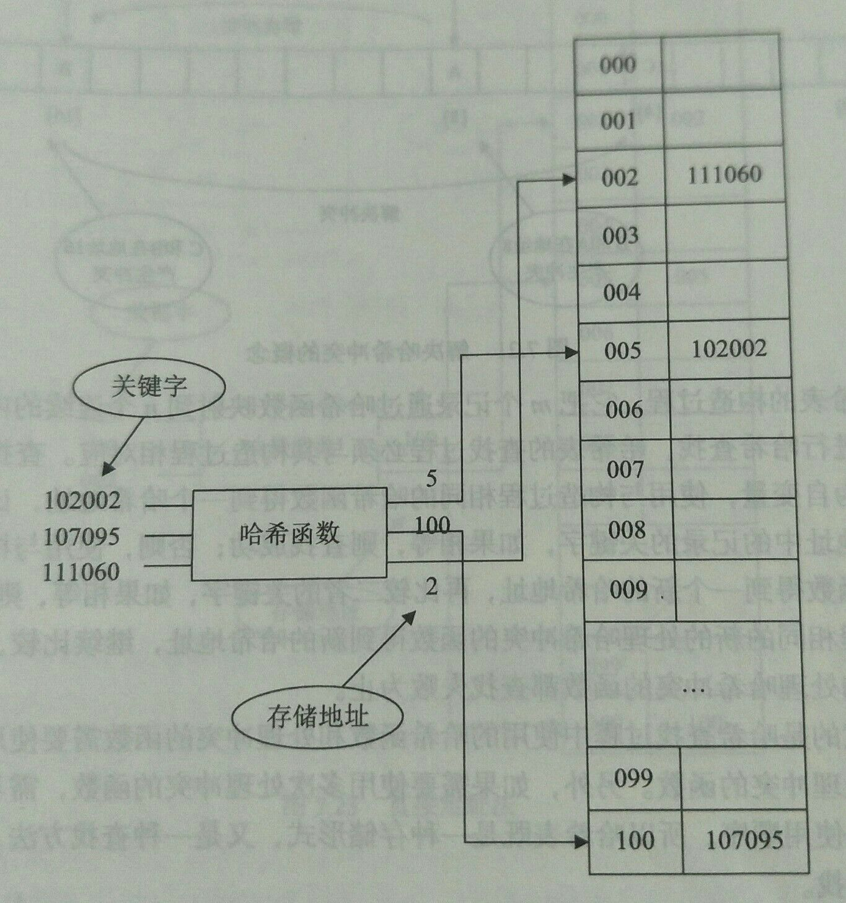

# 哈希表的基本概念

在上文的静态查找表和动态查找表中，数据元素在查找表中的存储位置是**随机**的，与数据元素的关键字之间没有关系，因此在查找时需要进行一系列的关键字比较才能确定被查找数据元素在查找表中的位置，查找效率由比较次数决定，数据元素越多，查找平均需要进行关键字比较的次数就越多。

如果能构造一个查找表，使**数据元素的关键字与数据元素的存放位置之间存在某种对应关系**，则可以直接由数据元素的关键字得到该数据元素的存储位置，这样查找过程就不需要进行多次关键字之间的比较，查找的效率大大提高。

**哈希表（Hash Table）**就是通过**哈希函数（Hash Function）**来确定记录存储位置的一种数据结构。

哈希表也叫**散列表**，是通过一个特定的哈希函数**将每个数据元素的关键字映射为查找表中的一个单元的存储位置**，并把该数据元素存放在该单元中，哈希函数的值就称为**哈希地址**。

哈希表**本质**上是**数据元素的关键字到内存空间的映射**，示意图如下：

对于哈希方法主要考虑两个问题，一是**如何构造哈希函数**，二是**如何解决哈希冲突**。