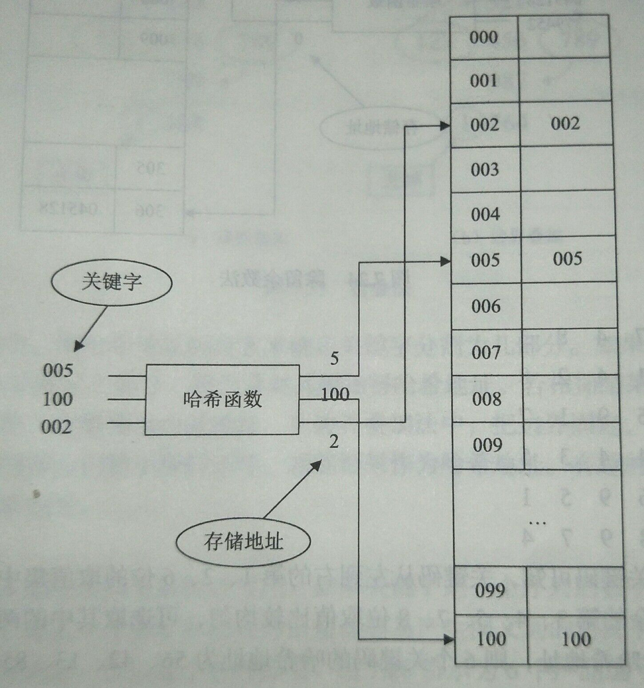
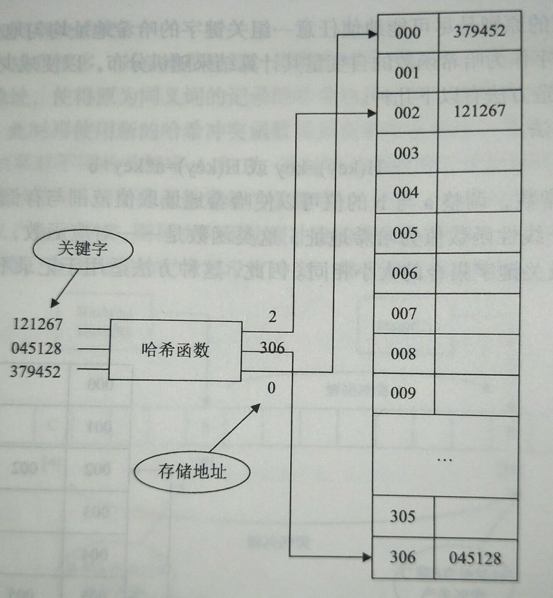
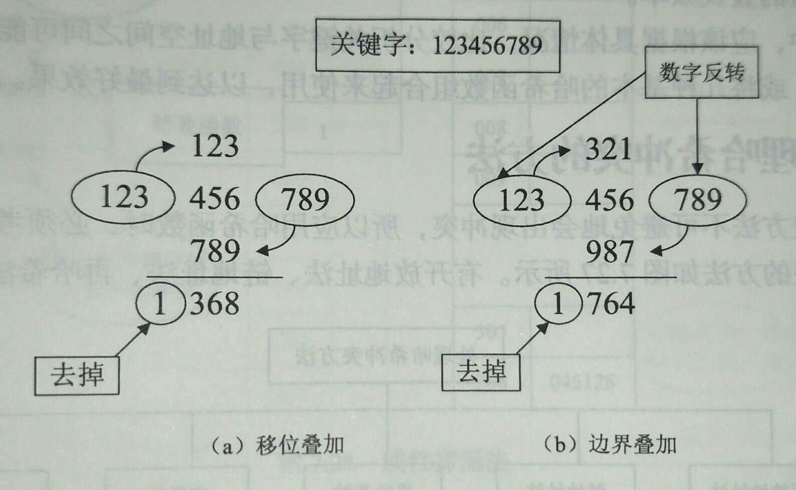
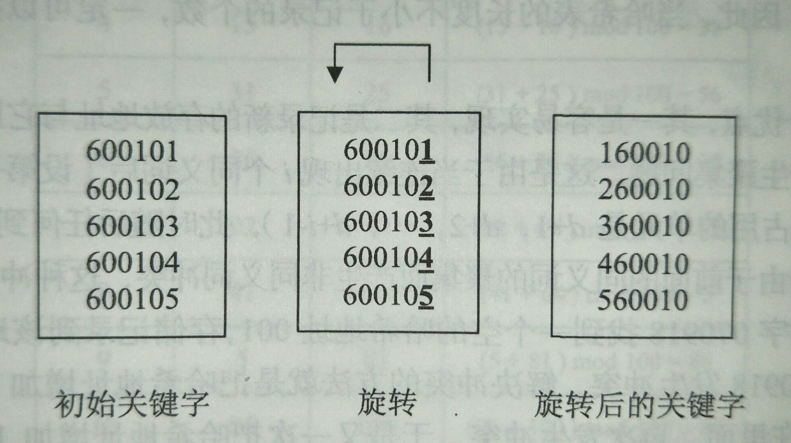

构造哈希函数的**原则**是**尽可能地使任意一组关键字的哈希地址均匀地分布在整个地址空间中**，即用任意关键字作为哈希函数的自变量，且其计算结果随机分布，以便减少冲突的发生可能性。

# 直接定址法

$$
Hash(key)=key
$$

$$
Hash(key)=a\times{key}+b
$$

其中，a 和 b 为常数，调整 a 与 b 的值可以**使哈希地址取值范围与存储空间范围一致**。

也就是**取数据元素关键字的某个线性函数值为哈希地址**，这类函数是**一对一函数**，不会产生冲突，但**要求地址集合与数据元素关键字集合的大小相同**。

直接定址法适用于**数据元素较少**的情况，其示意图如下：

# 除留余数法

$$
Hash(key)=key\mod{m}
$$

除留余数法就是将关键字**模以**一个常数 $$m$$，其值就作为哈希地址。

除留余数法计算简单，适用范围大，但是 **$$m$$ 的选择很重要**，如果选择不当，会产生较多同义词，使得哈希表中有较多的冲突。若哈希表的表长为 $$n$$，则要求 **$$m$$ 接近或等于 $$n$$，但不大于 $$n$$**。$$m$$ 一般选择**质数**或者**不包含小于 20 的质因数的合数**。

除留余数法的示意图如下：

# 数字提取法

数字提取法就是**从关键字中提取若干数位作为哈希地址**。

例如有 70 个数据元素，要求构造的哈希表长度为 100。不失一般性，取其中 6 个数据元素的关键字进行分析，它们的 8 个**关键码**如下所示：

$$
\begin{array}{}
7,3,5,6,7,4,8,3\\
7,5,4,2,1,4,2,8\\
8,5,1,3,5,9,1,7\\
7,5,8,5,4,4,3,5\\
8,5,2,4,6,9,5,1\\
8,3,7,8,8,9,7,4
\end{array}
$$

从左到右分析上述 6 个数据元素的关键码可知：

- 第 1、2、6 位的**取值集中**，若作为哈希地址会产生较多冲突。
- 第 3、4、5、7、8 位**取值比较均匀**，可以选取其中的两位作为哈希地址。

假设选取第 3、4 位作为哈希地址，那么这 6 个数据元素的哈希地址分别为：56,42,13,85,24,78。

# 平方取中法

平方取中法就是**取关键字的平方后的中间几位作为哈希地址**。

由于平方后的中间几位数与原关键字的每一位数字都相关，只要原关键字的分布是**随机**的，以平方后的中间几位数作为哈希地址一定也是**随机**分布的。

例如：
$$
6581\times6581=43309561\to3095
$$
取中间四位数 3095 作为哈希地址。

在关键字的**值较大**的情况下，对此问题变形为**取其中几位平方，再取平方后的中间几位数**。取的**位数**由**表长**决定，取的**原则**依然是要**减少冲突**。例如有：

$$
358998\to358\to358\times358=128164\to164
$$

$$
834749\to834\to834\times834=695556\to555
$$

$$
445787\to445\to445\times445=198025\to802
$$

$$
486356\to486\to486\times486=236196\to619
$$

$$
565769\to565\to565\times565=319225\to922
$$

# 折叠法

折叠法就是**把关键字折叠成位数相同的几部分，然后取这几部分的叠加结果作为哈希地址**。在关键字**位数较多**，并且每一位上数字的分布基本均匀时，采用折叠法得到的哈希地址也比较均匀。

折叠法中的**数位叠加**的方法有：

- **移位叠加（Fold Shift）** - 将分割后的每一部分的**最低位**对齐后再相加，**相加结果**就作为哈希地址。
- **边界叠加（Fold Boundary）** - 把每**相邻**的两部分数字按边界对着，再**对齐相加**得到哈希地址。

折叠法的示意图如下：

在移位叠加法中，**按照哈希地址的位数来确定关键字分割为几部分**。如果哈希地址是 3 位数，就把 9 位的关键字分成三个部分，移位并对其相加得到哈希地址。若相加结果大于 999，则舍弃掉第一个数字，剩下的 3 位数作为哈希地址。

在边界叠加法中，把边界固定，**前一部分和后一部分数字分别反转，中间部分的数字保持不变**，相加结果就作为哈希地址。

> **两种不同的折叠法得到了不同的哈希地址。**

# 旋转法

旋转法通常与其他哈希构造法**配合使用**。

如果一个关键字是一个**序列的数字**，常见于学号、产品编号等，并且除了**最后一位数字**外，其他位的信息都容易产生同义词的情况下，就可以使用旋转法**把最后一位数字旋转到第一位**以减小这种影响。

例如有 6 个产品编号：

利用**旋转法**把最后一位数字旋转到第一位之后，在使用**移位叠加法**分三段（即两位数两位数地）相加，最后得到地址：26,36,46,56,66，符合 100 个存储空间的地址要求。

# 如何设计哈希函数

每一类关键字都有自己的**特殊性**，**不存在**一种哈希函数对任何关键字集合都是最好的。设计哈希函数时，应该考虑以下几方面的因素：

- 计算哈希函数所需要的时间。
- 关键字的特征。
- 哈希表的大小。
- 关键字的分布情况。
- 数据元素的查找频率。

在实际应用中，应该根据具体情况，比较分析**关键字与地址空间之间可能的对应关系**，构造不同的哈希函数，或**将几种基本的哈希函数组合起来使用**，以达到最好的效果。