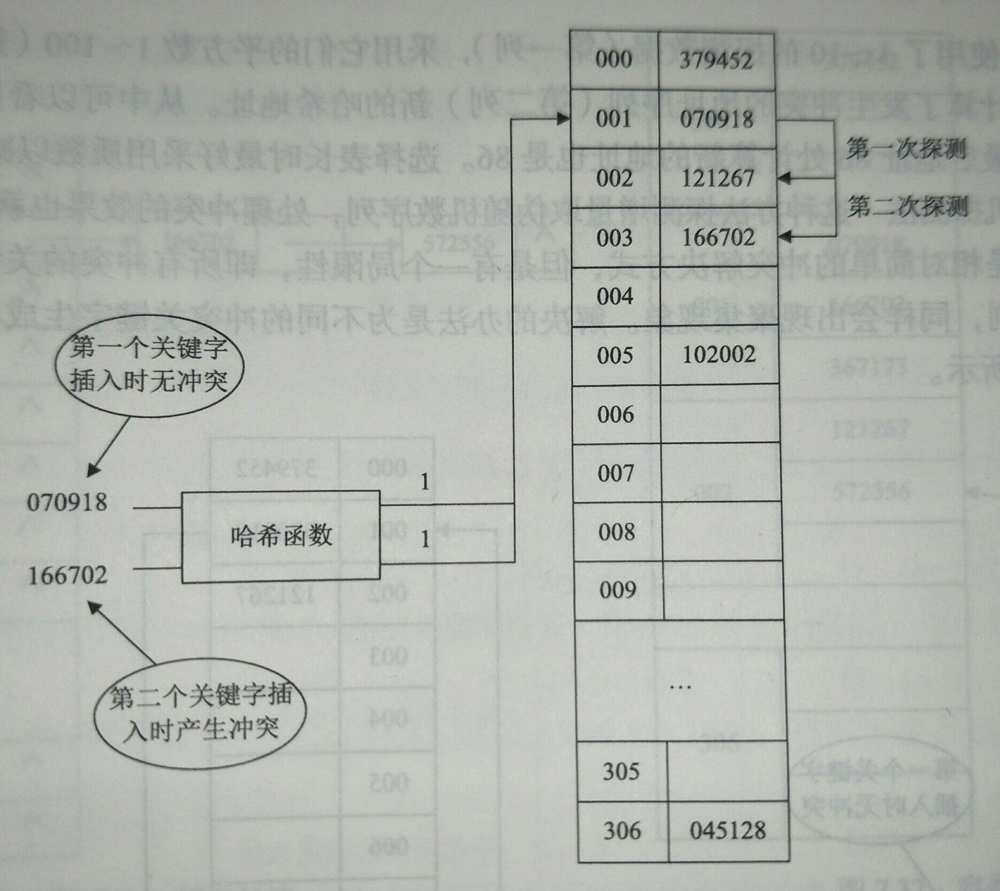
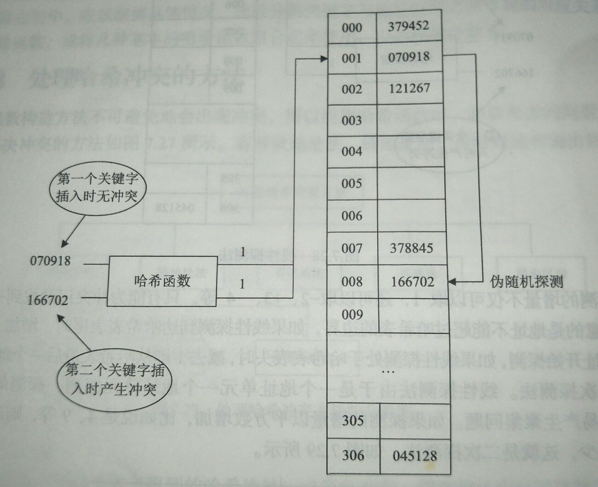
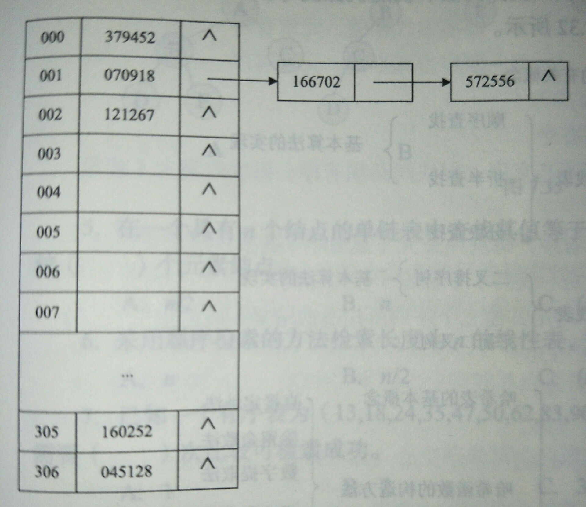
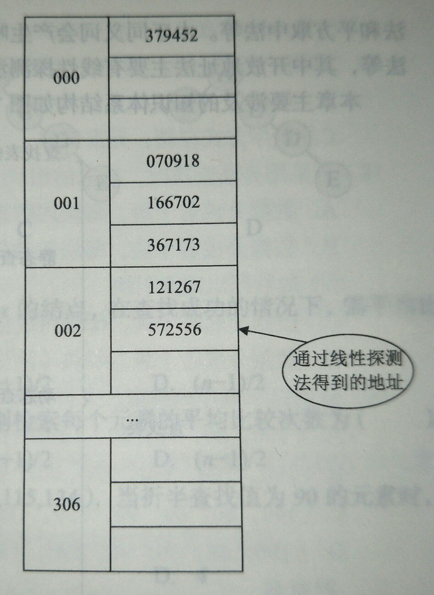

构造哈希表时不可避免地会出现冲突，所以应用哈希函数时，必须考虑的问题是如何解决冲突。

# 开放地址法

开放地址法是指**当由关键字得到的哈希地址发生冲突，就用某种方法形成一个探测的序列，并沿着这个序列逐个单元进行查询，直到找到这个关键字或找到一个开放的地址（即未存储的空单元）为止**。

> 只要哈希表足够大，空的哈希地址总能找到。

## 线性探测法

线性探测法是**从发生冲突的地址开始，依次探测后面的单元，直到找到一个空闲单元为止**。当哈希表的长度**不小于**数据元素的个数时，一定可以找到空闲的存储单元。

线性探测法的示意图如下：

线性探测法有两个**优点**：

1. 容易实现。
2. 数据元素新的存放地址与它原哈希函数映射地址相近。

但线性探测法容易产生**聚集问题**。假设连续出现了 $$i$$ 个同义词，第一个同义词占用的单元为 $$d$$，后续的同义词占用的单元是 $$d+1$$，$$d+2$$，…，$$d+i-1$$。此时，之后任何到 $$d+1$$，$$d+2$$，…，$$d+i-1$$ 单元上的哈希映射都会由于前面的同义词的聚集而产生**非同义词冲突**，这种冲突对查找不利。

> **非同义词冲突：数据元素准备占用的存储单元已经由其他数据元素占用，从而不得不探测下一个存储单元是否可存储。**

线性探测的**增量**不仅可以取 1，还可以取 -2、3 等其他数量，只要能为冲突数据元素找到一个未占用的地址。不过要注意**地址不能超过哈希表的边界**，如果线性探测到达了哈希表表尾，增加 1 就是从哈希表第一个地址开始重新探测；反之如果按照负增量探测到了表头，则重新从最后一个地址开始向前探测。

## 二次探测法

为了解决线性探测法的聚集问题，提出了**探测的增量以平方数增加**的二次探测法。

例如有一组数据：

| 探测数据 $$i$$ | 冲突地址 | 增量 $$i^2$$ | 新的地址        |
| -------------- | -------- | ------------ | --------------- |
| 1              | 1        | 1            | (1+1)%100=2     |
| 2              | 2        | 4            | (2+4)%100=6     |
| 3              | 6        | 9            | (6+9)%100=15    |
| 4              | 15       | 16           | (15+16)%100=31  |
| 5              | 31       | 25           | (31+25)%100=56  |
| 6              | 56       | 36           | (56+36)%100=92  |
| 7              | 92       | 49           | (92+49)%100=41  |
| 8              | 41       | 64           | (41+64)%100=5   |
| 9              | 5        | 81           | (5+81)%100=86   |
| 10             | 86       | 100          | (86+100)%100=86 |

从表中可以看出，二次探测法并不容易产生聚集现象，只有 9 和 10 的地址相同。在选择**哈希表表长**时，最好采用**质数**以减少冲突。

## 伪随机探测法

伪随机探测法的**探测增量**取自**伪随机序列**，处理冲突的效果也就取决于该序列。

这种处理方式是相对简单的冲突解决方式，但是局限性是所有冲突的关键字都是用相同的冲突处理序列，同样会出现**聚集现象**。解决的办法是未不同的冲突关键字生成不同的伪随机序列。

伪随机探测法的示意图如下：

# 链地址法

链地址法又称**拉链法**，**是解决地址冲突既灵活又有效的方法**。

一个数据元素存放在哈希表中，如果另一个新的数据元素与其产生的地址冲突，则**在该处建立一个结点存放新的数据元素**，并将该结点插入到**发生冲突的地址所在的一个链表中**。这种由冲突的数据元素构成的链表就称为**哈希链表**。

**一个哈希基表**和**若干条哈希链表**相连就构造了一个完整的哈希表，其示意图如下：

# 再哈希法

当同义词发生地址冲突时，**就用另一个哈希函数再计算另一个哈希地址**；如果再发生冲突，就再使用另一个哈希函数，直到不发生冲突为止。

再哈希法**不容易产生聚集**，但**增加了计算的时间**，并且要求预先要设置一个**哈希函数的序列**。

# 容器法

容器法是**为每一个哈希地址建立一个可以存储多个数据元素的容器（Bucket Hashing）**，即多个同义词都可以存储在同一地址空间中。

这样处理虽然暂时解决了地址冲突的问题，但**当容器存满时**，地址冲突依然会发生，这时应该采用如线性探测法再寻找另一个可以存储的地址。

容器法的示意图如下：

# 溢出区法

除了基本的存储区外（称为**基本表**），另外建立一个公共溢出区（称为**溢出表**），当发生冲突时，数据元素可以存入这个公共溢出区。