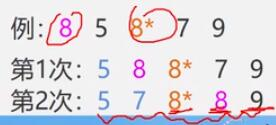

# 简单选择排序


> 简单选择排序又称直接选择排序。

## 简单选择排序的算法实现

简单选择排序的一般算法实现如下：

```c
void SelectionSort(DataType a, int n) {
    // 外层循环遍历序列，次数为 n-1 趟，最后一个数据元素必定是最大（或最小）的那个
	for (int i = 1; i <= n - 1; i++) {
        // 记录最小（或最大）元素的下标
		int idx = i;
        // 遍历第 i 个元素之后的元素
		for (int j = i + 1; j <= n; j++) {
            // 如果第 j 个元素比 idx 上的元素小（大），就更新最小（或最大）元素的下标
			if (a[j].key < a[idx].key) {
				idx = j;
			}
		}
        // 如果下标有变化，就交换元素
		if (idx != i) {
			ElemType temp = a[i];
			a[i] = a[idx];
			a[idx] = temp;
		}
	}
}
```

## 简单选择排序的性能分析

在简单选择排序中，第一次排序需要进行 $$n-1$$ 次比较，第二次排序要进行 $$n-2$$ 次比较，第 $$n-1$$ 次排序要进行 1 次比较，所以**总的比较次数为 $$n(n-1)/2$$ 次**。

在一次排序时，数据元素的**移动次数**在**最好情况下是 0 次**，**最坏为 3 次**（一次临时变量加上两次数据元素交换）。虽然整个排序过程移动次数并不多，但是总的比较次数很多，因此简单选择排序算法的时间复杂度为 **$$O(n^2)$$**。

简单选择排序只需要一个辅助空间用于交换数据元素，**对于存储空间没有过高的要求**。

简单选择排序在交换过程中可能会打乱相同关键字的数据元素的相对次序，示意图如下：



因此，简单选择排序是一种**不稳定的**排序算法。但也可以**优化算法**，使之成为稳定的排序算法，这种优化就称为**稳定化**。