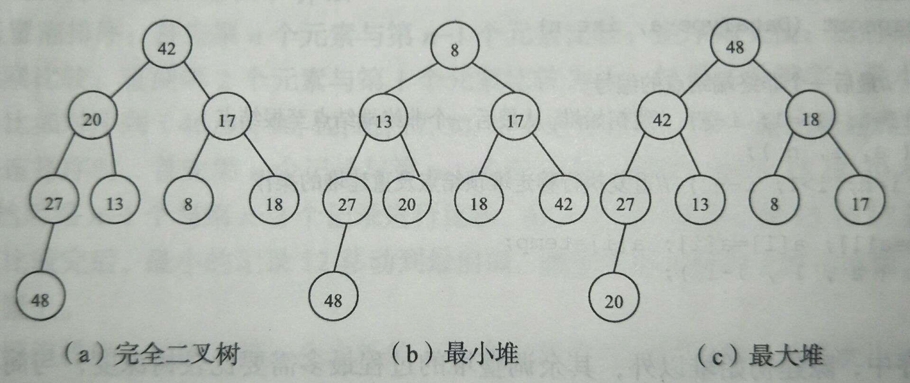
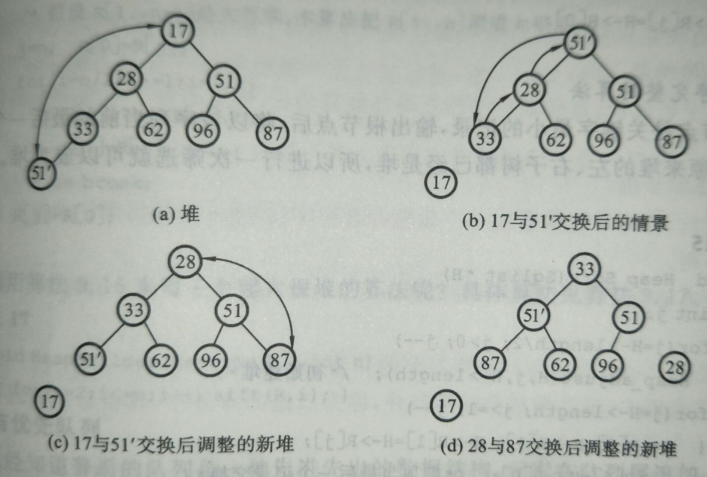

# 堆排序


## 堆排序的基本思想

**堆排序（Heap Sort）**是一种**树形选择排序**，利用了**堆顶数据元素的关键字是序列中最大（或最小）的元素**这一特性，使得在当前**无序区**中选择最大（或最小）关键字的数据元素变得简单。

堆排序的基本思想是：

1. 将待排序的数据元素序列构造成一个堆。
2. 将堆中关键字值最大（或者最小）的数据元素移出，并将剩下的数据元素调整成一个新的堆。
3. 再次找出新堆中关键字值最大（或者最小）的数据元素，并移出，然后再将剩下的数据元素调整成一个新的堆。
4. 依此类推，直到堆中只剩一个数据元素为止，数据元素出堆的顺序就是一个有序序列。

### 堆的基本概念

**堆**是由 $$n$$ 个元素组成的序列 $$\{k_1,k_2,{\cdots},k_{n-1},k_n\}$$，当且仅当满足关系 **$$k_i{\leq}k_{2i}$$ 且 $$k_i{\leq}k_{2i+1}$$**，或者 **$$k_i{\geq}k_{2i}$$ 且 $$k_i{\geq}k_{2i+1}$$**，其中 $$i{\in}\{1,2,3,{\cdots},n/2\}$$。

例如有序列 (47,35,27,26,18,7,13,19)，可以看出序列满足 $$k_i{\geq}k_{2i}$$ 且 $$k_i{\geq}k_{2i+1}$$ 的关系，这个序列就是一个堆。

> 堆中数据元素的关系就是完全二叉树中结点 i 的左、右孩子结点的位置；i 的最大取值就是完全二叉树中最后一个非叶结点的位置。

若将堆看成是**一棵以 $$k_1$$ 为根结点的完全二叉树**，那么这棵完全二叉树中的**每个非叶结点的值都不大于（或不小于）其左、右孩子结点的值**，示意图如下：



堆又分为：

- **最小堆/小根堆/小顶堆** - **$$k_1$$** 是**最小**的数据元素，且序列满足 **$$k_i{\leq}k_{2i}$$ 且 $$k_i{\leq}k_{2i+1}$$** 的关系。
- **最大堆/大根堆/大顶堆** - **$$k_1$$** 是**最大**的数据元素，且序列满足 **$$k_i{\geq}k_{2i}$$ 且 $$k_i{\geq}k_{2i+1}$$** 的关系。

由此可以得出，在堆的完全二叉树表示中，**根结点一定是 $$n$$ 个结点中值最大或者最小的结点**。

### 堆的调整

堆的调整步骤如下：

1. 在输出堆顶元素之后，将堆中的最后一个元素 $$E$$ 移到堆顶的位置替代。
2. 将新的根结点 $$E$$ 与其左、右孩子结点的关键字进行比较，和其中最大（或最小）的结点交换位置。
3. 重复操作 2，直到 $$E$$ 的关键字不小于（或不大于）其左、右孩子结点的关键字或者 E 变成叶结点为止。至此得到一个新的堆。

从堆顶到叶结点的调整过程就称为**筛选**，**最小堆**的筛选过程示意图如下：



### 堆的建立

设序列 $$R[n]$$ 是待排序的数据元素序列。

首先将二叉树的每棵子树都调整成为堆。**只含根结点的树是堆**，而该二叉树中第 $$n/2$$ 个结点之后的所有结点都没有子树，即**以第 $$n/2$$ 个结点之后的结点为根的子树都是堆**。

> **<font color="red">在一棵拥有 $n$ 个结点的完全二叉树中，$n/2$ 处的结点是最后一个非叶结点。</font>**

因此，**以这些叶结点为左、右孩子结点的根结点，其左、右子树都是堆**，则只要进行一次筛选就可以成为堆。同理，只要将这些结点的双亲结点进行一次筛选，就可以成为堆。

所以，**只需要从第 $$n/2$$ 个数据元素到第 1 个数据元素依次进行筛选就可以建立堆**。

最小堆调整的一般算法实现如下：

```c
void HeapAdjust(DataType a, int k, int m) {
	int i = k, j = 2 * i;
	ElemType temp = a[i];
	while (j <= m) {
		if (j < m && a[j].key < a[j+1].key) {
			j++;
		}
		if (a[i].key > a[j].key) {
			break;
		}
		a[i] = a[j];
		a[j] = temp;
		i = j;
		j = 2 * i;
	}
}
```

## 堆排序的算法实现

堆排序的一般算法实现如下：

```c
void HeapSort(DataType a, int n) {
	for (int i = n / 2; i >= 1; i--) {
		HeapAdjust(a, i, n);
	}
	for (int i = n; i >= 1; i--) {
		ElemType temp = a[1];
		a[1] = a[i];
		a[i] = temp;
		HeapAdjust(a, 1, i - 1);
	}
}
```

## 堆排序的性能分析

在堆排序中，除了建立初始堆以外，其余调整堆的过程最多需要比较树的深度次，与简单选择排序相比，时间效率提高了很多。另外，不管原始数据元素如何排列，堆排序的比较次数变化不大，所以，**堆排序对原始数据元素的排列状态并不敏感**。

对 $$n$$ 个关键字，**建成**深度为 $$k({\lfloor}{\log}_{2}n{\rfloor}+1)$$ 的堆，所需进行的**关键字比较次数**最多为 **$$4n$$**；对于深度为 $$k$$ 的堆，**筛选**所需进行的**关键字比较次数**最多为 **$$2(k-1)$$**。

调整堆顶 $$n-1$$ 次，总共进行的关键字比较次数不超过：

$$
2(\lfloor\log_2{(n-1)}\rfloor+\lfloor\log_2{(n-2)}\rfloor+{\cdots}+\lfloor\log_2{2}\rfloor)<2n(\lfloor\log_2{n}\rfloor)
$$

因此，堆排序在**最坏的情况**下，**时间复杂度为 $$O(n{\log}_{2}n)$$**，这是堆最大的优点。堆排序**适用于数据元素数量较多的情况**，较少时反而会降低效率，因为**其运行时间主要耗费在建立初始堆和调整新建堆时进行的反复筛选上**。

若对 $$n$$ 个数据元素进行堆排序，则在由初始堆进行每轮排序的过程中，共需要进行 **$$n-1$$ 次筛选运算**。

在堆排序中，只需要一个暂存被筛选记录内容的单元和两个简单变量，所以堆排序是一种**速度快而且省空间的**排序方法。

在堆的重建过程中会根据堆的要求改变数据元素的记录位置，故堆排序是一种**不稳定的**排序算法。