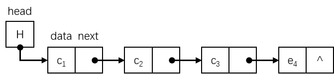

# 链串

串的链式存储结构就是**单链表**，每个结点的值是**一个或多个字符**，示意图如下：



当结点的数据域存放多个字符且最后一个结点的数据域未被字符占满时，可以添加**特殊字符**来填补，例如 \* 号。

除了定义链表的头指针外，还需要添加一个尾指针指示链表中最后一个结点，以便处理结点中的信息，另外还应该记录当前串的长度。串的链式存储的一般数据结构定义如下：

```c
// 块的大小
#define CHUNK_SIZE 4

typedef struct Chunk {
    char ch[CHUNK_SIZE];
    struct Chunk *next;
} Chunk;

typedef struct {
    Chunk *head, *tail;
    int length;
} LString;
```

在串的链式存储结构中，**结点大小的选择很重要，它会直接影响到串处理的效率**。在实际应用中，需要考虑串值的存储密度，它定义为：`存储密度=串值所占的存储位/实际分配的存储位`。

但由于链式存储结构**对于串的整体和子串的操作不太方便**，而且**占用的存储空间较大**，特别是在结点大小为 1 的链式存储结构中，每存储一个字符，都要存储一个指针。

因此，对串的链式存储结构不再深入讨论。