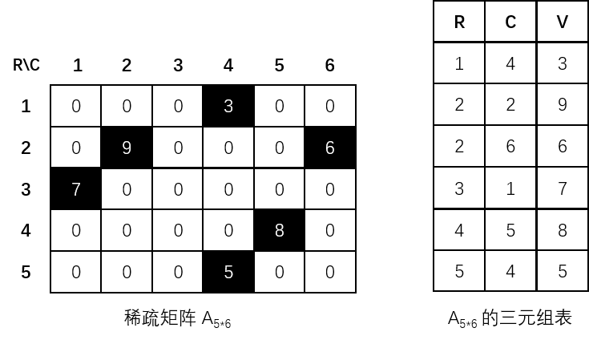
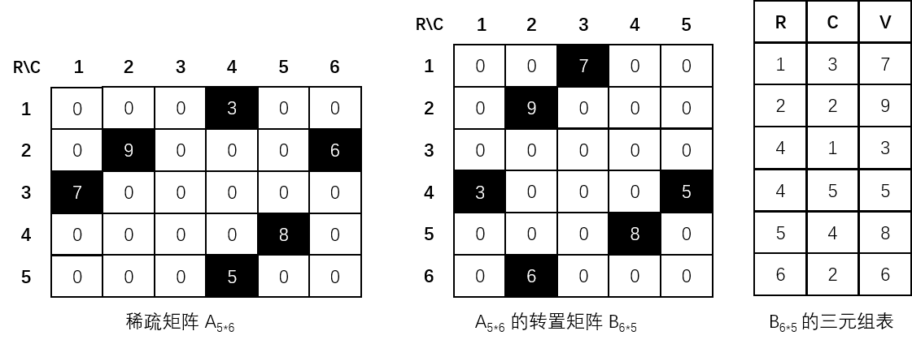
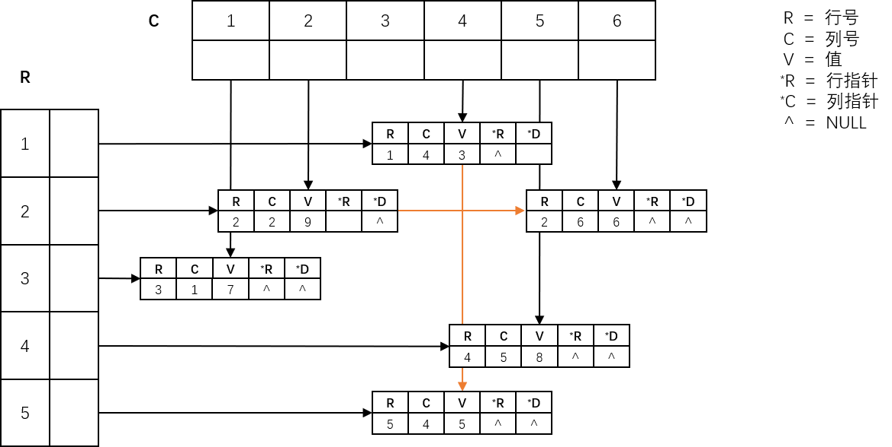

# 稀疏矩阵

## 稀疏矩阵的基本概念

若矩阵中的**零元素非常多**、**非零元素较少**、**分布没有规律**，就可以称此矩阵为**稀疏矩阵（Sparse Matrix）**。

对于一个 $$m{\times}n$$ 的矩阵，矩阵元素总数为 $$s=m{\times}n$$，设 $$t$$ 为矩阵非零元素的个数，**若 $$t$$ 远远小于 $$s$$**，则认为该矩阵为稀疏矩阵。

令：


$$
\delta=\frac{t}{m\times{n}}
$$


称 $${\delta}$$ 为稀疏矩阵的**稀疏因子**。一般来说，**当 $${\delta}$$ 远远小于 0.05 时**，才称矩阵为稀疏矩阵。

## 稀疏矩阵的三元组存储

和特殊矩阵不同的是，稀疏矩阵中的非零元素并没有特殊的分布规律，所以不便利用下标变换公式将其映射到一维数组中。在实际应用中，需要处理的稀疏矩阵常常较大，例如一个 100\*100 的矩阵只有 50 个非零元素，若存储矩阵中所有的元素（10000 个）会浪费大量的存储空间，所以**只考虑存储其中的非零元素**，就是实现了稀疏矩阵的**压缩存储**。

由于非零元素的分布无规律，可以用一个**包含行下标、列下标和矩阵元素值的三元组**，唯一地确定一个矩阵元素，再由所有非零元素的三元组构成一个线性表（称之为**三元组表**）来表示一个稀疏矩阵，示意图如下：



稀疏矩阵的三元组表一般**以行优先、顺序存储元素**，其一般数据结构定义如下：

```c
// 非零元素个数的最大值
#define SIZE 100

// 三元组
typedef struct {
    // 元素的值，此处为 int 类型，也可以自定义类型
    int e;
    // 元素所处行、元素所处列
    int row, col;
} Triple;

// 稀疏矩阵
typedef struct {
    // 三元组表，从 1 下标开始存储元素，0 下标不使用
    Triple array[SIZE+1];
    // 矩阵的行数、矩阵的列数、非零元素的个数
    int row_num, col_num, e_num;
} Matrix;
```

其一般算法实现如下：

```c
// 创建稀疏矩阵的三元组表示
Status CreateMatrix(Matrix &m) {
    // 0 下标不使用
    m.array[0].row = m.array[0].col = 0;
    
    // 接收矩阵的规模
    printf("请输入矩阵的行数、列数、非零元素，格式为【%%d,%%d,%%d】：\n");
    scanf("%d,%d,%d", &m.row_num, &m.col_num, &m.e_num);
    
    // 定义三元组临时变量
    Triple temp;
    // 存储矩阵元素
    for (int i = 1; i <= m.e_num; i++) {
        // 用死循环来校验输入的有效性，输入正确时结束循环
        while (1) {
            printf("请按行序顺序输入第%d个非零元素所在的行、列、元素值，格式为【%%d,%%d,%%d】：\n", i);
            scanf("%d,%d,%d", &temp.row, &temp.col, &temp.e);
            // 校验元素的行列是否超出边界
            if (temp.row < 1 || temp.col < 1 || temp.row > m.row_num || temp.col > m.col_num) {
                continue;
            }
            // 校验元素的行列是否小于上一个元素
            if (temp.row < m.array[i - 1].row || (temp.row == m.array[i - 1].row && temp.col <= m.array[i-1].col)) {
                continue;
            }
            // 存储元素
            m.array[i] = temp;
            break;
        }
    }
    return OK;
}

// 打印稀疏矩阵
void PrintMatrix(Matrix m) {
    printf("行\t列\t值\n");
    for (int i = 1; i<= m.e_num; i++) {
        printf("%d\t%d\t%d\n", m.array[i].row, m.array[i].col, m.array[i].e);
    }
}

// 矩阵和，将两矩阵中的元素揉合成一个新矩阵，相同位置的元素值相加
Status AddMatrix(Matrix m1, Matrix m2, Matrix &_new) {
	// 如果两矩阵的行与列的数量不相等
	if (m1.row_num != m2.row_num || m1.col_num != m2.col_num) {
		return ERROR;
	}

	// 初始化新矩阵
	_new.row_num = m1.row_num;
	_new.col_num = m1.col_num;
	_new.e_num = 0;

	// 存储新矩阵的元素，i 是 _new 的下标，j 是 m1 的下标，k 是 m2 的下标
	int i = 1, j = 1, k = 1;
    // 按照行列从小到大的顺序存储
    // 若是两元素行列相同，则将其值相加
    // 每次循环只存储一个对应行列的元素，防止同时存储两个不同行列的元素后，导致大小排序混乱以及错过行列相同的两元素
	while (j <= m1.e_num && k <= m2.e_num) {
		// 首先考虑两元素所处行不相等的情况
		if (m1.array[j].row != m2.array[k].row) {
			// 将行小的元素添加到 _new 中
			if (m1.array[j].row < m2.array[k].row) {
				_new.array[i++] = m1.array[j++];
			} else {
				_new.array[i++] = m2.array[k++];
			}
		} else {
			// 如果所处列也相等，就将两元素值相加
			if (m1.array[j].col == m2.array[k].col) {
                // 若元素和为零，则不存储
                if (m1.array[j].e + m2.array[k].e == 0) {
                    continue;
                }
                _new.array[i] = m1.array[j++];
                _new.array[i++].e += m2.array[k++].e;
			} else {
				// 将列小的元素添加到 _new 中
				if (m1.array[j].col < m2.array[k].col) {
					_new.array[i++] = m1.array[j++];
				} else {
					_new.array[i++] = m2.array[k++];
				}
			}
		}
		// 更新 _new 内存储的元素数量
		_new.e_num++; 
	}
    
	// 存储遗漏的元素
    // 剩下的元素的行列肯定比现有的元素大，所以直接存储即可，不需要考虑大小排序
	while (j <= m1.e_num) {
		_new.array[i++] = m1.array[j++];
		_new.e_num++; 
	}
	while (k <= m2.e_num) {
		_new.array[i++] = m2.array[k++];
		_new.e_num++; 
	}
	return OK;
}

// 矩阵差，m1 - m2 
Status SubMatrix(Matrix m1, Matrix m2, Matrix &_new) {
	// 如果两矩阵的行与列的数量不相等
	if (m1.row_num != m2.row_num || m1.col_num != m2.col_num) {
		return ERROR;
	}
    
    // 先将 m2 的所有元素值取相反数（若规定为 m2 - m1，则将 m1 的元素取反） 
    for (int i = 1; i<= m2.e_num; i++) {
        m2.array[i].e *= -1;
    }
    // 再调用矩阵和算法即可完成矩阵差算法
    AddMatrix(m1, m2, _new);
    return OK;
}

// 矩阵积
Status MultMatrix(Matrix m1, Matrix m2, Matrix &_new) {
	// 如果两矩阵的行与列的数量不相等
	if (m1.row_num != m2.row_num || m1.col_num != m2.col_num) {
		return ERROR;
	}

	// 初始化新矩阵
	_new.row_num = m1.row_num;
	_new.col_num = m1.col_num;
	_new.e_num = 0;

	// 存储新矩阵的元素，i 是 _new 的下标，j 是 m1 的下标，k 是 m2 的下标
	int i = 1, j = 1, k = 1;
    // 按照行列从小到大的顺序存储
    // 若是两元素行列相同，则将其值相乘
    // 每次循环只存储一个对应行列的元素（值为 0），防止同时存储两个不同行列的元素后，导致大小排序混乱以及错过行列相同的两元素
	while (j <= m1.e_num && k <= m2.e_num) {
		// 首先考虑两元素所处行不相等的情况
		if (m1.array[j].row != m2.array[k].row) {
			// 将行小的元素添加到 _new 中
			if (m1.array[j].row < m2.array[k].row) {
				_new.array[i] = m1.array[j++];
				_new.array[i++].e = 0;
			} else {
				_new.array[i] = m2.array[k++];
				_new.array[i++].e = 0;
			}
		} else {
			// 如果所处列也相等，就将两元素值相加
			if (m1.array[j].col == m2.array[k].col) {
				_new.array[i] = m1.array[j++];
				_new.array[i++].e *= m2.array[k++].e;
			} else {
				// 将列小的元素添加到 _new 中
				if (m1.array[j].col < m2.array[k].col) {
					_new.array[i] = m1.array[j++];
					_new.array[i++].e = 0;
				} else {
					_new.array[i] = m2.array[k++];
					_new.array[i++].e = 0;
				}
			}
		}
		// 更新 _new 内存储的元素数量
		_new.e_num++;
	}

	// 存储遗漏的元素
	// 剩下的元素的行列肯定比现有的元素大，所以直接存储即可，不需要考虑大小排序
	while (j <= m1.e_num) {
		_new.array[i] = m1.array[j++];
		_new.array[i++].e = 0;
		_new.e_num++;
	}
	while (k <= m2.e_num) {
		_new.array[i] = m2.array[k++];
		_new.array[i++].e = 0;
		_new.e_num++;
	}
	return OK;
}
```

## 稀疏矩阵的转置

稀疏矩阵操作的讨论重点是**转置操作**。

要实现稀疏矩阵的转置操作，需要比较 A 和 B 两互为**转置矩阵**的稀疏矩阵。若两个矩阵在行列互换后与对方相等，则称它们互为转置矩阵，示意图如下：



若矩阵 $$A$$ 是 $$m{\times}n$$ 的规模，则它的转置矩阵 $$B$$ 就是 $$n{\times}m$$ 的规模，且有：


$$
A(row,col)=B(col,row)\ (1\leq{row}\leq{n},1\leq{col}\leq{m})
$$


假设 $$a$$ 和 $$b$$ 是 Matrix 类型的变量，分别表示矩阵 $$A$$ 和 $$B$$。若要由 $$a$$ 转化得到 $$b$$，需要进行以下三个方面的变换：

1. 将矩阵的行列值互换。
2. 将每个三元组中的 row 和 col 值互换。
3. 调整三元组之间的顺序，按 $$B$$ 的行为主序依次排列。

有两种方法可以实现 $$a$$ 到 $$b$$ 的转换。最简单的方法是把 $$a$$ 三元组中的 row 和 col 互换，然后再对新的三元组行号按从小到大排列，就可以得到 $$b$$ 的三元组，时间复杂度为 **$$O(e{\_}num^2)$$**，一般算法实现如下：

```c
Status TransposeMatrix(Matrix a, Matrix &b) {
    // 没有非零元素时终止执行
    if (!a.e_num) {
        return ERROR;
    }
    // 将 a 转置给 b
    b.row_num = a.row_num;
    b.col_num = a.col_num;
    b.e_num = a.e_num;
    for (int i = 1; i <= a.e_num; i++) {
        b.array[i].row = a.array[i].col;
        b.array[i].col = a.array[i].row;
        b.array[i].e = a.array[i].e;
    }
    // 为 b 按照行列顺序从小到大排列
    Triple temp;
    for (int i = 1; i <= b.e_num - 1; i++) {
        for (int j = 1; j <= b.e_num - i; j++) {
        	// 因为在 a 里面已经是按照行序顺序排列了，在 b 里行转换成列后，只需要顺序排列行
            if (b.array[j].row > b.array[j + 1].row) {
                temp = b.array[j];
                b.array[j] = b.array[j + 1];
                b.array[j + 1] = temp;
            }
        }
    }
    return OK;
}
```

这种简单的方法需要一遍又一遍扫描矩阵，而另一种方法不需要在 row 和 col 互换后对新的三元组重新排列，改而把 row 和 col 交换后直接放在正确的位置上，提高转置效率，这就是稀疏矩阵的**快速转置算法**。

快速转置算法的关键是要**确定矩阵 $$A$$ 中每一列（等于 $$B$$ 中每一行）第一个非零元素在 $$b$$ 中的关键位置**，与这些非零元素同列的三元组就依次放在它们后面。为了记录这些信息，需要引入两个辅助数组 num 和 first：

- **num 数组** - 用来存放事先统计的稀疏矩阵 $$A$$ 各列的非零元素个数，也就是转置矩阵 $$B$$ 各行的非零元素个数。
- **first 数组** - 用来存放事先计算出来的稀疏矩阵各行三元组第一个元素在转置矩阵 $$B$$ 中应存放的起始位置。

快速转置的一般算法实现如下：

```c
Status FastTransposeMatrix(Matrix a, Matrix &b) {
    // 没有非零元素时终止执行
    if (!a.e_num) {
        return ERROR;
    }
    
    // 辅助数组，同样的，0 下标不存放值，从 1 下标开始
    int num[a.col_num + 1], first[a.col_num + 1];
    // 初始化 num 
    for (int i = 0; i < a.col_num + 1; i++) {
    	num[i] = 0;
	}
    // 求 a 中每一列含非零元素的个数
    for (int i = 1; i <= a.e_num; i++) {
        num[a.array[i].col]++;
    }
    // 求第 col 列中第一个非零元素在 b 中的序号
    first[1] = 1;
    for (int i = 2; i <= a.col_num; i++) {
        first[i] = first[i - 1] + num[i - 1];
    }
    
    // 转置
    b.row_num = a.row_num;
    b.col_num = a.col_num;
    b.e_num = a.e_num;
    for (int i = 1; i <= a.e_num; i++) {
    	// 通过辅助数组获取当前元素应当存储在 b 的何处（下标）
        // 同时因为同行可能有多个非零元素，所以要使其值加一，让后续的元素被正确地存储
        int b_idx = first[a.array[i].col]++;
        b.array[b_idx].row = a.array[i].col;
        b.array[b_idx].col = a.array[i].row;
        b.array[b_idx].e = a.array[i].e;
    }
    return OK;
}
```

通常，当 e_num 远小于 row_num+col_num 且 e_num>col_num 时，转置操作选用时间复杂度为 **$$O(col{\_}num+e{\_}num)$$** 的快速转置算法，虽然需要另外增加两个辅助数组，但它的效率是最高的。

## 稀疏矩阵的十字链表存储

用顺序存储结构存储稀疏矩阵的三元组线性表结构易于理解，可以节省很多存储单元，但缺点是顺序表的长度不易设定，可能存在溢出与浪费的问题，例如：

- 当非零元素增加或减少时，若矩阵元素的值由零元素变成非零元素，就要向顺序表中插入一个三元组；若非零元素变成非零元素，就要从顺序表中删除一个三元组。
- 为了保持顺序表数据元素之间的相对顺序，进行插入和删除操作时，就必须移动数据元素，操作很不方便。

以链式存储结构存储稀疏矩阵的三元组线性表可以克服这些不足，称之为**十字链表**。

在三元组十字链表表示中，**每个结点有五个域**，除了行号、列号和值这三个域外，另设两个指针域 right 和 down：

- **right 域** - 指向同一行的下一个非零元素的指针。
- **down 域** - 指向同一列的下一个非零元素的指针。

通过 right 指针把同一行的所有三元组链接成一个单链表，通过 down 指针把同一列的所有三元组连接成一个单链表，这样稀疏矩阵就形成了一个十字交叉的效果，故称其为稀疏矩阵三元组的十字链表存储结构，示意图如下：


